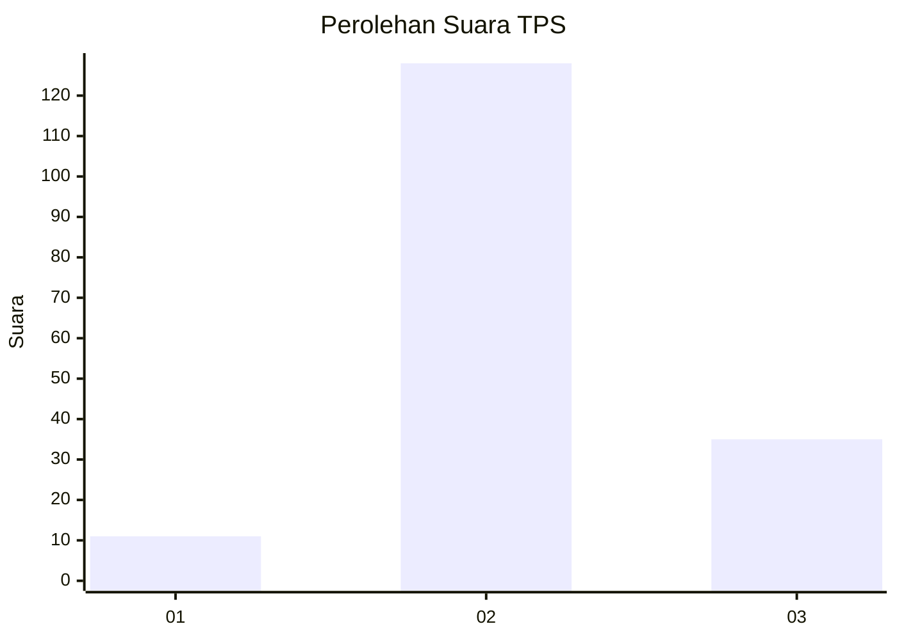

# Hasil

## Grafik

## Tabel

| No. | Nama Paslon    | Suara | Suara (raw) | Persentase |
|:--- |:-------------- | -----:| -----------:| ----------:|
| 1   | ANIES MUHAIMIN | 11    | [11][p-1]   | 6,32       |
| 2   | PRABOWO GIBRAN | 128   | [128][p-2]  | 73,56      |
| 3   | GANJAR MAHFUD  | 35    | [35][p-3]   | 20,11      |

[p-1]: https://github.com/gigit-pemilu/pemilu-2024/blob/main/pilpres/hitung-suara/sub/35-jawa-timur/sub/07-malang/sub/08-wajak/sub/2013-ngembal/sub/009-tps/sub/paslon-1.txt
[p-2]: https://github.com/gigit-pemilu/pemilu-2024/blob/main/pilpres/hitung-suara/sub/35-jawa-timur/sub/07-malang/sub/08-wajak/sub/2013-ngembal/sub/009-tps/sub/paslon-2.txt
[p-3]: https://github.com/gigit-pemilu/pemilu-2024/blob/main/pilpres/hitung-suara/sub/35-jawa-timur/sub/07-malang/sub/08-wajak/sub/2013-ngembal/sub/009-tps/sub/paslon-3.txt

## Foto C Plano

https://sirekap-obj-formc.kpu.go.id/1bc1/pemilu/ppwp/35/07/08/20/13/3507082013009-20240218-205505--a11e4335-abb1-414b-9167-cb9e9b07876a.jpg

https://sirekap-obj-formc.kpu.go.id/1bc1/pemilu/ppwp/35/07/08/20/13/3507082013009-20240218-212039--5f2bd47a-d148-4c3d-81fb-837088079996.jpg

https://sirekap-obj-formc.kpu.go.id/1bc1/pemilu/ppwp/35/07/08/20/13/3507082013009-20240218-212217--fd0b8289-03a1-48d3-a28a-2d0692af77c5.jpg

## Metadata

| Key        | Value               |
| ---------- | ------------------- |
| Time Stamp | 2024-02-24 22:31:28 |

