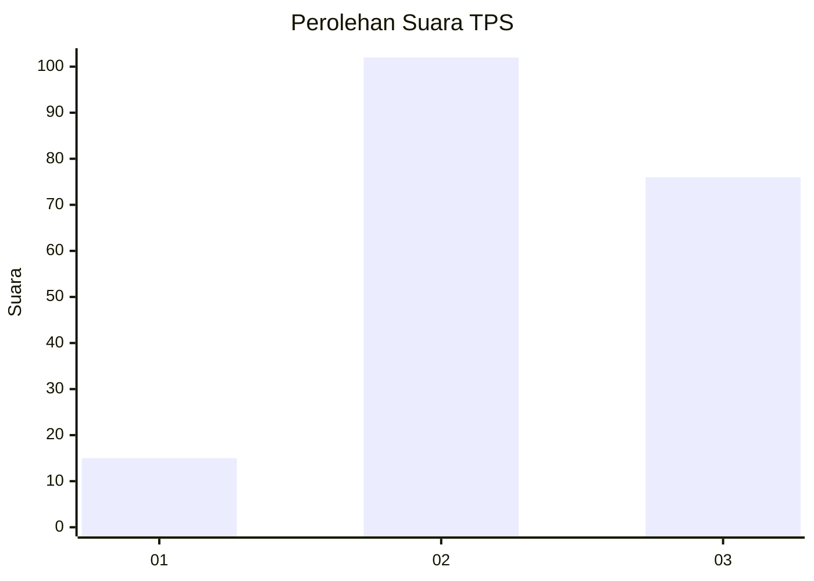
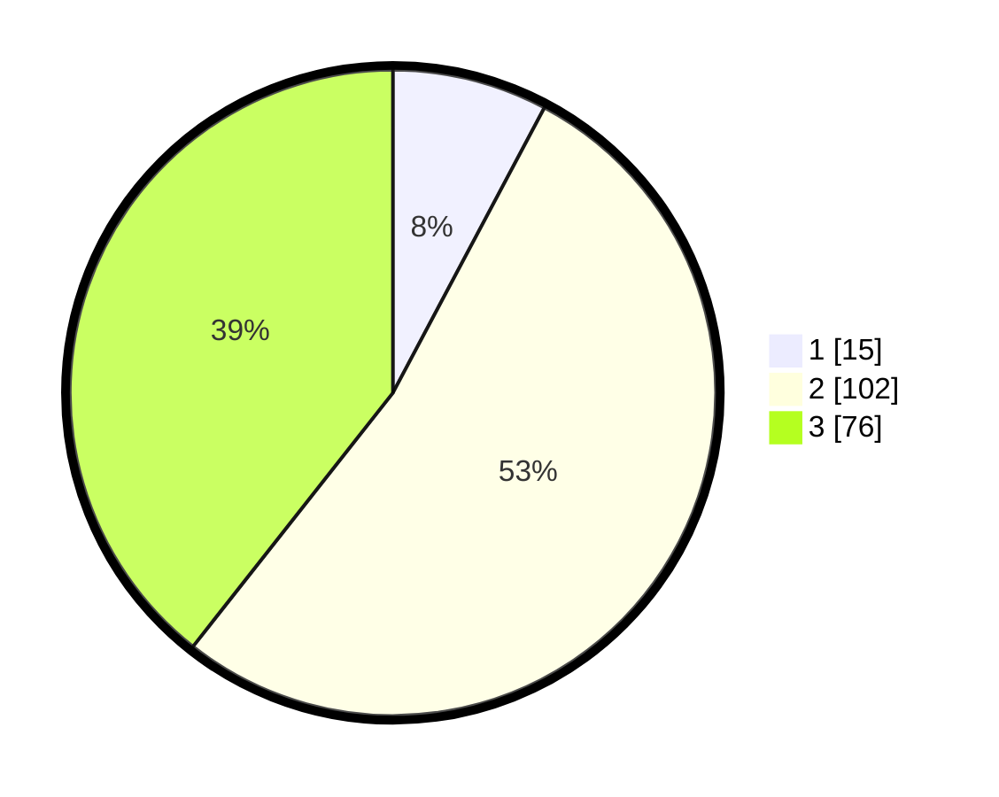

# Hasil

## Grafik

## Tabel

| No. | Nama Paslon    | Suara | Suara (raw) | Persentase |
|:--- |:-------------- | -----:| -----------:| ----------:|
| 1   | ANIES MUHAIMIN | 15    | [15][p-1]   | 7,77       |
| 2   | PRABOWO GIBRAN | 102   | [102][p-2]  | 52,85      |
| 3   | GANJAR MAHFUD  | 76    | [76][p-3]   | 39,38      |

[p-1]: https://github.com/gigit-pemilu/pemilu-2024-35-jawa-timur/blob/main/pilpres/hitung-suara/sub/35-jawa-timur/sub/07-malang/sub/08-wajak/sub/2013-ngembal/sub/010-tps/sub/paslon-1.txt
[p-2]: https://github.com/gigit-pemilu/pemilu-2024-35-jawa-timur/blob/main/pilpres/hitung-suara/sub/35-jawa-timur/sub/07-malang/sub/08-wajak/sub/2013-ngembal/sub/010-tps/sub/paslon-2.txt
[p-3]: https://github.com/gigit-pemilu/pemilu-2024-35-jawa-timur/blob/main/pilpres/hitung-suara/sub/35-jawa-timur/sub/07-malang/sub/08-wajak/sub/2013-ngembal/sub/010-tps/sub/paslon-3.txt

## Foto C Plano

https://sirekap-obj-formc.kpu.go.id/b0f4/pemilu/ppwp/35/07/08/20/13/3507082013010-20240218-210719--0e0af9db-927a-44c2-a236-4d9a711d75b2.jpg

https://sirekap-obj-formc.kpu.go.id/b0f4/pemilu/ppwp/35/07/08/20/13/3507082013010-20240218-211142--94bb32a4-a608-4e3d-817d-e380b38400cc.jpg

https://sirekap-obj-formc.kpu.go.id/b0f4/pemilu/ppwp/35/07/08/20/13/3507082013010-20240218-211313--16a8289a-dd8e-470b-8634-58b17e08098a.jpg

## Metadata

| Key        | Value               |
| ---------- | ------------------- |
| Time Stamp | 2024-02-24 22:31:28 |

