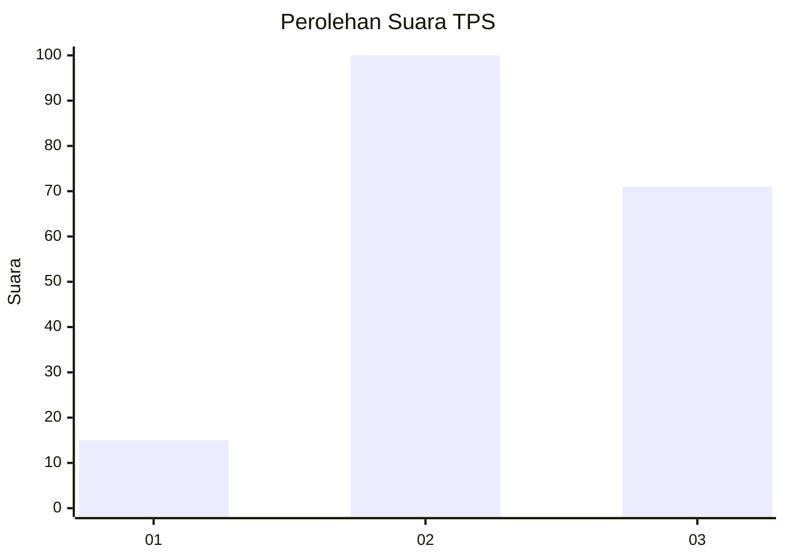
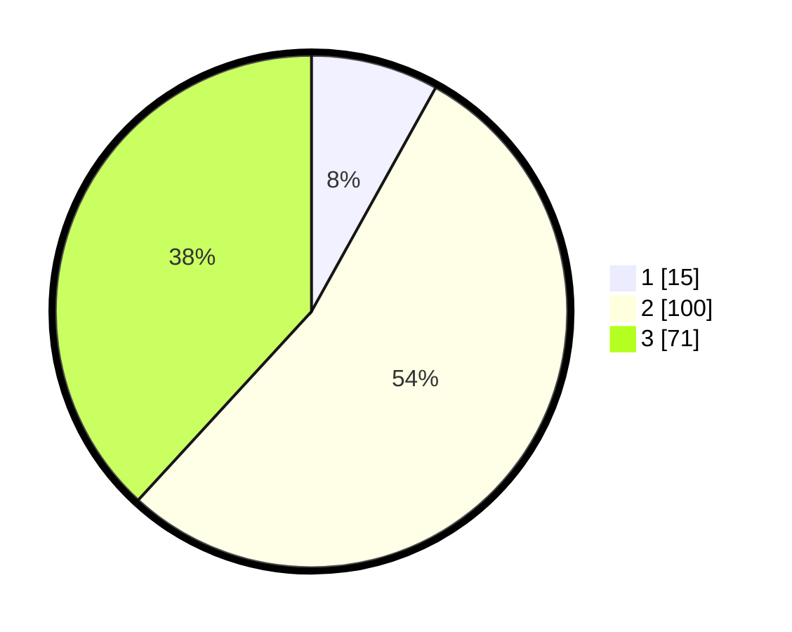

# Hasil

## Grafik

## Tabel

| No. | Nama Paslon    | Suara | Suara (raw) | Persentase |
|:--- |:-------------- | -----:| -----------:| ----------:|
| 1   | ANIES MUHAIMIN | 15    | [15][p-1]   | 8,06       |
| 2   | PRABOWO GIBRAN | 100   | [100][p-2]  | 53,76      |
| 3   | GANJAR MAHFUD  | 71    | [71][p-3]   | 38,17      |

[p-1]: https://github.com/gigit-pemilu/pemilu-2024-35-jawa-timur/blob/main/pilpres/hitung-suara/sub/35-jawa-timur/sub/07-malang/sub/08-wajak/sub/2013-ngembal/sub/014-tps/sub/paslon-1.txt
[p-2]: https://github.com/gigit-pemilu/pemilu-2024-35-jawa-timur/blob/main/pilpres/hitung-suara/sub/35-jawa-timur/sub/07-malang/sub/08-wajak/sub/2013-ngembal/sub/014-tps/sub/paslon-2.txt
[p-3]: https://github.com/gigit-pemilu/pemilu-2024-35-jawa-timur/blob/main/pilpres/hitung-suara/sub/35-jawa-timur/sub/07-malang/sub/08-wajak/sub/2013-ngembal/sub/014-tps/sub/paslon-3.txt

## Foto C Plano

https://sirekap-obj-formc.kpu.go.id/2987/pemilu/ppwp/35/07/08/20/13/3507082013014-20240218-202429--f5104da3-fb13-42e0-848e-d136bbd9e82e.jpg

https://sirekap-obj-formc.kpu.go.id/2987/pemilu/ppwp/35/07/08/20/13/3507082013014-20240218-201450--79df6eae-b49a-4eb0-a3b8-9d069b17fe00.jpg

https://sirekap-obj-formc.kpu.go.id/2987/pemilu/ppwp/35/07/08/20/13/3507082013014-20240218-201729--8a7bce54-3743-436b-9de4-86e058129652.jpg

## Metadata

| Key        | Value               |
| ---------- | ------------------- |
| Time Stamp | 2024-02-22 01:00:00 |

