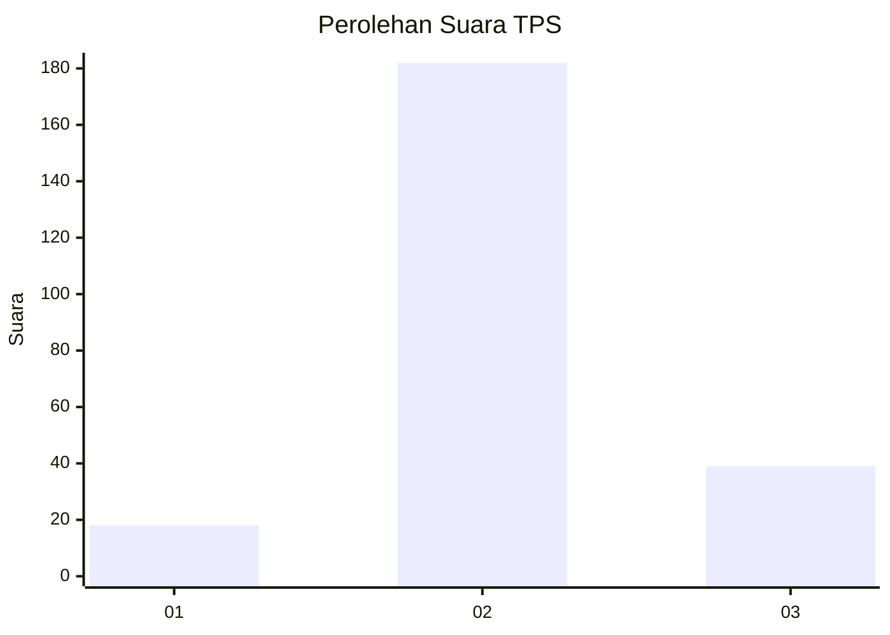
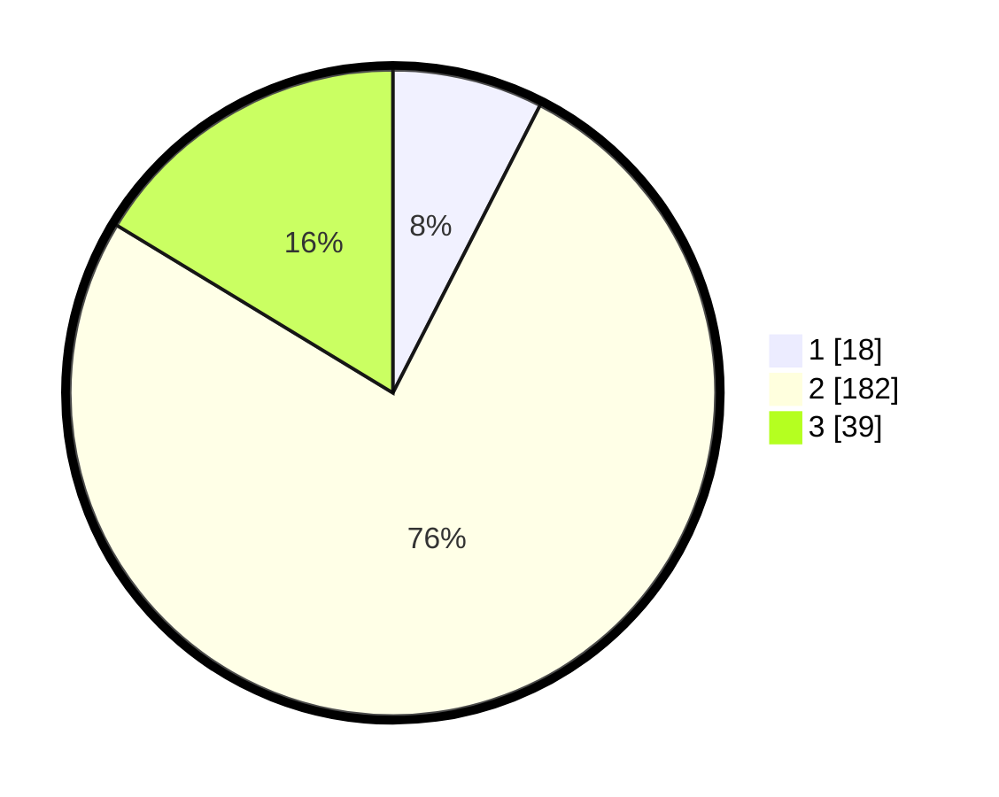

# Hasil

## Grafik

## Tabel

| No. | Nama Paslon    | Suara | Suara (raw) | Persentase |
|:--- |:-------------- | -----:| -----------:| ----------:|
| 1   | ANIES MUHAIMIN | 18    | [18][p-1]   | 7,53       |
| 2   | PRABOWO GIBRAN | 182   | [182][p-2]  | 76,15      |
| 3   | GANJAR MAHFUD  | 39    | [39][p-3]   | 16,32      |

[p-1]: https://github.com/gigit-pemilu/pemilu-2024-35-jawa-timur/blob/main/pilpres/hitung-suara/sub/35-jawa-timur/sub/07-malang/sub/09-turen/sub/2007-talok/sub/014-tps/sub/paslon-1.txt
[p-2]: https://github.com/gigit-pemilu/pemilu-2024-35-jawa-timur/blob/main/pilpres/hitung-suara/sub/35-jawa-timur/sub/07-malang/sub/09-turen/sub/2007-talok/sub/014-tps/sub/paslon-2.txt
[p-3]: https://github.com/gigit-pemilu/pemilu-2024-35-jawa-timur/blob/main/pilpres/hitung-suara/sub/35-jawa-timur/sub/07-malang/sub/09-turen/sub/2007-talok/sub/014-tps/sub/paslon-3.txt

## Foto C Plano

https://sirekap-obj-formc.kpu.go.id/0f8c/pemilu/ppwp/35/07/09/20/07/3507092007014-20240214-155643--c5c25864-78f9-4859-8e69-0e7df0161d80.jpg

https://sirekap-obj-formc.kpu.go.id/0f8c/pemilu/ppwp/35/07/09/20/07/3507092007014-20240214-160138--f8984f0a-d3dc-40c9-a171-8b529f01a90f.jpg

https://sirekap-obj-formc.kpu.go.id/0f8c/pemilu/ppwp/35/07/09/20/07/3507092007014-20240217-035952--73d78e6a-34db-4f4c-afd8-cb8fbab0140d.jpg

## Metadata

| Key        | Value               |
| ---------- | ------------------- |
| Time Stamp | 2024-02-19 06:16:00 |

## DATA PEMILIH TETAP

Jumlah pemilih dalam DPT: **269**.
 * L: **746**.
 * P: **143**.

## DATA PENGGUNA HAK PILIH

Jumlah pengguna hak pilih dalam DPT: **389**.
 * L: **418**.
 * P: **123**.

Jumlah pengguna hak pilih dalam DPTb: **0**.
 * L: **800**.
 * P: **838**.

Jumlah pengguna hak pilih dalam DPK: **2**.
 * L: **1**.
 * P: **831**.

Jumlah pengguna hak pilih: **243**.
 * L: **189**.
 * P: **924**.

## JUMLAH SUARA SAH DAN TIDAK SAH

JUMLAH SELURUH SUARA SAH: **239**.

JUMLAH SUARA TIDAK SAH: **4**.

JUMLAH SELURUH SUARA SAH DAN SUARA TIDAK SAH: **243**.

