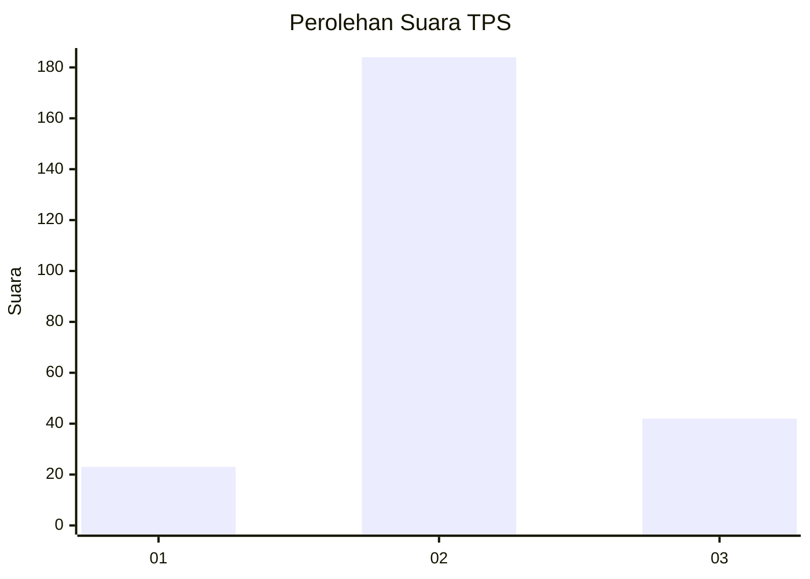
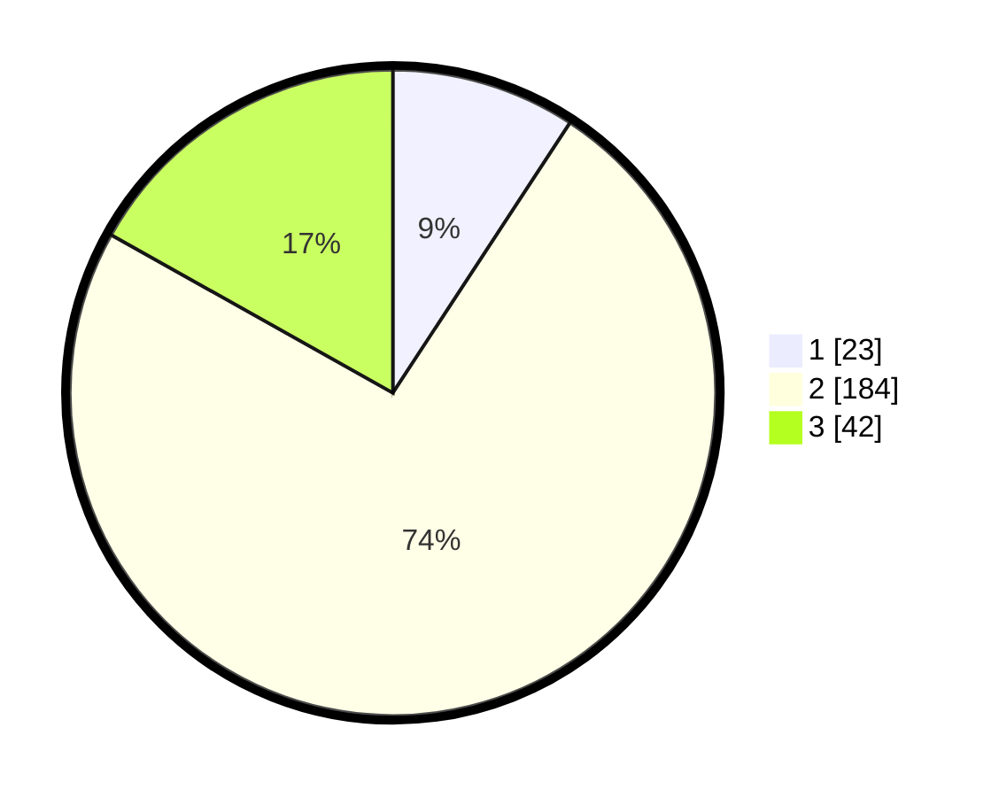

# Hasil

## Grafik

## Tabel

| No. | Nama Paslon    | Suara | Suara (raw) | Persentase |
|:--- |:-------------- | -----:| -----------:| ----------:|
| 1   | ANIES MUHAIMIN | 23    | [23][p-1]   | 9,24       |
| 2   | PRABOWO GIBRAN | 184   | [184][p-2]  | 73,90      |
| 3   | GANJAR MAHFUD  | 42    | [42][p-3]   | 16,87      |

[p-1]: https://github.com/gigit-pemilu/pemilu-2024-35-jawa-timur/blob/main/pilpres/hitung-suara/sub/35-jawa-timur/sub/07-malang/sub/09-turen/sub/2012-pagedangan/sub/032-tps/sub/paslon-1.txt
[p-2]: https://github.com/gigit-pemilu/pemilu-2024-35-jawa-timur/blob/main/pilpres/hitung-suara/sub/35-jawa-timur/sub/07-malang/sub/09-turen/sub/2012-pagedangan/sub/032-tps/sub/paslon-2.txt
[p-3]: https://github.com/gigit-pemilu/pemilu-2024-35-jawa-timur/blob/main/pilpres/hitung-suara/sub/35-jawa-timur/sub/07-malang/sub/09-turen/sub/2012-pagedangan/sub/032-tps/sub/paslon-3.txt

## Foto C Plano

https://sirekap-obj-formc.kpu.go.id/2c0d/pemilu/ppwp/35/07/09/20/12/3507092012032-20240216-075839--aa4912a6-cf3e-4edf-a111-900662ea5b00.jpg

https://sirekap-obj-formc.kpu.go.id/2c0d/pemilu/ppwp/35/07/09/20/12/3507092012032-20240216-075841--41bcc234-23f8-425b-8dea-d6819f94eb78.jpg

https://sirekap-obj-formc.kpu.go.id/2c0d/pemilu/ppwp/35/07/09/20/12/3507092012032-20240216-075840--edceeecb-ea0d-4f24-89d8-18dbe68588eb.jpg

## Metadata

| Key        | Value               |
| ---------- | ------------------- |
| Time Stamp | 2024-02-21 21:00:04 |

## DATA PEMILIH TETAP

Jumlah pemilih dalam DPT: **253**.
 * L: **127**.
 * P: **126**.

## DATA PENGGUNA HAK PILIH

Jumlah pengguna hak pilih dalam DPT: **2**.
 * L: **1**.
 * P: **1**.

Jumlah pengguna hak pilih dalam DPTb: **255**.
 * L: **128**.
 * P: **127**.

Jumlah pengguna hak pilih dalam DPK: **0**.
 * L: **0**.
 * P: **0**.

Jumlah pengguna hak pilih: **255**.
 * L: **128**.
 * P: **127**.

## JUMLAH SUARA SAH DAN TIDAK SAH

JUMLAH SELURUH SUARA SAH: **249**.

JUMLAH SUARA TIDAK SAH: **6**.

JUMLAH SELURUH SUARA SAH DAN SUARA TIDAK SAH: **255**.

