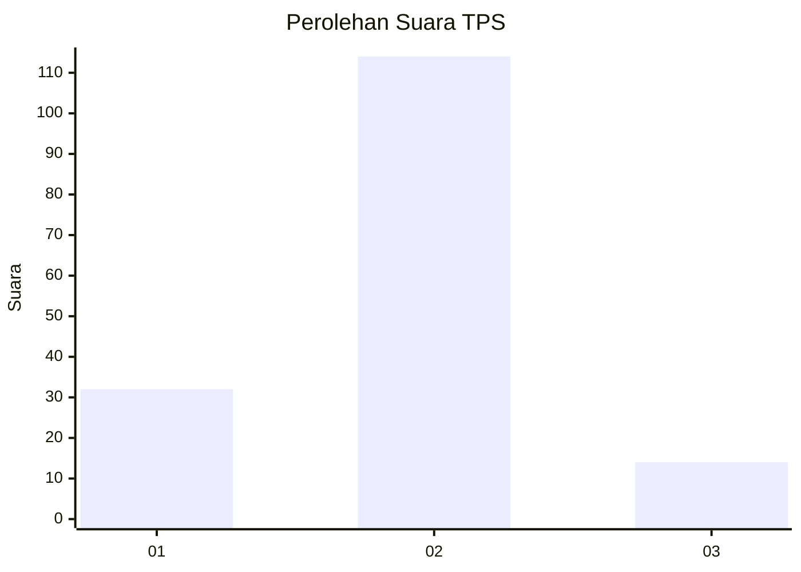

# Hasil

## Grafik

## Tabel

| No. | Nama Paslon    | Suara | Suara (raw) | Persentase |
|:--- |:-------------- | -----:| -----------:| ----------:|
| 1   | ANIES MUHAIMIN | 32    | [32][p-1]   | 20,00      |
| 2   | PRABOWO GIBRAN | 114   | [114][p-2]  | 71,25      |
| 3   | GANJAR MAHFUD  | 14    | [14][p-3]   | 8,75       |

[p-1]: https://github.com/gigit-pemilu/pemilu-2024-35-jawa-timur/blob/main/pilpres/hitung-suara/sub/35-jawa-timur/sub/07-malang/sub/10-gondanglegi/sub/2011-ketawang/sub/902-tps/sub/paslon-1.txt
[p-2]: https://github.com/gigit-pemilu/pemilu-2024-35-jawa-timur/blob/main/pilpres/hitung-suara/sub/35-jawa-timur/sub/07-malang/sub/10-gondanglegi/sub/2011-ketawang/sub/902-tps/sub/paslon-2.txt
[p-3]: https://github.com/gigit-pemilu/pemilu-2024-35-jawa-timur/blob/main/pilpres/hitung-suara/sub/35-jawa-timur/sub/07-malang/sub/10-gondanglegi/sub/2011-ketawang/sub/902-tps/sub/paslon-3.txt

## Foto C Plano

https://sirekap-obj-formc.kpu.go.id/5af3/pemilu/ppwp/35/07/10/20/11/3507102011902-20240216-145035--5b2562d1-4e32-4868-bd15-16a7fad2b973.jpg

https://sirekap-obj-formc.kpu.go.id/5af3/pemilu/ppwp/35/07/10/20/11/3507102011902-20240216-145036--28b910fc-6de2-47e2-a68c-17b362ce6be6.jpg

https://sirekap-obj-formc.kpu.go.id/5af3/pemilu/ppwp/35/07/10/20/11/3507102011902-20240216-145036--3612a385-d652-425d-8e63-ccc0206d19c2.jpg

## Metadata

| Key        | Value               |
| ---------- | ------------------- |
| Time Stamp | 2024-02-19 06:16:00 |

## DATA PEMILIH TETAP

Jumlah pemilih dalam DPT: **268**.
 * L: **1**.
 * P: **267**.

## DATA PENGGUNA HAK PILIH

Jumlah pengguna hak pilih dalam DPT: **140**.
 * L: **1**.
 * P: **139**.

Jumlah pengguna hak pilih dalam DPTb: **20**.
 * L: **0**.
 * P: **20**.

Jumlah pengguna hak pilih dalam DPK: **0**.
 * L: **0**.
 * P: **0**.

Jumlah pengguna hak pilih: **160**.
 * L: **1**.
 * P: **159**.

## JUMLAH SUARA SAH DAN TIDAK SAH

JUMLAH SELURUH SUARA SAH: **160**.

JUMLAH SUARA TIDAK SAH: **0**.

JUMLAH SELURUH SUARA SAH DAN SUARA TIDAK SAH: **160**.

