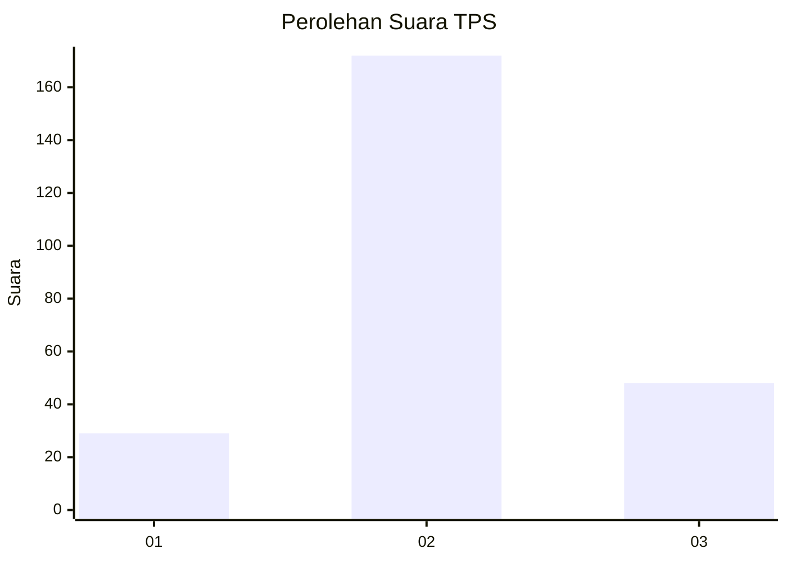
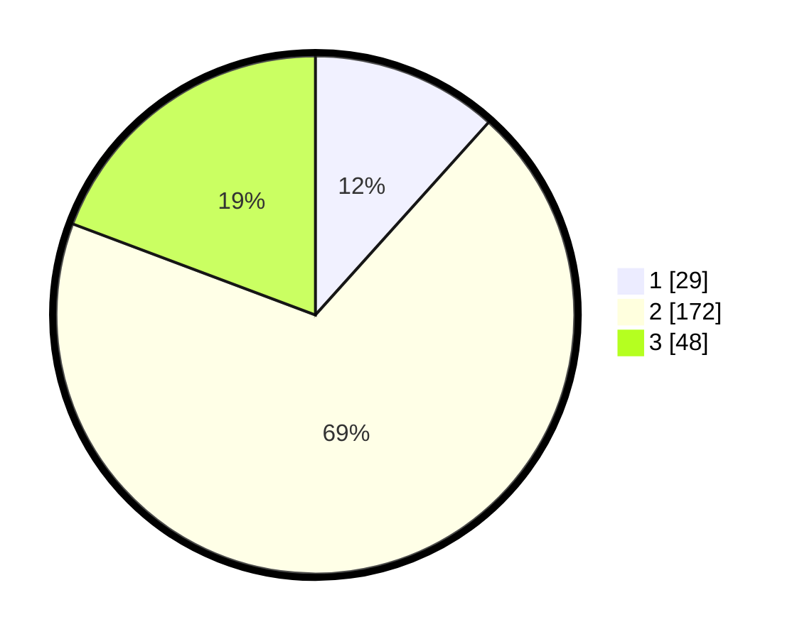

# Hasil

## Grafik

## Tabel

| No. | Nama Paslon    | Suara | Suara (raw) | Persentase |
|:--- |:-------------- | -----:| -----------:| ----------:|
| 1   | ANIES MUHAIMIN | 29    | [29][p-1]   | 11,65      |
| 2   | PRABOWO GIBRAN | 172   | [172][p-2]  | 69,08      |
| 3   | GANJAR MAHFUD  | 48    | [48][p-3]   | 19,28      |

[p-1]: https://github.com/gigit-pemilu/pemilu-2024/blob/main/pilpres/hitung-suara/sub/35-jawa-timur/sub/07-malang/sub/10-gondanglegi/sub/2013-sumberjaya/sub/002-tps/sub/paslon-1.txt
[p-2]: https://github.com/gigit-pemilu/pemilu-2024/blob/main/pilpres/hitung-suara/sub/35-jawa-timur/sub/07-malang/sub/10-gondanglegi/sub/2013-sumberjaya/sub/002-tps/sub/paslon-2.txt
[p-3]: https://github.com/gigit-pemilu/pemilu-2024/blob/main/pilpres/hitung-suara/sub/35-jawa-timur/sub/07-malang/sub/10-gondanglegi/sub/2013-sumberjaya/sub/002-tps/sub/paslon-3.txt

## Foto C Plano

https://sirekap-obj-formc.kpu.go.id/eed6/pemilu/ppwp/35/07/10/20/13/3507102013002-20240216-050749--81157bd8-cc95-46fb-8481-6b206312c4ce.jpg

https://sirekap-obj-formc.kpu.go.id/eed6/pemilu/ppwp/35/07/10/20/13/3507102013002-20240216-050751--a089fe60-ffd4-408c-953c-9baa40dd40a8.jpg

https://sirekap-obj-formc.kpu.go.id/eed6/pemilu/ppwp/35/07/10/20/13/3507102013002-20240216-050750--cb81ca44-7bc3-4220-b646-d314c168aef0.jpg

## Metadata

| Key        | Value               |
| ---------- | ------------------- |
| Time Stamp | 2024-02-19 06:16:00 |

## DATA PEMILIH TETAP

Jumlah pemilih dalam DPT: **295**.
 * L: **154**.
 * P: **141**.

## DATA PENGGUNA HAK PILIH

Jumlah pengguna hak pilih dalam DPT: **251**.
 * L: **138**.
 * P: **113**.

Jumlah pengguna hak pilih dalam DPTb: **251**.
 * L: **138**.
 * P: **113**.

Jumlah pengguna hak pilih dalam DPK: **7**.
 * L: **2**.
 * P: **5**.

Jumlah pengguna hak pilih: **258**.
 * L: **140**.
 * P: **118**.

## JUMLAH SUARA SAH DAN TIDAK SAH

JUMLAH SELURUH SUARA SAH: **249**.

JUMLAH SUARA TIDAK SAH: **8**.

JUMLAH SELURUH SUARA SAH DAN SUARA TIDAK SAH: **257**.

