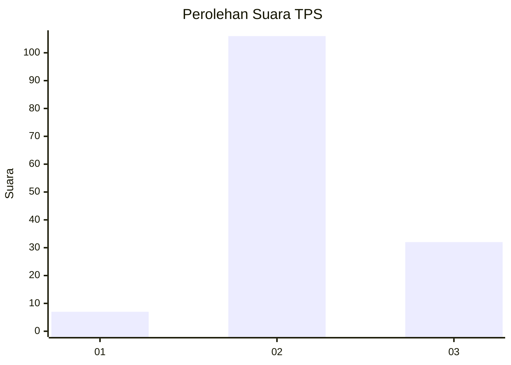

# Hasil

## Grafik

## Tabel

| No. | Nama Paslon    | Suara | Suara (raw) | Persentase |
|:--- |:-------------- | -----:| -----------:| ----------:|
| 1   | ANIES MUHAIMIN | 7     | [7][p-1]    | 4,83       |
| 2   | PRABOWO GIBRAN | 106   | [106][p-2]  | 73,10      |
| 3   | GANJAR MAHFUD  | 32    | [32][p-3]   | 22,07      |

[p-1]: https://github.com/gigit-pemilu/pemilu-2024-35-jawa-timur/blob/main/pilpres/hitung-suara/sub/35-jawa-timur/sub/07-malang/sub/11-kalipare/sub/2004-sukowilangun/sub/008-tps/sub/paslon-1.txt
[p-2]: https://github.com/gigit-pemilu/pemilu-2024-35-jawa-timur/blob/main/pilpres/hitung-suara/sub/35-jawa-timur/sub/07-malang/sub/11-kalipare/sub/2004-sukowilangun/sub/008-tps/sub/paslon-2.txt
[p-3]: https://github.com/gigit-pemilu/pemilu-2024-35-jawa-timur/blob/main/pilpres/hitung-suara/sub/35-jawa-timur/sub/07-malang/sub/11-kalipare/sub/2004-sukowilangun/sub/008-tps/sub/paslon-3.txt

## Foto C Plano

https://sirekap-obj-formc.kpu.go.id/7bbf/pemilu/ppwp/35/07/11/20/04/3507112004008-20240214-222510--87b6c22c-9f0f-4722-98be-9b869e7db233.jpg

https://sirekap-obj-formc.kpu.go.id/7bbf/pemilu/ppwp/35/07/11/20/04/3507112004008-20240214-141139--b1f71828-8078-451a-866e-fb2a9bb4a581.jpg

https://sirekap-obj-formc.kpu.go.id/7bbf/pemilu/ppwp/35/07/11/20/04/3507112004008-20240214-141627--1cbf3192-7c70-4693-a7ca-62217e4a9633.jpg

## Metadata

| Key        | Value               |
| ---------- | ------------------- |
| Time Stamp | 2024-02-17 11:00:02 |

