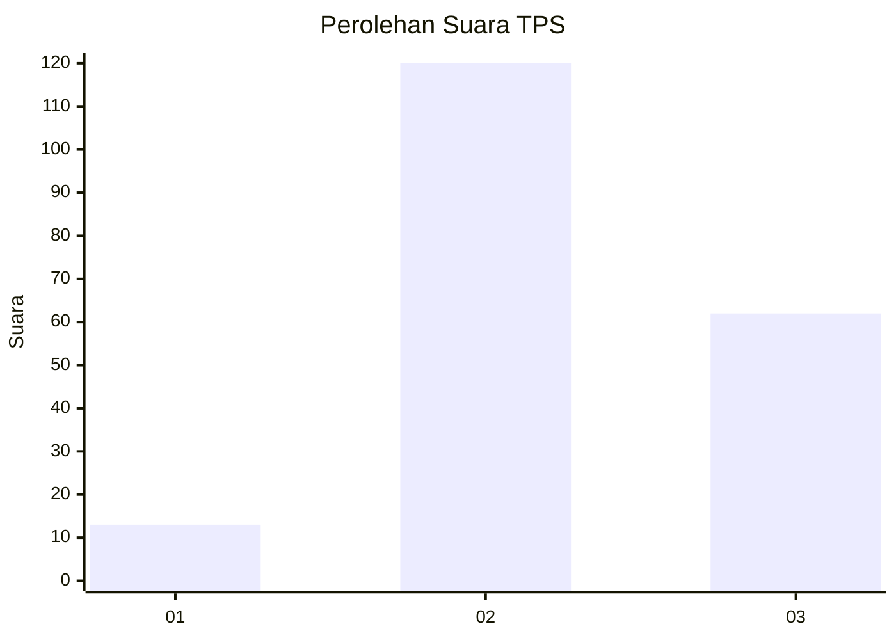
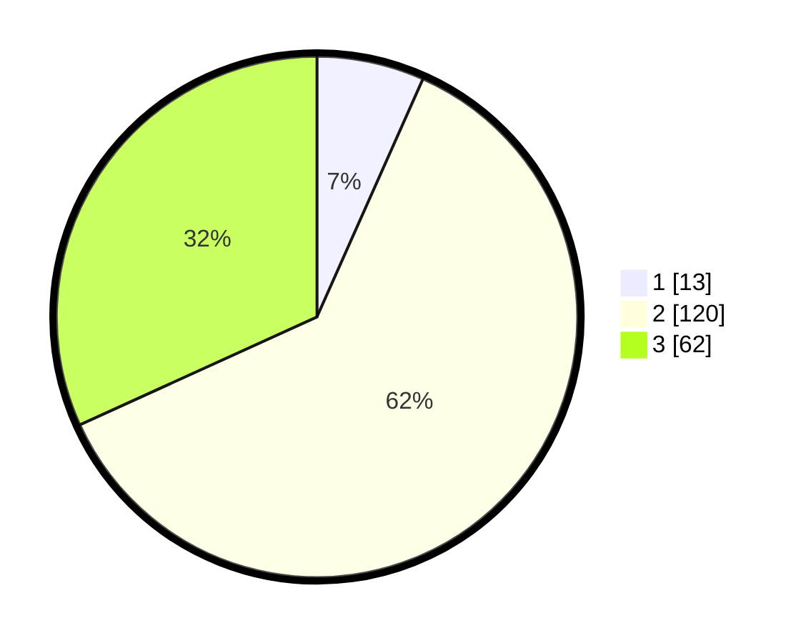

# Hasil

## Grafik

## Tabel

| No. | Nama Paslon    | Suara | Suara (raw) | Persentase |
|:--- |:-------------- | -----:| -----------:| ----------:|
| 1   | ANIES MUHAIMIN | 13    | [13][p-1]   | 6,67       |
| 2   | PRABOWO GIBRAN | 120   | [120][p-2]  | 61,54      |
| 3   | GANJAR MAHFUD  | 62    | [62][p-3]   | 31,79      |

[p-1]: https://github.com/gigit-pemilu/pemilu-2024/blob/main/pilpres/hitung-suara/sub/35-jawa-timur/sub/07-malang/sub/11-kalipare/sub/2005-tumpakrejo/sub/004-tps/sub/paslon-1.txt
[p-2]: https://github.com/gigit-pemilu/pemilu-2024/blob/main/pilpres/hitung-suara/sub/35-jawa-timur/sub/07-malang/sub/11-kalipare/sub/2005-tumpakrejo/sub/004-tps/sub/paslon-2.txt
[p-3]: https://github.com/gigit-pemilu/pemilu-2024/blob/main/pilpres/hitung-suara/sub/35-jawa-timur/sub/07-malang/sub/11-kalipare/sub/2005-tumpakrejo/sub/004-tps/sub/paslon-3.txt

## Foto C Plano

https://sirekap-obj-formc.kpu.go.id/683b/pemilu/ppwp/35/07/11/20/05/3507112005004-20240214-230946--352ca2a6-2dcd-4b93-b55b-13b4882cdabd.jpg

https://sirekap-obj-formc.kpu.go.id/683b/pemilu/ppwp/35/07/11/20/05/3507112005004-20240214-231113--31c9aa90-7ba3-44d4-8b19-0e95c60aa464.jpg

https://sirekap-obj-formc.kpu.go.id/683b/pemilu/ppwp/35/07/11/20/05/3507112005004-20240214-231258--f68d7143-d4e6-491e-a322-8c4c7f9aedd4.jpg

## Metadata

| Key        | Value               |
| ---------- | ------------------- |
| Time Stamp | 2024-02-17 11:30:03 |

