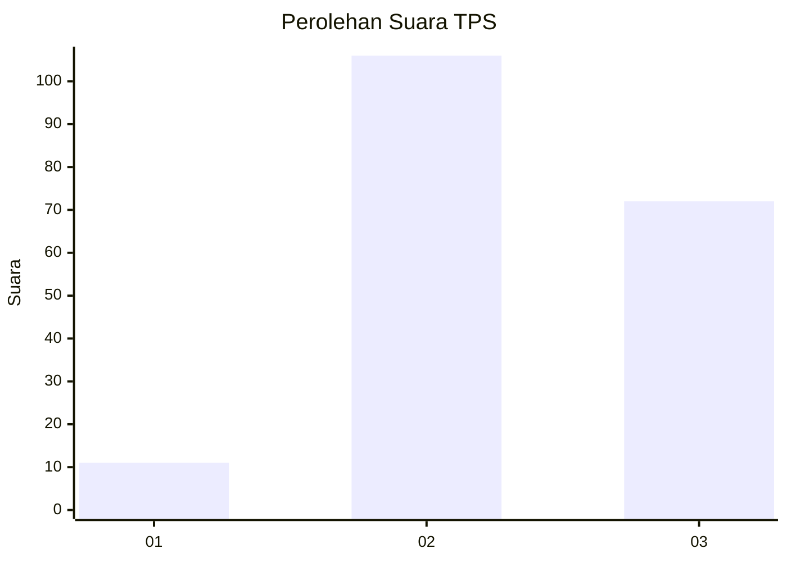
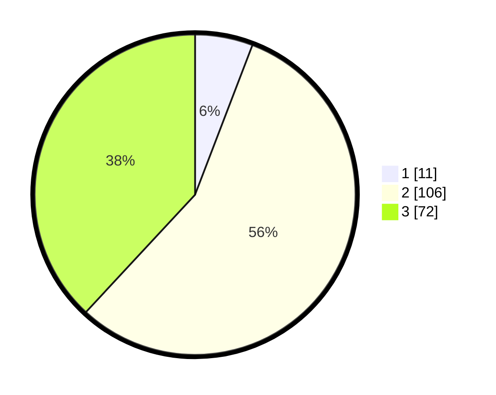

# Hasil

## Grafik

## Tabel

| No. | Nama Paslon    | Suara | Suara (raw) | Persentase |
|:--- |:-------------- | -----:| -----------:| ----------:|
| 1   | ANIES MUHAIMIN | 11    | [11][p-1]   | 5,82       |
| 2   | PRABOWO GIBRAN | 106   | [106][p-2]  | 56,08      |
| 3   | GANJAR MAHFUD  | 72    | [72][p-3]   | 38,10      |

[p-1]: https://github.com/gigit-pemilu/pemilu-2024-35-jawa-timur/blob/main/pilpres/hitung-suara/sub/35-jawa-timur/sub/07-malang/sub/11-kalipare/sub/2005-tumpakrejo/sub/011-tps/sub/paslon-1.txt
[p-2]: https://github.com/gigit-pemilu/pemilu-2024-35-jawa-timur/blob/main/pilpres/hitung-suara/sub/35-jawa-timur/sub/07-malang/sub/11-kalipare/sub/2005-tumpakrejo/sub/011-tps/sub/paslon-2.txt
[p-3]: https://github.com/gigit-pemilu/pemilu-2024-35-jawa-timur/blob/main/pilpres/hitung-suara/sub/35-jawa-timur/sub/07-malang/sub/11-kalipare/sub/2005-tumpakrejo/sub/011-tps/sub/paslon-3.txt

## Foto C Plano

https://sirekap-obj-formc.kpu.go.id/3821/pemilu/ppwp/35/07/11/20/05/3507112005011-20240214-230423--5ba58886-a46a-4acb-8bda-88e7de086656.jpg

https://sirekap-obj-formc.kpu.go.id/3821/pemilu/ppwp/35/07/11/20/05/3507112005011-20240214-230454--7c7bcbbd-2e10-42f7-a0f6-bebf6df8f4da.jpg

https://sirekap-obj-formc.kpu.go.id/3821/pemilu/ppwp/35/07/11/20/05/3507112005011-20240214-230526--cb7f5180-ea47-44a9-bfdd-086522144104.jpg

## Metadata

| Key        | Value               |
| ---------- | ------------------- |
| Time Stamp | 2024-02-17 11:00:02 |

