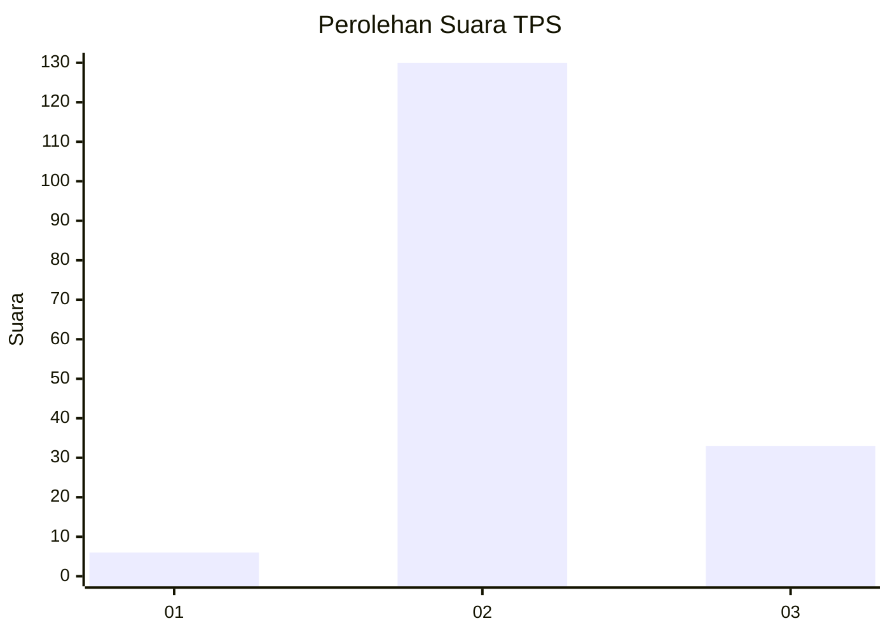

# Hasil

## Grafik

## Tabel

| No. | Nama Paslon    | Suara | Suara (raw) | Persentase |
|:--- |:-------------- | -----:| -----------:| ----------:|
| 1   | ANIES MUHAIMIN | 6     | [6][p-1]    | 3,55       |
| 2   | PRABOWO GIBRAN | 130   | [130][p-2]  | 76,92      |
| 3   | GANJAR MAHFUD  | 33    | [33][p-3]   | 19,53      |

[p-1]: https://github.com/gigit-pemilu/pemilu-2024/blob/main/pilpres/hitung-suara/sub/35-jawa-timur/sub/07-malang/sub/11-kalipare/sub/2006-arjosari/sub/008-tps/sub/paslon-1.txt
[p-2]: https://github.com/gigit-pemilu/pemilu-2024/blob/main/pilpres/hitung-suara/sub/35-jawa-timur/sub/07-malang/sub/11-kalipare/sub/2006-arjosari/sub/008-tps/sub/paslon-2.txt
[p-3]: https://github.com/gigit-pemilu/pemilu-2024/blob/main/pilpres/hitung-suara/sub/35-jawa-timur/sub/07-malang/sub/11-kalipare/sub/2006-arjosari/sub/008-tps/sub/paslon-3.txt

## Foto C Plano

https://sirekap-obj-formc.kpu.go.id/12b1/pemilu/ppwp/35/07/11/20/06/3507112006008-20240214-231456--31ad09c8-1a73-4e7d-a4d9-b87ffd6b7935.jpg

https://sirekap-obj-formc.kpu.go.id/12b1/pemilu/ppwp/35/07/11/20/06/3507112006008-20240214-231640--0808ef83-fc75-4329-a53a-bb0b241df616.jpg

https://sirekap-obj-formc.kpu.go.id/12b1/pemilu/ppwp/35/07/11/20/06/3507112006008-20240214-231842--ab1ef317-308a-4e1b-bdad-7c95980bdc8f.jpg

## Metadata

| Key        | Value               |
| ---------- | ------------------- |
| Time Stamp | 2024-02-17 11:30:03 |

