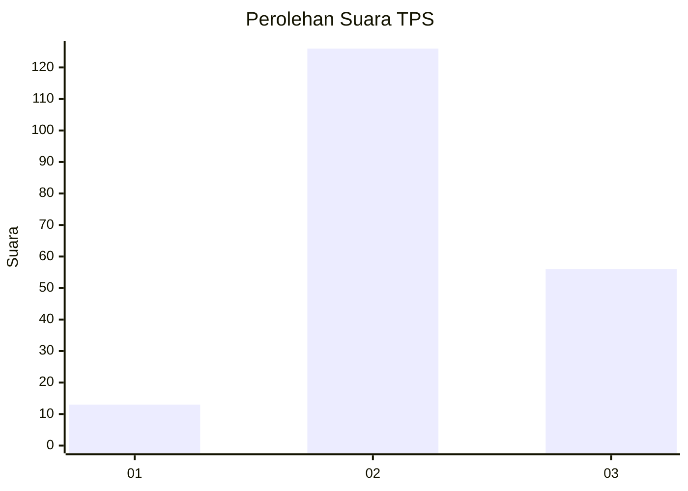
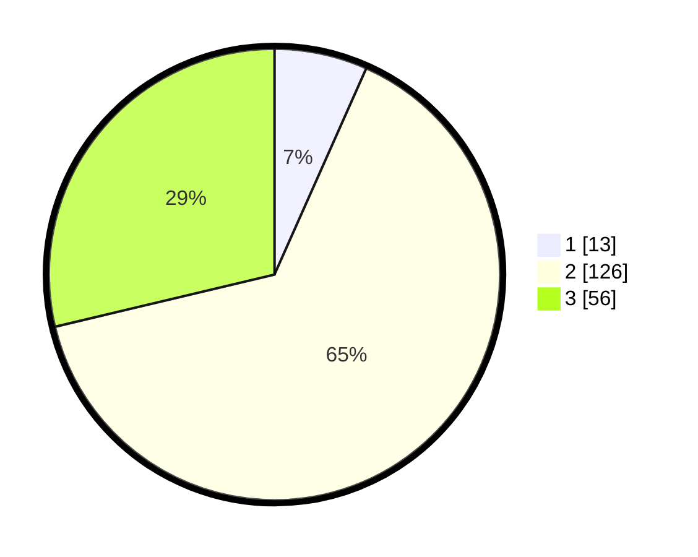

# Hasil

## Grafik

## Tabel

| No. | Nama Paslon    | Suara | Suara (raw) | Persentase |
|:--- |:-------------- | -----:| -----------:| ----------:|
| 1   | ANIES MUHAIMIN | 13    | [13][p-1]   | 6,67       |
| 2   | PRABOWO GIBRAN | 126   | [126][p-2]  | 64,62      |
| 3   | GANJAR MAHFUD  | 56    | [56][p-3]   | 28,72      |

[p-1]: https://github.com/gigit-pemilu/pemilu-2024/blob/main/pilpres/hitung-suara/sub/35-jawa-timur/sub/07-malang/sub/11-kalipare/sub/2006-arjosari/sub/017-tps/sub/paslon-1.txt
[p-2]: https://github.com/gigit-pemilu/pemilu-2024/blob/main/pilpres/hitung-suara/sub/35-jawa-timur/sub/07-malang/sub/11-kalipare/sub/2006-arjosari/sub/017-tps/sub/paslon-2.txt
[p-3]: https://github.com/gigit-pemilu/pemilu-2024/blob/main/pilpres/hitung-suara/sub/35-jawa-timur/sub/07-malang/sub/11-kalipare/sub/2006-arjosari/sub/017-tps/sub/paslon-3.txt

## Foto C Plano

https://sirekap-obj-formc.kpu.go.id/9874/pemilu/ppwp/35/07/11/20/06/3507112006017-20240227-234113--50a1f6cd-4c2b-4b4c-8d55-f6ff3ef27827.jpg

https://sirekap-obj-formc.kpu.go.id/9874/pemilu/ppwp/35/07/11/20/06/3507112006017-20240221-123437--84587343-1feb-4c3d-afe6-4995fc55e9b7.jpg

https://sirekap-obj-formc.kpu.go.id/9874/pemilu/ppwp/35/07/11/20/06/3507112006017-20240221-123648--17df3a3f-0a0c-474b-927e-5d51eeef4567.jpg

## Metadata

| Key        | Value               |
| ---------- | ------------------- |
| Time Stamp | 2024-02-28 00:00:00 |

