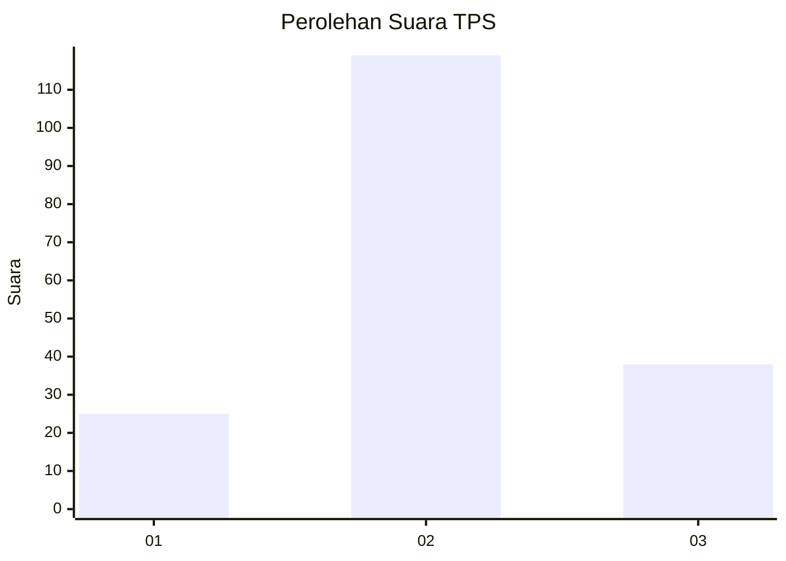
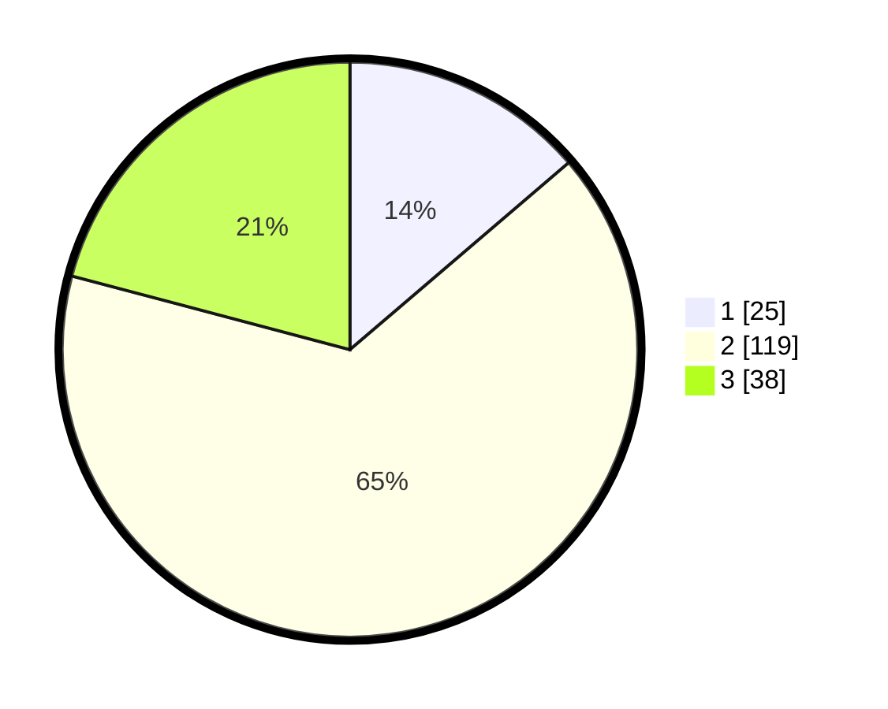

# Hasil

## Grafik

## Tabel

| No. | Nama Paslon    | Suara | Suara (raw) | Persentase |
|:--- |:-------------- | -----:| -----------:| ----------:|
| 1   | ANIES MUHAIMIN | 25    | [25][p-1]   | 13,74      |
| 2   | PRABOWO GIBRAN | 119   | [119][p-2]  | 65,38      |
| 3   | GANJAR MAHFUD  | 38    | [38][p-3]   | 20,88      |

[p-1]: https://github.com/gigit-pemilu/pemilu-2024/blob/main/pilpres/hitung-suara/sub/35-jawa-timur/sub/07-malang/sub/11-kalipare/sub/2006-arjosari/sub/019-tps/sub/paslon-1.txt
[p-2]: https://github.com/gigit-pemilu/pemilu-2024/blob/main/pilpres/hitung-suara/sub/35-jawa-timur/sub/07-malang/sub/11-kalipare/sub/2006-arjosari/sub/019-tps/sub/paslon-2.txt
[p-3]: https://github.com/gigit-pemilu/pemilu-2024/blob/main/pilpres/hitung-suara/sub/35-jawa-timur/sub/07-malang/sub/11-kalipare/sub/2006-arjosari/sub/019-tps/sub/paslon-3.txt

## Foto C Plano

https://sirekap-obj-formc.kpu.go.id/ae43/pemilu/ppwp/35/07/11/20/06/3507112006019-20240214-223230--125457b4-1d83-4776-9c33-363b83f98bf4.jpg

https://sirekap-obj-formc.kpu.go.id/ae43/pemilu/ppwp/35/07/11/20/06/3507112006019-20240214-223343--9dd60077-f4ad-455b-bbd4-5b4459e88224.jpg

https://sirekap-obj-formc.kpu.go.id/ae43/pemilu/ppwp/35/07/11/20/06/3507112006019-20240214-223451--3c527fad-2ecc-417d-880c-2fa9b0964cfb.jpg

## Metadata

| Key        | Value               |
| ---------- | ------------------- |
| Time Stamp | 2024-02-17 11:30:03 |

