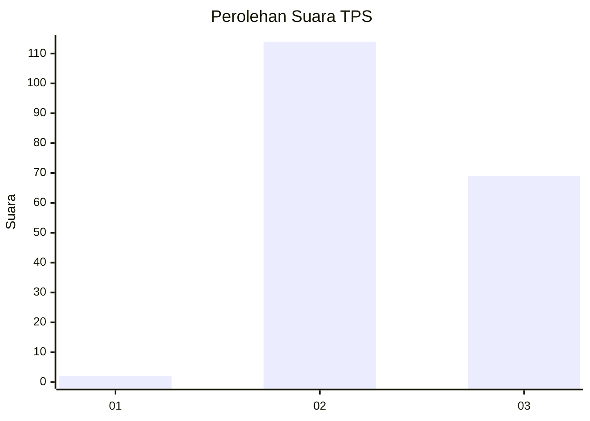
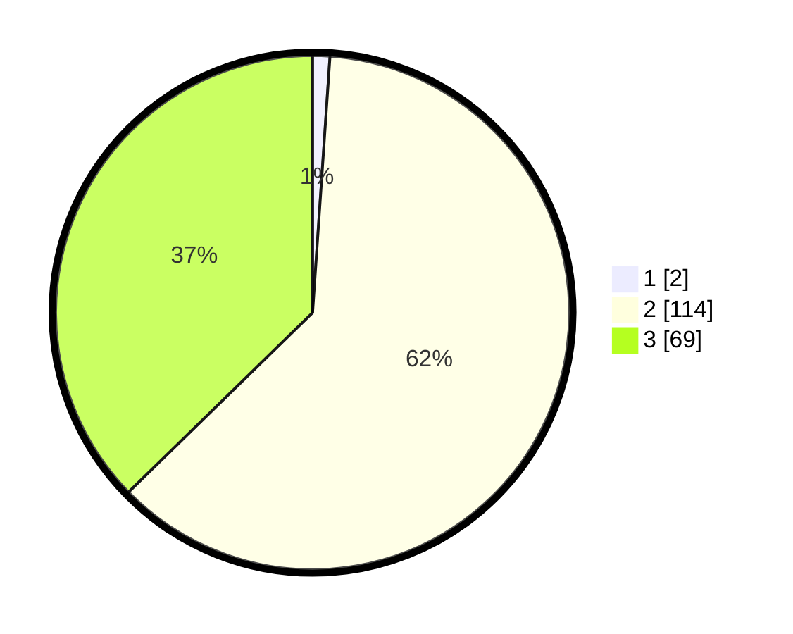

# Hasil

## Grafik

## Tabel

| No. | Nama Paslon    | Suara | Suara (raw) | Persentase |
|:--- |:-------------- | -----:| -----------:| ----------:|
| 1   | ANIES MUHAIMIN | 2     | [2][p-1]    | 1,08       |
| 2   | PRABOWO GIBRAN | 114   | [114][p-2]  | 61,62      |
| 3   | GANJAR MAHFUD  | 69    | [69][p-3]   | 37,30      |

[p-1]: https://github.com/gigit-pemilu/pemilu-2024/blob/main/pilpres/hitung-suara/sub/35-jawa-timur/sub/07-malang/sub/11-kalipare/sub/2007-kalirejo/sub/006-tps/sub/paslon-1.txt
[p-2]: https://github.com/gigit-pemilu/pemilu-2024/blob/main/pilpres/hitung-suara/sub/35-jawa-timur/sub/07-malang/sub/11-kalipare/sub/2007-kalirejo/sub/006-tps/sub/paslon-2.txt
[p-3]: https://github.com/gigit-pemilu/pemilu-2024/blob/main/pilpres/hitung-suara/sub/35-jawa-timur/sub/07-malang/sub/11-kalipare/sub/2007-kalirejo/sub/006-tps/sub/paslon-3.txt

## Foto C Plano

https://sirekap-obj-formc.kpu.go.id/f1b2/pemilu/ppwp/35/07/11/20/07/3507112007006-20240218-011333--9a5af292-6850-4e1f-ae64-810cd648f1a7.jpg

https://sirekap-obj-formc.kpu.go.id/f1b2/pemilu/ppwp/35/07/11/20/07/3507112007006-20240216-174945--7af94c1a-dc6b-4ee2-a918-cbc1960e7118.jpg

https://sirekap-obj-formc.kpu.go.id/f1b2/pemilu/ppwp/35/07/11/20/07/3507112007006-20240217-194455--50795676-ee8c-47ef-b2b2-9b62ae876b01.jpg

## Metadata

| Key        | Value               |
| ---------- | ------------------- |
| Time Stamp | 2024-02-19 06:16:00 |

