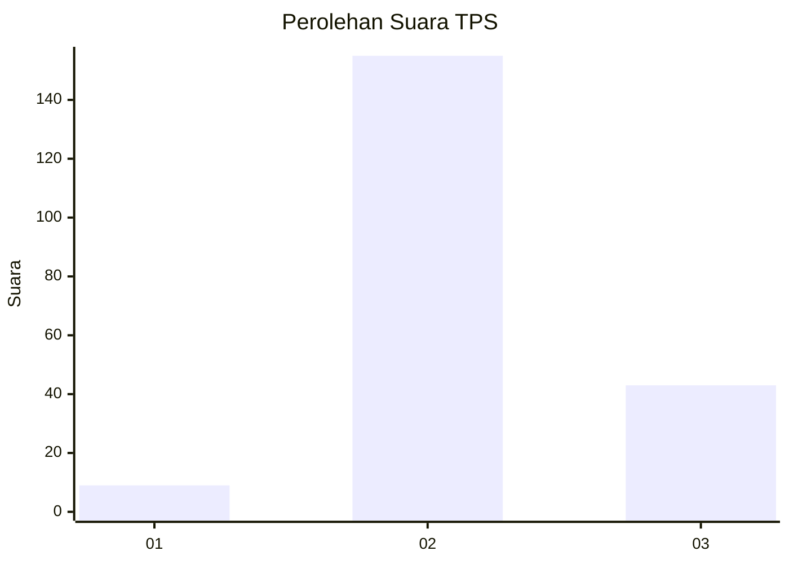

# Hasil

## Grafik

## Tabel

| No. | Nama Paslon    | Suara | Suara (raw) | Persentase |
|:--- |:-------------- | -----:| -----------:| ----------:|
| 1   | ANIES MUHAIMIN | 9     | [9][p-1]    | 4,35       |
| 2   | PRABOWO GIBRAN | 155   | [155][p-2]  | 74,88      |
| 3   | GANJAR MAHFUD  | 43    | [43][p-3]   | 20,77      |

[p-1]: https://github.com/gigit-pemilu/pemilu-2024/blob/main/pilpres/hitung-suara/sub/35-jawa-timur/sub/07-malang/sub/11-kalipare/sub/2007-kalirejo/sub/009-tps/sub/paslon-1.txt
[p-2]: https://github.com/gigit-pemilu/pemilu-2024/blob/main/pilpres/hitung-suara/sub/35-jawa-timur/sub/07-malang/sub/11-kalipare/sub/2007-kalirejo/sub/009-tps/sub/paslon-2.txt
[p-3]: https://github.com/gigit-pemilu/pemilu-2024/blob/main/pilpres/hitung-suara/sub/35-jawa-timur/sub/07-malang/sub/11-kalipare/sub/2007-kalirejo/sub/009-tps/sub/paslon-3.txt

## Foto C Plano

https://sirekap-obj-formc.kpu.go.id/9e56/pemilu/ppwp/35/07/11/20/07/3507112007009-20240217-150046--5cf14ecf-0395-4464-90e4-9e8bbda0d94f.jpg

https://sirekap-obj-formc.kpu.go.id/9e56/pemilu/ppwp/35/07/11/20/07/3507112007009-20240217-144425--24ffacfe-0bb3-4a88-b6b0-1c58808ea560.jpg

https://sirekap-obj-formc.kpu.go.id/9e56/pemilu/ppwp/35/07/11/20/07/3507112007009-20240217-163423--d89e4e9b-3fe6-4f87-86b8-8ab6fad5311b.jpg

## Metadata

| Key        | Value               |
| ---------- | ------------------- |
| Time Stamp | 2024-02-19 06:16:00 |

