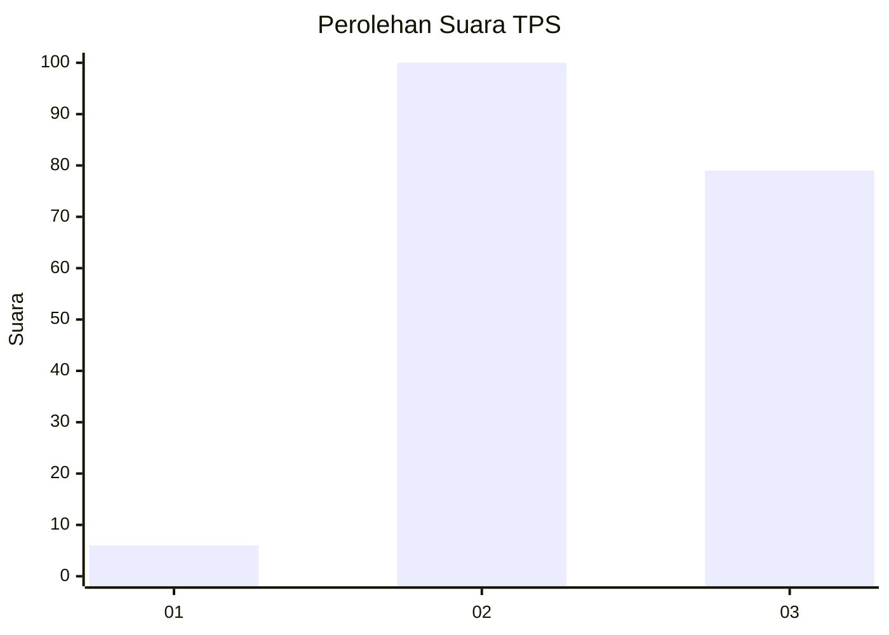
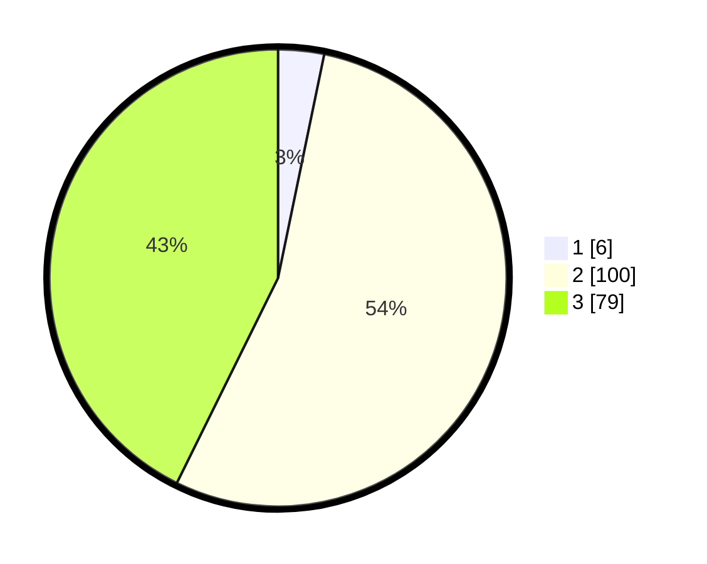

# Hasil

## Grafik

## Tabel

| No. | Nama Paslon    | Suara | Suara (raw) | Persentase |
|:--- |:-------------- | -----:| -----------:| ----------:|
| 1   | ANIES MUHAIMIN | 6     | [6][p-1]    | 3,24       |
| 2   | PRABOWO GIBRAN | 100   | [100][p-2]  | 54,05      |
| 3   | GANJAR MAHFUD  | 79    | [79][p-3]   | 42,70      |

[p-1]: https://github.com/gigit-pemilu/pemilu-2024-35-jawa-timur/blob/main/pilpres/hitung-suara/sub/35-jawa-timur/sub/07-malang/sub/11-kalipare/sub/2009-kaliasri/sub/008-tps/sub/paslon-1.txt
[p-2]: https://github.com/gigit-pemilu/pemilu-2024-35-jawa-timur/blob/main/pilpres/hitung-suara/sub/35-jawa-timur/sub/07-malang/sub/11-kalipare/sub/2009-kaliasri/sub/008-tps/sub/paslon-2.txt
[p-3]: https://github.com/gigit-pemilu/pemilu-2024-35-jawa-timur/blob/main/pilpres/hitung-suara/sub/35-jawa-timur/sub/07-malang/sub/11-kalipare/sub/2009-kaliasri/sub/008-tps/sub/paslon-3.txt

## Foto C Plano

https://sirekap-obj-formc.kpu.go.id/b3fa/pemilu/ppwp/35/07/11/20/09/3507112009008-20240218-143126--d07bebd3-28b3-4ef1-9d46-1a327ad93517.jpg

https://sirekap-obj-formc.kpu.go.id/b3fa/pemilu/ppwp/35/07/11/20/09/3507112009008-20240218-143537--67a238ca-10ea-49ca-bf4e-78efa78e8848.jpg

https://sirekap-obj-formc.kpu.go.id/b3fa/pemilu/ppwp/35/07/11/20/09/3507112009008-20240218-143647--c13a12b7-6734-40a1-850d-d7c2aceeee95.jpg

## Metadata

| Key        | Value               |
| ---------- | ------------------- |
| Time Stamp | 2024-02-25 15:00:00 |

