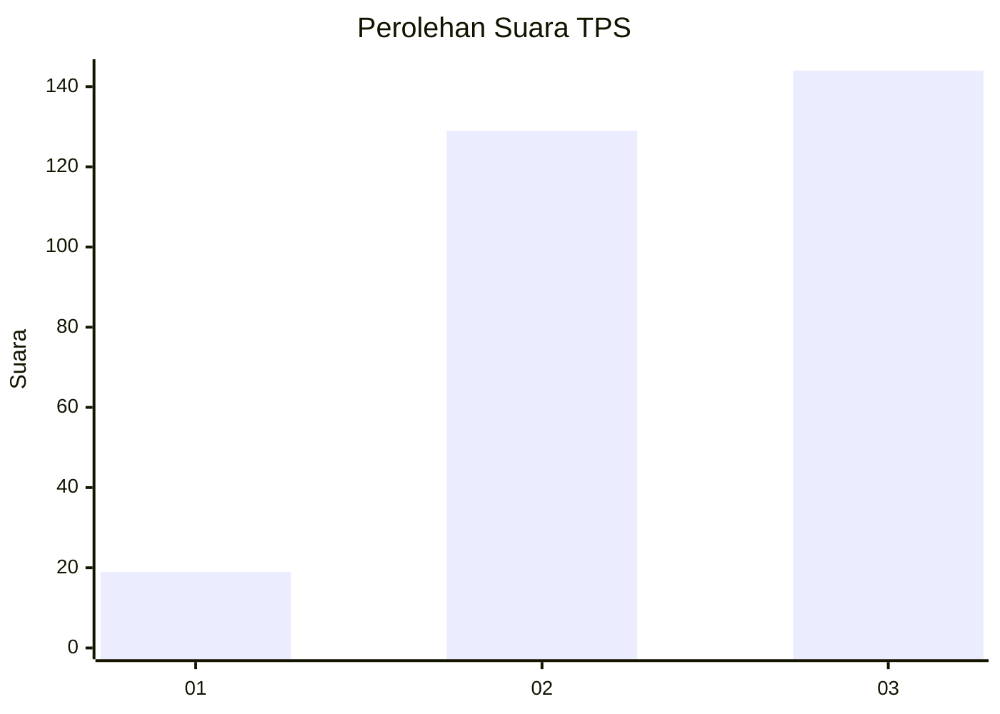
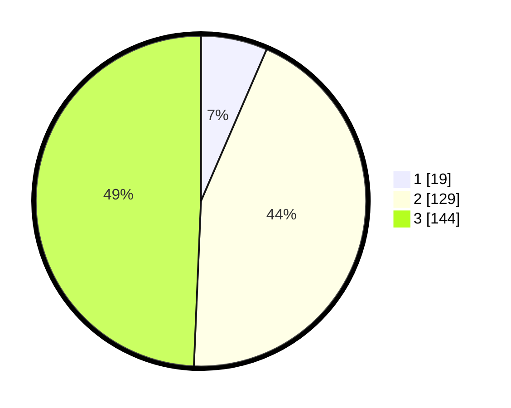

# Hasil

## Grafik

## Tabel

| No. | Nama Paslon    | Suara | Suara (raw) | Persentase |
|:--- |:-------------- | -----:| -----------:| ----------:|
| 1   | ANIES MUHAIMIN | 19    | [19][p-1]   | 6,51       |
| 2   | PRABOWO GIBRAN | 129   | [129][p-2]  | 44,18      |
| 3   | GANJAR MAHFUD  | 144   | [144][p-3]  | 49,32      |

[p-1]: https://github.com/gigit-pemilu/pemilu-2024/blob/main/pilpres/hitung-suara/sub/35-jawa-timur/sub/07-malang/sub/12-sumberpucung/sub/2001-ternyang/sub/001-tps/sub/paslon-1.txt
[p-2]: https://github.com/gigit-pemilu/pemilu-2024/blob/main/pilpres/hitung-suara/sub/35-jawa-timur/sub/07-malang/sub/12-sumberpucung/sub/2001-ternyang/sub/001-tps/sub/paslon-2.txt
[p-3]: https://github.com/gigit-pemilu/pemilu-2024/blob/main/pilpres/hitung-suara/sub/35-jawa-timur/sub/07-malang/sub/12-sumberpucung/sub/2001-ternyang/sub/001-tps/sub/paslon-3.txt

## Foto C Plano

https://sirekap-obj-formc.kpu.go.id/0ec4/pemilu/ppwp/35/07/12/20/01/3507122001001-20240217-220054--e574664e-549c-4d35-9cf5-2e4f5581908e.jpg

https://sirekap-obj-formc.kpu.go.id/0ec4/pemilu/ppwp/35/07/12/20/01/3507122001001-20240217-220056--429bc658-8b90-40a8-a478-a3d407fd18a1.jpg

https://sirekap-obj-formc.kpu.go.id/0ec4/pemilu/ppwp/35/07/12/20/01/3507122001001-20240217-220055--d7be276a-92b2-4b03-9c01-005d9206f677.jpg

## Metadata

| Key        | Value               |
| ---------- | ------------------- |
| Time Stamp | 2024-02-19 06:16:00 |

## DATA PEMILIH TETAP

Jumlah pemilih dalam DPT: **270**.
 * L: **128**.
 * P: **142**.

## DATA PENGGUNA HAK PILIH

Jumlah pengguna hak pilih dalam DPT: **197**.
 * L: **89**.
 * P: **108**.

Jumlah pengguna hak pilih dalam DPTb: **1**.
 * L: **1**.
 * P: **0**.

Jumlah pengguna hak pilih dalam DPK: **2**.
 * L: **1**.
 * P: **1**.

Jumlah pengguna hak pilih: **200**.
 * L: **91**.
 * P: **109**.

## JUMLAH SUARA SAH DAN TIDAK SAH

JUMLAH SELURUH SUARA SAH: **192**.

JUMLAH SUARA TIDAK SAH: **8**.

JUMLAH SELURUH SUARA SAH DAN SUARA TIDAK SAH: **200**.

