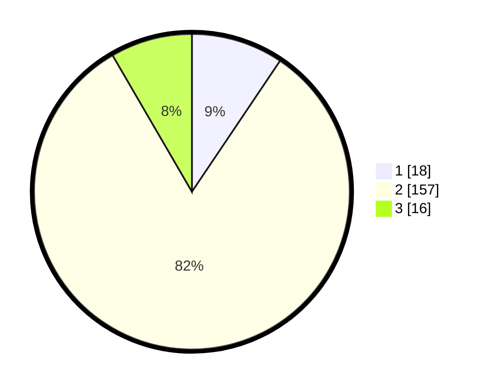

# Hasil

## Grafik

## Tabel

| No. | Nama Paslon    | Suara | Suara (raw) | Persentase |
|:--- |:-------------- | -----:| -----------:| ----------:|
| 1   | ANIES MUHAIMIN | 18    | [18][p-1]   | 9,42       |
| 2   | PRABOWO GIBRAN | 157   | [157][p-2]  | 82,20      |
| 3   | GANJAR MAHFUD  | 16    | [16][p-3]   | 8,38       |

[p-1]: https://github.com/gigit-pemilu/pemilu-2024/blob/main/pilpres/hitung-suara/sub/35-jawa-timur/sub/07-malang/sub/13-kepanjen/sub/2008-panggungrejo/sub/002-tps/sub/paslon-1.txt
[p-2]: https://github.com/gigit-pemilu/pemilu-2024/blob/main/pilpres/hitung-suara/sub/35-jawa-timur/sub/07-malang/sub/13-kepanjen/sub/2008-panggungrejo/sub/002-tps/sub/paslon-2.txt
[p-3]: https://github.com/gigit-pemilu/pemilu-2024/blob/main/pilpres/hitung-suara/sub/35-jawa-timur/sub/07-malang/sub/13-kepanjen/sub/2008-panggungrejo/sub/002-tps/sub/paslon-3.txt

## Foto C Plano

https://sirekap-obj-formc.kpu.go.id/7304/pemilu/ppwp/35/07/13/20/08/3507132008002-20240218-230924--419d01b6-787b-49ac-a132-be0f3eb83457.jpg

https://sirekap-obj-formc.kpu.go.id/7304/pemilu/ppwp/35/07/13/20/08/3507132008002-20240218-230925--2467c0ab-d24c-4136-a203-0c04c4e601e6.jpg

https://sirekap-obj-formc.kpu.go.id/7304/pemilu/ppwp/35/07/13/20/08/3507132008002-20240218-230924--481ed96a-0be1-4347-a737-f8592070090f.jpg

## Metadata

| Key        | Value               |
| ---------- | ------------------- |
| Time Stamp | 2024-02-19 06:16:00 |

## DATA PEMILIH TETAP

Jumlah pemilih dalam DPT: **247**.
 * L: **71**.
 * P: **176**.

## DATA PENGGUNA HAK PILIH

Jumlah pengguna hak pilih dalam DPT: **160**.
 * L: **54**.
 * P: **106**.

Jumlah pengguna hak pilih dalam DPTb: **12**.
 * L: **11**.
 * P: **1**.

Jumlah pengguna hak pilih dalam DPK: **22**.
 * L: **1**.
 * P: **21**.

Jumlah pengguna hak pilih: **194**.
 * L: **66**.
 * P: **128**.

## JUMLAH SUARA SAH DAN TIDAK SAH

JUMLAH SELURUH SUARA SAH: **191**.

JUMLAH SUARA TIDAK SAH: **3**.

JUMLAH SELURUH SUARA SAH DAN SUARA TIDAK SAH: **194**.

