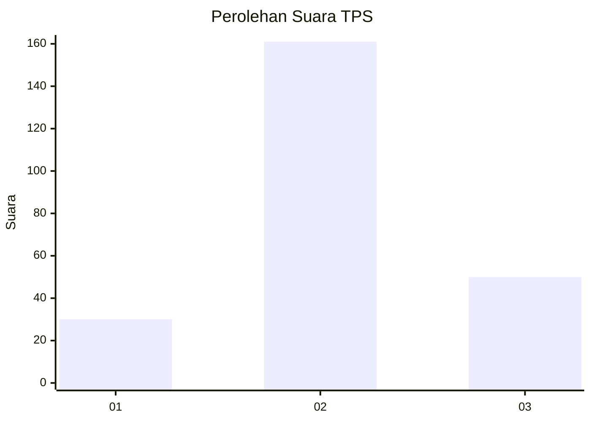
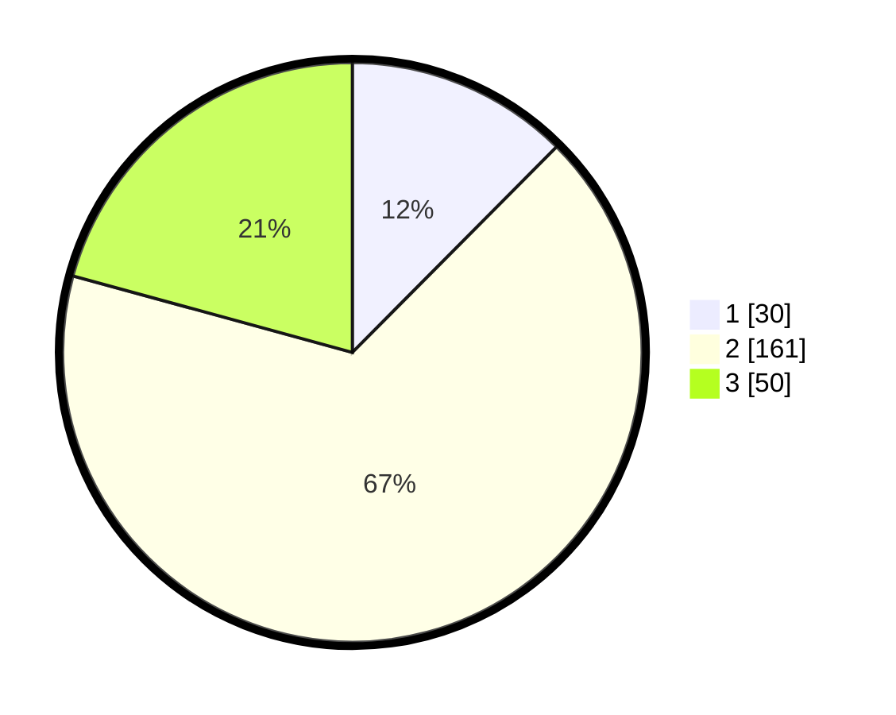

# Hasil

## Grafik

## Tabel

| No. | Nama Paslon    | Suara | Suara (raw) | Persentase |
|:--- |:-------------- | -----:| -----------:| ----------:|
| 1   | ANIES MUHAIMIN | 30    | [30][p-1]   | 12,45      |
| 2   | PRABOWO GIBRAN | 161   | [161][p-2]  | 66,80      |
| 3   | GANJAR MAHFUD  | 50    | [50][p-3]   | 20,75      |

[p-1]: https://github.com/gigit-pemilu/pemilu-2024/blob/main/pilpres/hitung-suara/sub/35-jawa-timur/sub/07-malang/sub/13-kepanjen/sub/2014-sukoraharjo/sub/009-tps/sub/paslon-1.txt
[p-2]: https://github.com/gigit-pemilu/pemilu-2024/blob/main/pilpres/hitung-suara/sub/35-jawa-timur/sub/07-malang/sub/13-kepanjen/sub/2014-sukoraharjo/sub/009-tps/sub/paslon-2.txt
[p-3]: https://github.com/gigit-pemilu/pemilu-2024/blob/main/pilpres/hitung-suara/sub/35-jawa-timur/sub/07-malang/sub/13-kepanjen/sub/2014-sukoraharjo/sub/009-tps/sub/paslon-3.txt

## Foto C Plano

https://sirekap-obj-formc.kpu.go.id/13bf/pemilu/ppwp/35/07/13/20/14/3507132014009-20240216-235053--cb0d766a-7313-4e51-8d48-ec808529975e.jpg

https://sirekap-obj-formc.kpu.go.id/13bf/pemilu/ppwp/35/07/13/20/14/3507132014009-20240217-003803--f410883e-356b-496a-b2ae-779bdd32a41a.jpg

https://sirekap-obj-formc.kpu.go.id/13bf/pemilu/ppwp/35/07/13/20/14/3507132014009-20240217-004120--94bf6ba1-6ebb-4e23-930d-36cb7c853a7c.jpg

## Metadata

| Key        | Value               |
| ---------- | ------------------- |
| Time Stamp | 2024-02-17 01:00:00 |

