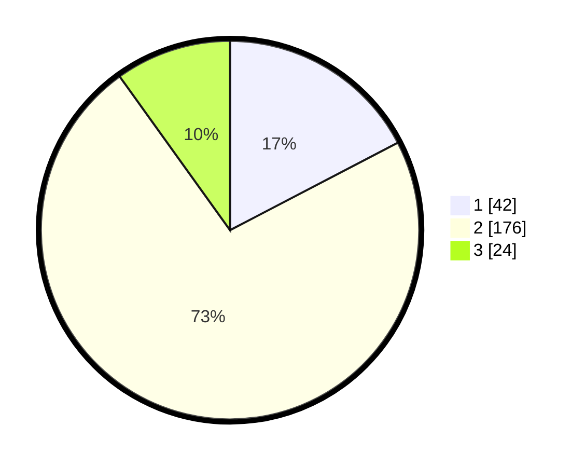

# Hasil

## Grafik

## Tabel

| No. | Nama Paslon    | Suara | Suara (raw) | Persentase |
|:--- |:-------------- | -----:| -----------:| ----------:|
| 1   | ANIES MUHAIMIN | 42    | [42][p-1]   | 17,36      |
| 2   | PRABOWO GIBRAN | 176   | [176][p-2]  | 72,73      |
| 3   | GANJAR MAHFUD  | 24    | [24][p-3]   | 9,92       |

[p-1]: https://github.com/gigit-pemilu/pemilu-2024-35-jawa-timur/blob/main/pilpres/hitung-suara/sub/35-jawa-timur/sub/07-malang/sub/14-bululawang/sub/2003-bakalan/sub/016-tps/sub/paslon-1.txt
[p-2]: https://github.com/gigit-pemilu/pemilu-2024-35-jawa-timur/blob/main/pilpres/hitung-suara/sub/35-jawa-timur/sub/07-malang/sub/14-bululawang/sub/2003-bakalan/sub/016-tps/sub/paslon-2.txt
[p-3]: https://github.com/gigit-pemilu/pemilu-2024-35-jawa-timur/blob/main/pilpres/hitung-suara/sub/35-jawa-timur/sub/07-malang/sub/14-bululawang/sub/2003-bakalan/sub/016-tps/sub/paslon-3.txt

## Foto C Plano

https://sirekap-obj-formc.kpu.go.id/8fe3/pemilu/ppwp/35/07/14/20/03/3507142003016-20240215-030539--5ffa05a6-1d8c-4cca-8c46-07c454e53361.jpg

https://sirekap-obj-formc.kpu.go.id/8fe3/pemilu/ppwp/35/07/14/20/03/3507142003016-20240215-030715--b1d21e00-6d8a-4326-9f65-47d813df76cf.jpg

https://sirekap-obj-formc.kpu.go.id/8fe3/pemilu/ppwp/35/07/14/20/03/3507142003016-20240215-030836--4266ae64-ca82-4d71-a247-6d007ae3b0b4.jpg

## Metadata

| Key        | Value               |
| ---------- | ------------------- |
| Time Stamp | 2024-02-24 22:31:28 |

