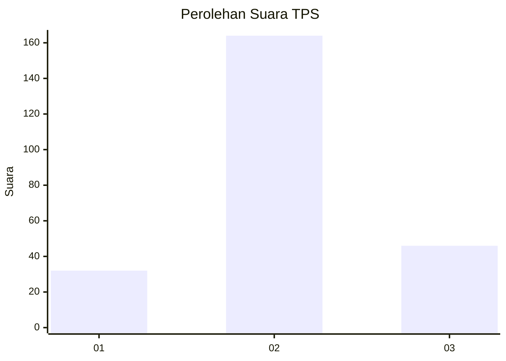
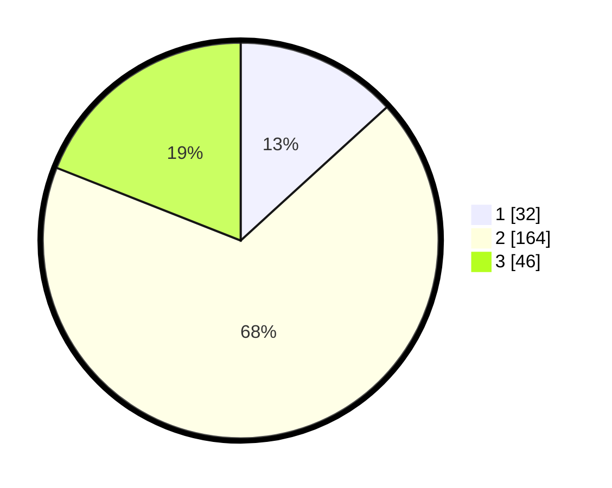

# Hasil

## Grafik

## Tabel

| No. | Nama Paslon    | Suara | Suara (raw) | Persentase |
|:--- |:-------------- | -----:| -----------:| ----------:|
| 1   | ANIES MUHAIMIN | 32    | [32][p-1]   | 13,22      |
| 2   | PRABOWO GIBRAN | 164   | [164][p-2]  | 67,77      |
| 3   | GANJAR MAHFUD  | 46    | [46][p-3]   | 19,01      |

[p-1]: https://github.com/gigit-pemilu/pemilu-2024/blob/main/pilpres/hitung-suara/sub/35-jawa-timur/sub/07-malang/sub/14-bululawang/sub/2006-sukonolo/sub/003-tps/sub/paslon-1.txt
[p-2]: https://github.com/gigit-pemilu/pemilu-2024/blob/main/pilpres/hitung-suara/sub/35-jawa-timur/sub/07-malang/sub/14-bululawang/sub/2006-sukonolo/sub/003-tps/sub/paslon-2.txt
[p-3]: https://github.com/gigit-pemilu/pemilu-2024/blob/main/pilpres/hitung-suara/sub/35-jawa-timur/sub/07-malang/sub/14-bululawang/sub/2006-sukonolo/sub/003-tps/sub/paslon-3.txt

## Foto C Plano

https://sirekap-obj-formc.kpu.go.id/8e86/pemilu/ppwp/35/07/14/20/06/3507142006003-20240214-232050--b0a663a7-b2c6-4aae-97ff-d07d123fa849.jpg

https://sirekap-obj-formc.kpu.go.id/8e86/pemilu/ppwp/35/07/14/20/06/3507142006003-20240214-232145--131777ae-c923-4294-bab6-5f78ae4f9f5b.jpg

https://sirekap-obj-formc.kpu.go.id/8e86/pemilu/ppwp/35/07/14/20/06/3507142006003-20240214-232247--22c51cc1-538b-45ce-82d7-06fae19fda88.jpg

## Metadata

| Key        | Value               |
| ---------- | ------------------- |
| Time Stamp | 2024-02-19 06:16:00 |

