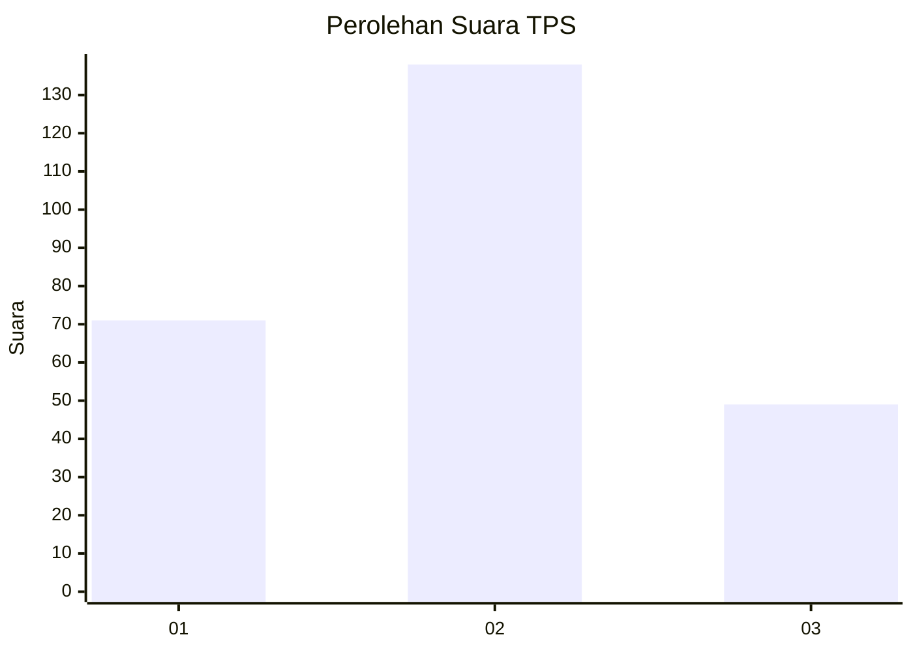
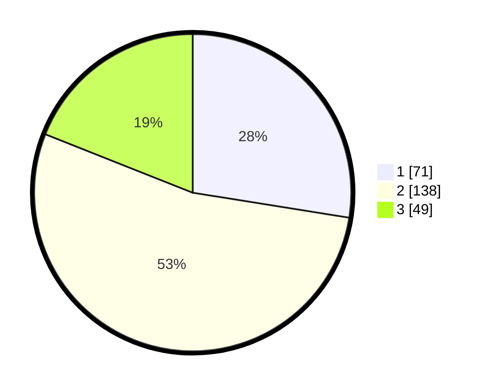

# Hasil

## Grafik

## Tabel

| No. | Nama Paslon    | Suara | Suara (raw) | Persentase |
|:--- |:-------------- | -----:| -----------:| ----------:|
| 1   | ANIES MUHAIMIN | 71    | [71][p-1]   | 27,52      |
| 2   | PRABOWO GIBRAN | 138   | [138][p-2]  | 53,49      |
| 3   | GANJAR MAHFUD  | 49    | [49][p-3]   | 18,99      |

[p-1]: https://github.com/gigit-pemilu/pemilu-2024/blob/main/pilpres/hitung-suara/sub/35-jawa-timur/sub/07-malang/sub/14-bululawang/sub/2012-kuwolu/sub/009-tps/sub/paslon-1.txt
[p-2]: https://github.com/gigit-pemilu/pemilu-2024/blob/main/pilpres/hitung-suara/sub/35-jawa-timur/sub/07-malang/sub/14-bululawang/sub/2012-kuwolu/sub/009-tps/sub/paslon-2.txt
[p-3]: https://github.com/gigit-pemilu/pemilu-2024/blob/main/pilpres/hitung-suara/sub/35-jawa-timur/sub/07-malang/sub/14-bululawang/sub/2012-kuwolu/sub/009-tps/sub/paslon-3.txt

## Foto C Plano

https://sirekap-obj-formc.kpu.go.id/6a09/pemilu/ppwp/35/07/14/20/12/3507142012009-20240219-120034--665abae2-d082-4101-9b0c-08ffbca6092d.jpg

https://sirekap-obj-formc.kpu.go.id/6a09/pemilu/ppwp/35/07/14/20/12/3507142012009-20240219-121143--eb9ce732-dc43-46f1-b31b-d78c5eb6962b.jpg

https://sirekap-obj-formc.kpu.go.id/6a09/pemilu/ppwp/35/07/14/20/12/3507142012009-20240214-193804--73bc6504-6622-4ec7-8b97-50603aafa0ae.jpg

## Metadata

| Key        | Value               |
| ---------- | ------------------- |
| Time Stamp | 2024-02-25 17:00:00 |

