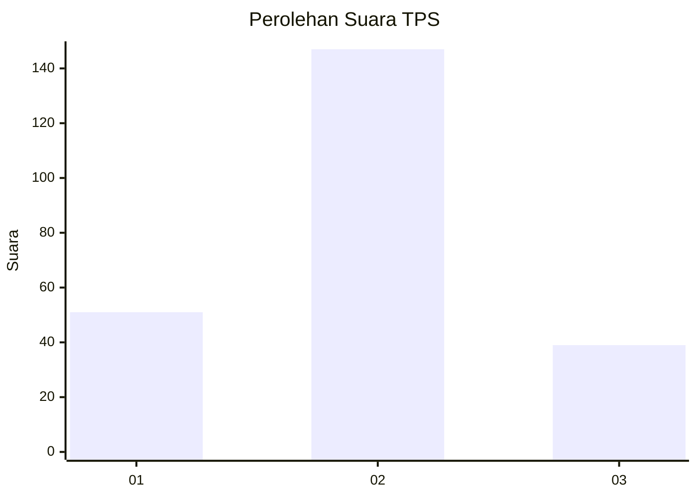

# Hasil

## Grafik

## Tabel

| No. | Nama Paslon    | Suara | Suara (raw) | Persentase |
|:--- |:-------------- | -----:| -----------:| ----------:|
| 1   | ANIES MUHAIMIN | 51    | [51][p-1]   | 21,52      |
| 2   | PRABOWO GIBRAN | 147   | [147][p-2]  | 62,03      |
| 3   | GANJAR MAHFUD  | 39    | [39][p-3]   | 16,46      |

[p-1]: https://github.com/gigit-pemilu/pemilu-2024-35-jawa-timur/blob/main/pilpres/hitung-suara/sub/35-jawa-timur/sub/07-malang/sub/14-bululawang/sub/2012-kuwolu/sub/010-tps/sub/paslon-1.txt
[p-2]: https://github.com/gigit-pemilu/pemilu-2024-35-jawa-timur/blob/main/pilpres/hitung-suara/sub/35-jawa-timur/sub/07-malang/sub/14-bululawang/sub/2012-kuwolu/sub/010-tps/sub/paslon-2.txt
[p-3]: https://github.com/gigit-pemilu/pemilu-2024-35-jawa-timur/blob/main/pilpres/hitung-suara/sub/35-jawa-timur/sub/07-malang/sub/14-bululawang/sub/2012-kuwolu/sub/010-tps/sub/paslon-3.txt

## Foto C Plano

https://sirekap-obj-formc.kpu.go.id/bcf6/pemilu/ppwp/35/07/14/20/12/3507142012010-20240216-154026--9785a644-085d-461d-9564-91b2479fdfde.jpg

https://sirekap-obj-formc.kpu.go.id/bcf6/pemilu/ppwp/35/07/14/20/12/3507142012010-20240216-154029--edb65de5-2055-4926-ae24-e9739521c635.jpg

https://sirekap-obj-formc.kpu.go.id/bcf6/pemilu/ppwp/35/07/14/20/12/3507142012010-20240216-154032--b9e62202-d255-4ac5-8dfb-a09080a66851.jpg

## Metadata

| Key        | Value               |
| ---------- | ------------------- |
| Time Stamp | 2024-02-24 22:31:28 |

