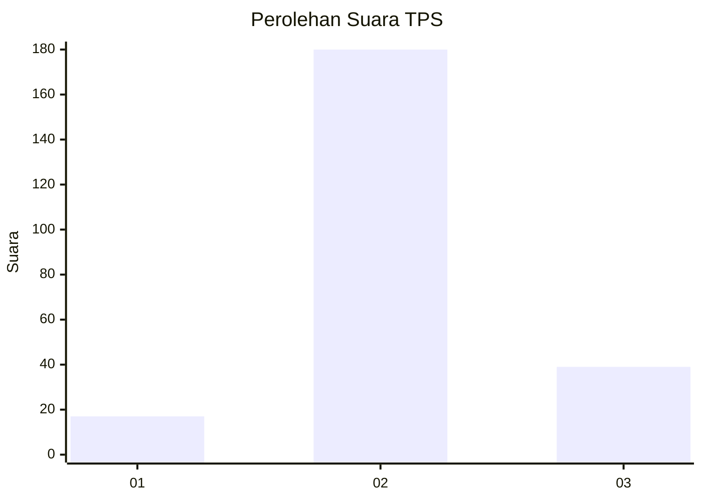
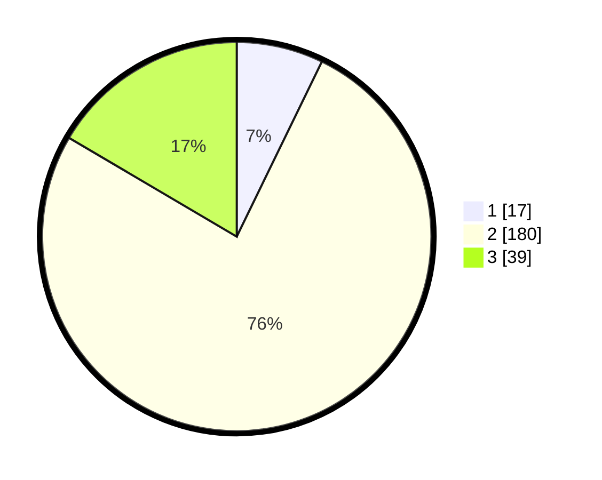

# Hasil

## Grafik

## Tabel

| No. | Nama Paslon    | Suara | Suara (raw) | Persentase |
|:--- |:-------------- | -----:| -----------:| ----------:|
| 1   | ANIES MUHAIMIN | 17    | [17][p-1]   | 7,20       |
| 2   | PRABOWO GIBRAN | 180   | [180][p-2]  | 76,27      |
| 3   | GANJAR MAHFUD  | 39    | [39][p-3]   | 16,53      |

[p-1]: https://github.com/gigit-pemilu/pemilu-2024/blob/main/pilpres/hitung-suara/sub/35-jawa-timur/sub/07-malang/sub/14-bululawang/sub/2014-pringu/sub/008-tps/sub/paslon-1.txt
[p-2]: https://github.com/gigit-pemilu/pemilu-2024/blob/main/pilpres/hitung-suara/sub/35-jawa-timur/sub/07-malang/sub/14-bululawang/sub/2014-pringu/sub/008-tps/sub/paslon-2.txt
[p-3]: https://github.com/gigit-pemilu/pemilu-2024/blob/main/pilpres/hitung-suara/sub/35-jawa-timur/sub/07-malang/sub/14-bululawang/sub/2014-pringu/sub/008-tps/sub/paslon-3.txt

## Foto C Plano

https://sirekap-obj-formc.kpu.go.id/47d5/pemilu/ppwp/35/07/14/20/14/3507142014008-20240218-200145--758ad2db-3acf-4ac9-96a7-2be9444204ef.jpg

https://sirekap-obj-formc.kpu.go.id/47d5/pemilu/ppwp/35/07/14/20/14/3507142014008-20240218-195943--2feede67-30c6-4f17-9af9-8b3caba0f1ad.jpg

https://sirekap-obj-formc.kpu.go.id/47d5/pemilu/ppwp/35/07/14/20/14/3507142014008-20240218-200239--090186b2-a09a-48c2-8c59-5fb91ad2b57e.jpg

## Metadata

| Key        | Value               |
| ---------- | ------------------- |
| Time Stamp | 2024-02-24 22:31:28 |

