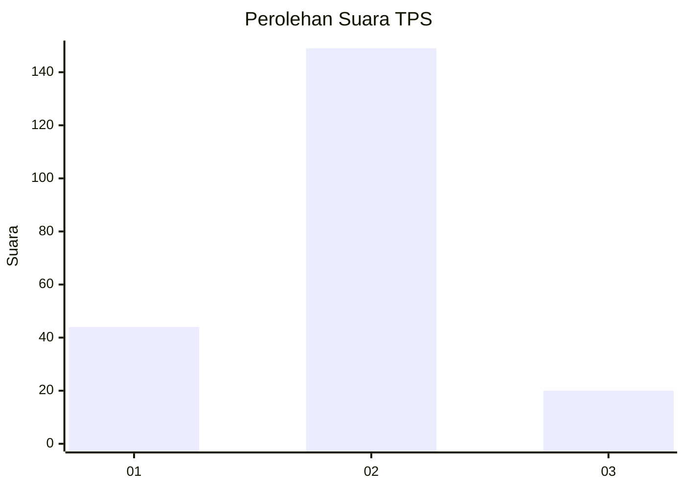

# Hasil

## Grafik

## Tabel

| No. | Nama Paslon    | Suara | Suara (raw) | Persentase |
|:--- |:-------------- | -----:| -----------:| ----------:|
| 1   | ANIES MUHAIMIN | 44    | [44][p-1]   | 20,66      |
| 2   | PRABOWO GIBRAN | 149   | [149][p-2]  | 69,95      |
| 3   | GANJAR MAHFUD  | 20    | [20][p-3]   | 9,39       |

[p-1]: https://github.com/gigit-pemilu/pemilu-2024/blob/main/pilpres/hitung-suara/sub/35-jawa-timur/sub/07-malang/sub/15-tajinan/sub/2011-sumbersuko/sub/018-tps/sub/paslon-1.txt
[p-2]: https://github.com/gigit-pemilu/pemilu-2024/blob/main/pilpres/hitung-suara/sub/35-jawa-timur/sub/07-malang/sub/15-tajinan/sub/2011-sumbersuko/sub/018-tps/sub/paslon-2.txt
[p-3]: https://github.com/gigit-pemilu/pemilu-2024/blob/main/pilpres/hitung-suara/sub/35-jawa-timur/sub/07-malang/sub/15-tajinan/sub/2011-sumbersuko/sub/018-tps/sub/paslon-3.txt

## Foto C Plano

https://sirekap-obj-formc.kpu.go.id/9720/pemilu/ppwp/35/07/15/20/11/3507152011018-20240227-184523--d2bc0a4b-6c3b-4f38-bbc6-547e6013a9bd.jpg

https://sirekap-obj-formc.kpu.go.id/9720/pemilu/ppwp/35/07/15/20/11/3507152011018-20240217-221652--26c68490-a8d8-49c9-a910-d0ea092d605c.jpg

https://sirekap-obj-formc.kpu.go.id/9720/pemilu/ppwp/35/07/15/20/11/3507152011018-20240217-222138--c2547996-bad4-4ffc-8d85-707e9374fdba.jpg

## Metadata

| Key        | Value               |
| ---------- | ------------------- |
| Time Stamp | 2024-02-27 19:00:00 |

