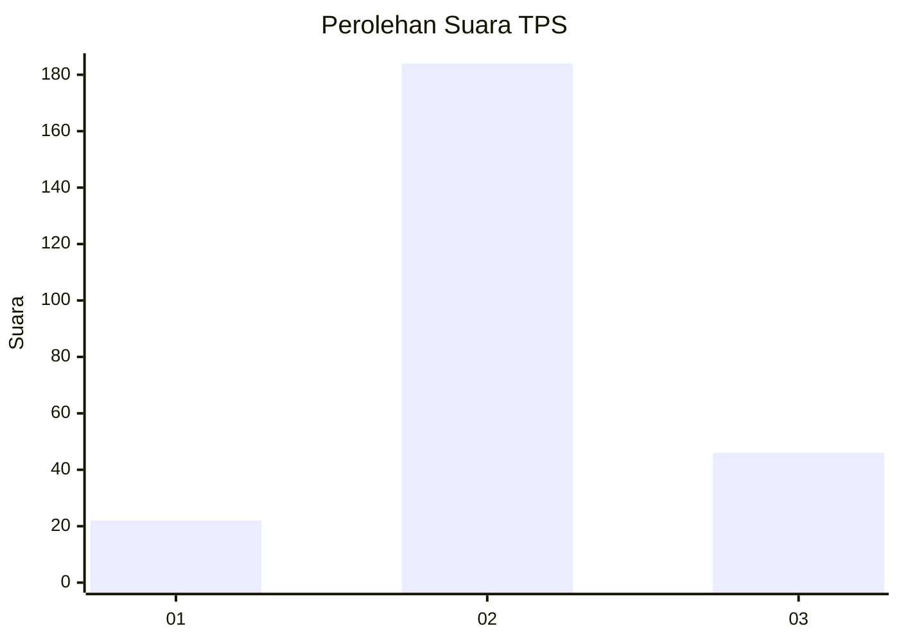
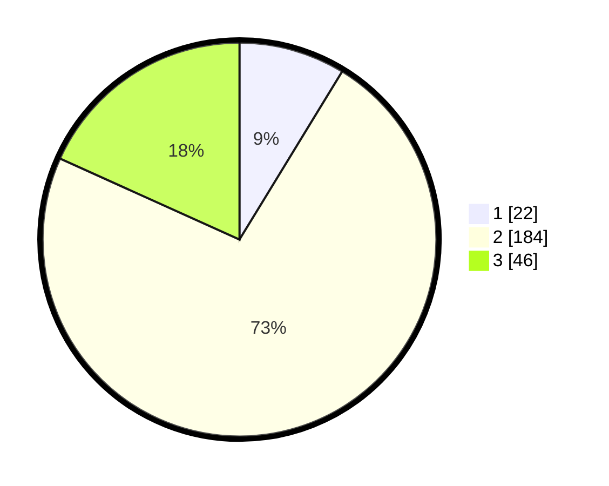

# Hasil

## Grafik

## Tabel

| No. | Nama Paslon    | Suara | Suara (raw) | Persentase |
|:--- |:-------------- | -----:| -----------:| ----------:|
| 1   | ANIES MUHAIMIN | 22    | [22][p-1]   | 8,73       |
| 2   | PRABOWO GIBRAN | 184   | [184][p-2]  | 73,02      |
| 3   | GANJAR MAHFUD  | 46    | [46][p-3]   | 18,25      |

[p-1]: https://github.com/gigit-pemilu/pemilu-2024/blob/main/pilpres/hitung-suara/sub/35-jawa-timur/sub/07-malang/sub/16-tumpang/sub/2001-ngingit/sub/005-tps/sub/paslon-1.txt
[p-2]: https://github.com/gigit-pemilu/pemilu-2024/blob/main/pilpres/hitung-suara/sub/35-jawa-timur/sub/07-malang/sub/16-tumpang/sub/2001-ngingit/sub/005-tps/sub/paslon-2.txt
[p-3]: https://github.com/gigit-pemilu/pemilu-2024/blob/main/pilpres/hitung-suara/sub/35-jawa-timur/sub/07-malang/sub/16-tumpang/sub/2001-ngingit/sub/005-tps/sub/paslon-3.txt

## Foto C Plano

https://sirekap-obj-formc.kpu.go.id/4f8e/pemilu/ppwp/35/07/16/20/01/3507162001005-20240215-224352--90c22716-425d-4620-af1f-d39a0cc2edbc.jpg

https://sirekap-obj-formc.kpu.go.id/4f8e/pemilu/ppwp/35/07/16/20/01/3507162001005-20240215-224355--1ebe947a-fc59-439f-84d3-8213a0aef0f0.jpg

https://sirekap-obj-formc.kpu.go.id/4f8e/pemilu/ppwp/35/07/16/20/01/3507162001005-20240215-224354--33115c1d-21bd-47ec-a34c-c43bf7f3b466.jpg

## Metadata

| Key        | Value               |
| ---------- | ------------------- |
| Time Stamp | 2024-02-17 02:00:02 |

## DATA PEMILIH TETAP

Jumlah pemilih dalam DPT: **285**.
 * L: **144**.
 * P: **141**.

## DATA PENGGUNA HAK PILIH

Jumlah pengguna hak pilih dalam DPT: **261**.
 * L: **132**.
 * P: **129**.

Jumlah pengguna hak pilih dalam DPTb: **0**.
 * L: **0**.
 * P: **0**.

Jumlah pengguna hak pilih dalam DPK: **0**.
 * L: **0**.
 * P: **0**.

Jumlah pengguna hak pilih: **261**.
 * L: **132**.
 * P: **129**.

## JUMLAH SUARA SAH DAN TIDAK SAH

JUMLAH SELURUH SUARA SAH: **252**.

JUMLAH SUARA TIDAK SAH: **9**.

JUMLAH SELURUH SUARA SAH DAN SUARA TIDAK SAH: **261**.

