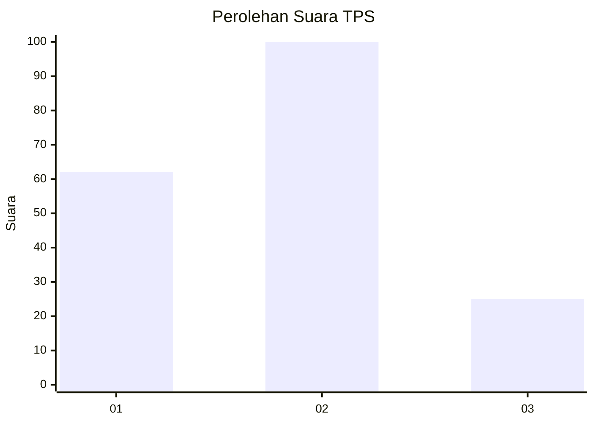
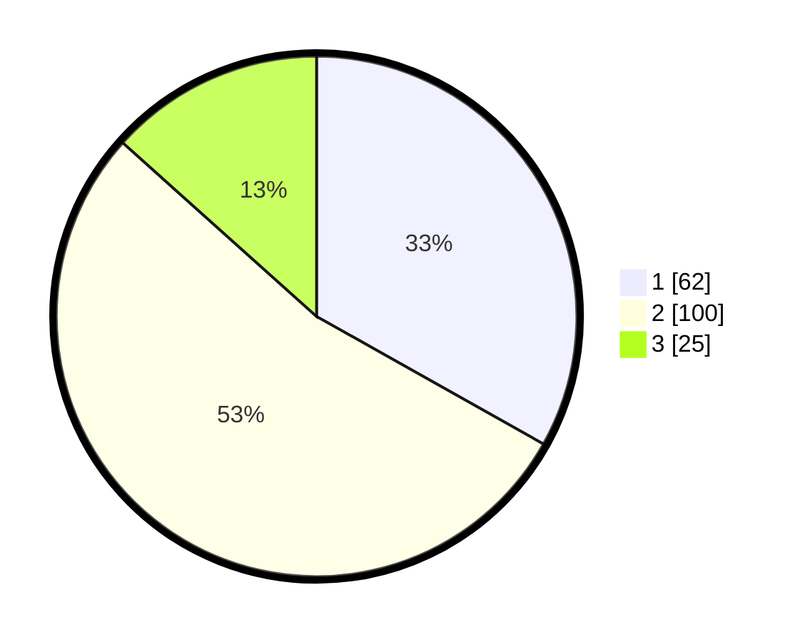

# Hasil

## Grafik

## Tabel

| No. | Nama Paslon    | Suara | Suara (raw) | Persentase |
|:--- |:-------------- | -----:| -----------:| ----------:|
| 1   | ANIES MUHAIMIN | 62    | [62][p-1]   | 33,16      |
| 2   | PRABOWO GIBRAN | 100   | [100][p-2]  | 53,48      |
| 3   | GANJAR MAHFUD  | 25    | [25][p-3]   | 13,37      |

[p-1]: https://github.com/gigit-pemilu/pemilu-2024/blob/main/pilpres/hitung-suara/sub/35-jawa-timur/sub/07-malang/sub/16-tumpang/sub/2003-kambingan/sub/008-tps/sub/paslon-1.txt
[p-2]: https://github.com/gigit-pemilu/pemilu-2024/blob/main/pilpres/hitung-suara/sub/35-jawa-timur/sub/07-malang/sub/16-tumpang/sub/2003-kambingan/sub/008-tps/sub/paslon-2.txt
[p-3]: https://github.com/gigit-pemilu/pemilu-2024/blob/main/pilpres/hitung-suara/sub/35-jawa-timur/sub/07-malang/sub/16-tumpang/sub/2003-kambingan/sub/008-tps/sub/paslon-3.txt

## Foto C Plano

https://sirekap-obj-formc.kpu.go.id/3a48/pemilu/ppwp/35/07/16/20/03/3507162003008-20240214-141338--695f4da8-f08d-459c-923e-01901c7ed713.jpg

https://sirekap-obj-formc.kpu.go.id/3a48/pemilu/ppwp/35/07/16/20/03/3507162003008-20240214-141446--a83f8d1c-9f03-4894-89dc-4170171e0596.jpg

https://sirekap-obj-formc.kpu.go.id/3a48/pemilu/ppwp/35/07/16/20/03/3507162003008-20240214-141622--84c71396-2e78-4d01-8ff0-a29a8e8780e8.jpg

## Metadata

| Key        | Value               |
| ---------- | ------------------- |
| Time Stamp | 2024-02-14 21:46:01 |

