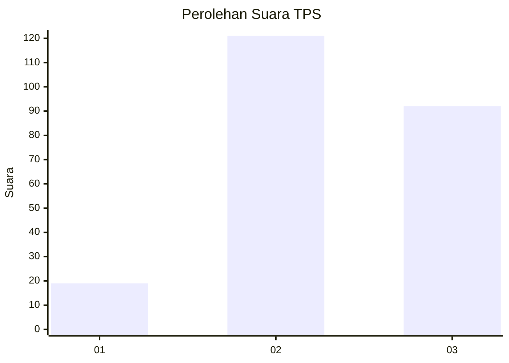
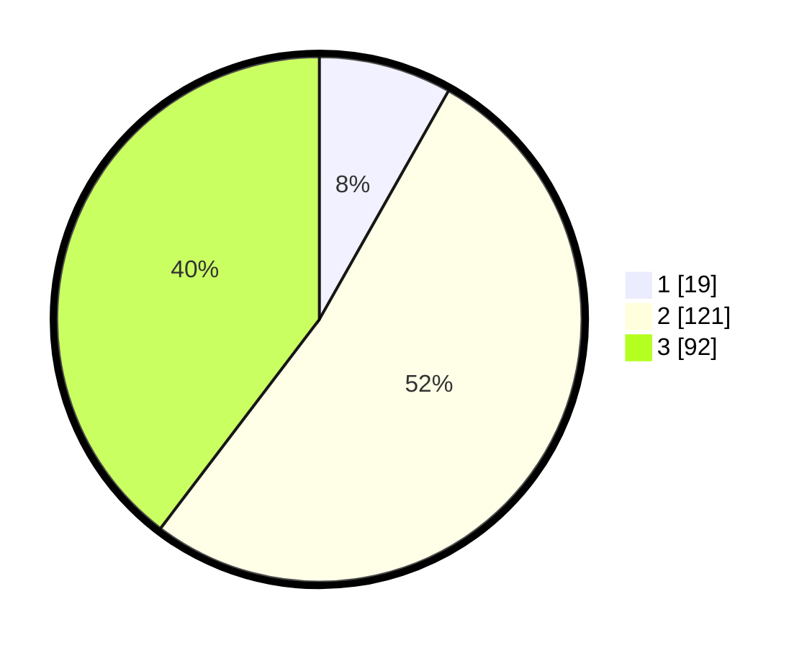

# Hasil

## Grafik

## Tabel

| No. | Nama Paslon    | Suara | Suara (raw) | Persentase |
|:--- |:-------------- | -----:| -----------:| ----------:|
| 1   | ANIES MUHAIMIN | 19    | [19][p-1]   | 8,19       |
| 2   | PRABOWO GIBRAN | 121   | [121][p-2]  | 52,16      |
| 3   | GANJAR MAHFUD  | 92    | [92][p-3]   | 39,66      |

[p-1]: https://github.com/gigit-pemilu/pemilu-2024-35-jawa-timur/blob/main/pilpres/hitung-suara/sub/35-jawa-timur/sub/07-malang/sub/16-tumpang/sub/2004-pandanajeng/sub/006-tps/sub/paslon-1.txt
[p-2]: https://github.com/gigit-pemilu/pemilu-2024-35-jawa-timur/blob/main/pilpres/hitung-suara/sub/35-jawa-timur/sub/07-malang/sub/16-tumpang/sub/2004-pandanajeng/sub/006-tps/sub/paslon-2.txt
[p-3]: https://github.com/gigit-pemilu/pemilu-2024-35-jawa-timur/blob/main/pilpres/hitung-suara/sub/35-jawa-timur/sub/07-malang/sub/16-tumpang/sub/2004-pandanajeng/sub/006-tps/sub/paslon-3.txt

## Foto C Plano

https://sirekap-obj-formc.kpu.go.id/dade/pemilu/ppwp/35/07/16/20/04/3507162004006-20240217-122119--64af06e5-9684-425b-9a19-b3a3eab38556.jpg

https://sirekap-obj-formc.kpu.go.id/dade/pemilu/ppwp/35/07/16/20/04/3507162004006-20240217-122609--c3eb5f6a-3106-4d10-b929-7bd75d35e43b.jpg

https://sirekap-obj-formc.kpu.go.id/dade/pemilu/ppwp/35/07/16/20/04/3507162004006-20240217-124532--159c0599-049d-4987-ae9f-4608ce2cc0ee.jpg

## Metadata

| Key        | Value               |
| ---------- | ------------------- |
| Time Stamp | 2024-02-17 13:37:34 |

