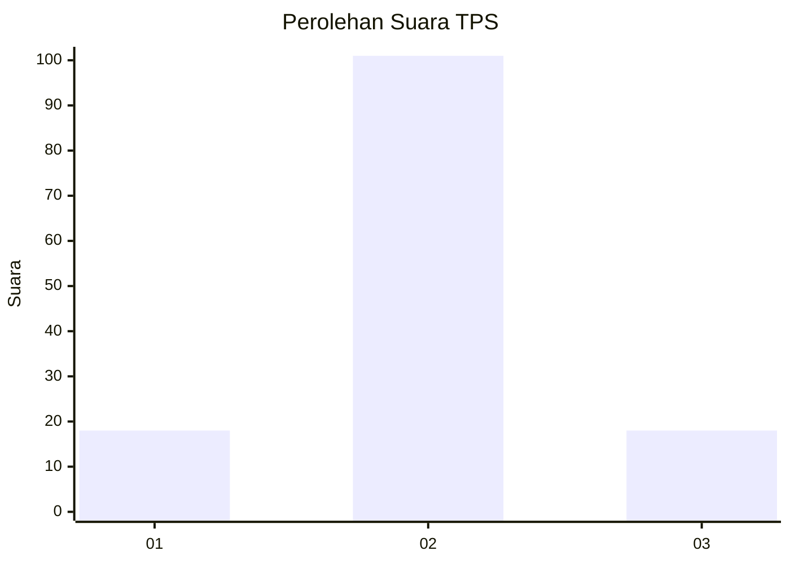
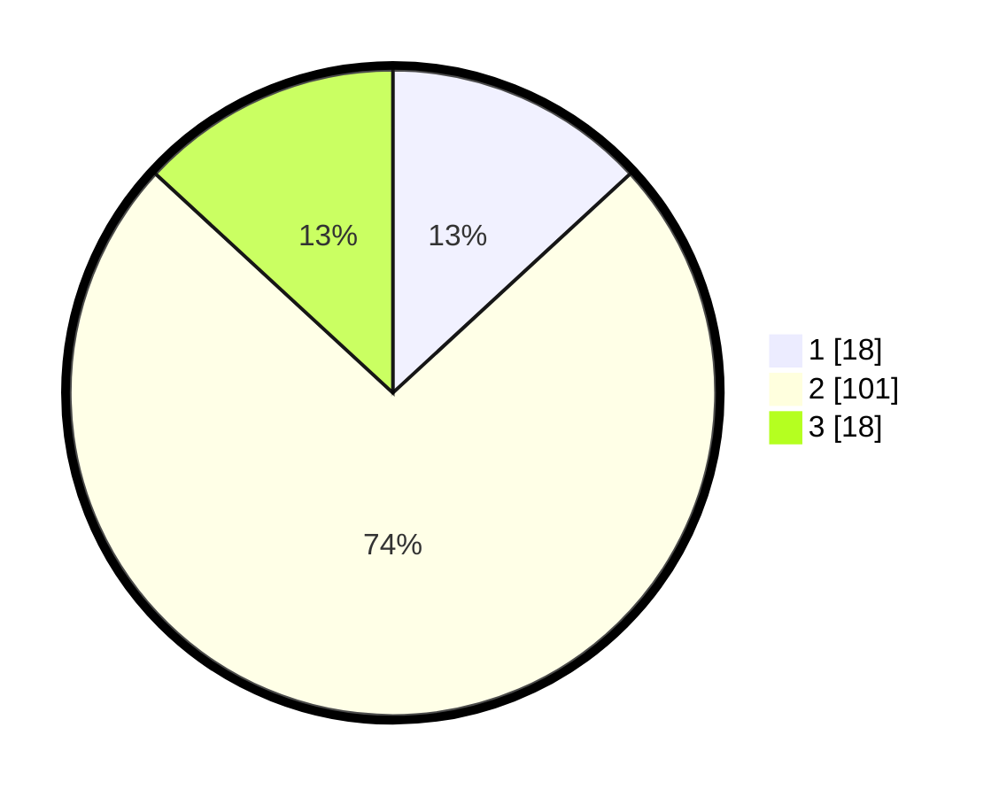

# Hasil

## Grafik

## Tabel

| No. | Nama Paslon    | Suara | Suara (raw) | Persentase |
|:--- |:-------------- | -----:| -----------:| ----------:|
| 1   | ANIES MUHAIMIN | 18    | [18][p-1]   | 13,14      |
| 2   | PRABOWO GIBRAN | 101   | [101][p-2]  | 73,72      |
| 3   | GANJAR MAHFUD  | 18    | [18][p-3]   | 13,14      |

[p-1]: https://github.com/gigit-pemilu/pemilu-2024-35-jawa-timur/blob/main/pilpres/hitung-suara/sub/35-jawa-timur/sub/07-malang/sub/17-jabung/sub/2001-taji/sub/002-tps/sub/paslon-1.txt
[p-2]: https://github.com/gigit-pemilu/pemilu-2024-35-jawa-timur/blob/main/pilpres/hitung-suara/sub/35-jawa-timur/sub/07-malang/sub/17-jabung/sub/2001-taji/sub/002-tps/sub/paslon-2.txt
[p-3]: https://github.com/gigit-pemilu/pemilu-2024-35-jawa-timur/blob/main/pilpres/hitung-suara/sub/35-jawa-timur/sub/07-malang/sub/17-jabung/sub/2001-taji/sub/002-tps/sub/paslon-3.txt

## Foto C Plano

https://sirekap-obj-formc.kpu.go.id/e72b/pemilu/ppwp/35/07/17/20/01/3507172001002-20240216-175803--d891a1a4-c28b-47dc-a583-1d2217f37bee.jpg

https://sirekap-obj-formc.kpu.go.id/e72b/pemilu/ppwp/35/07/17/20/01/3507172001002-20240216-175805--c2c76982-3f74-4dac-8483-5f1f4e9867a4.jpg

https://sirekap-obj-formc.kpu.go.id/e72b/pemilu/ppwp/35/07/17/20/01/3507172001002-20240216-175804--64b826ae-f268-43b9-82b1-73c82f5cbb90.jpg

## Metadata

| Key        | Value               |
| ---------- | ------------------- |
| Time Stamp | 2024-02-17 16:00:02 |

## DATA PEMILIH TETAP

Jumlah pemilih dalam DPT: **144**.
 * L: **70**.
 * P: **74**.

## DATA PENGGUNA HAK PILIH

Jumlah pengguna hak pilih dalam DPT: **137**.
 * L: **65**.
 * P: **72**.

Jumlah pengguna hak pilih dalam DPTb: **0**.
 * L: **0**.
 * P: **0**.

Jumlah pengguna hak pilih dalam DPK: **2**.
 * L: **2**.
 * P: **0**.

Jumlah pengguna hak pilih: **139**.
 * L: **67**.
 * P: **72**.

## JUMLAH SUARA SAH DAN TIDAK SAH

JUMLAH SELURUH SUARA SAH: **137**.

JUMLAH SUARA TIDAK SAH: **2**.

JUMLAH SELURUH SUARA SAH DAN SUARA TIDAK SAH: **139**.

