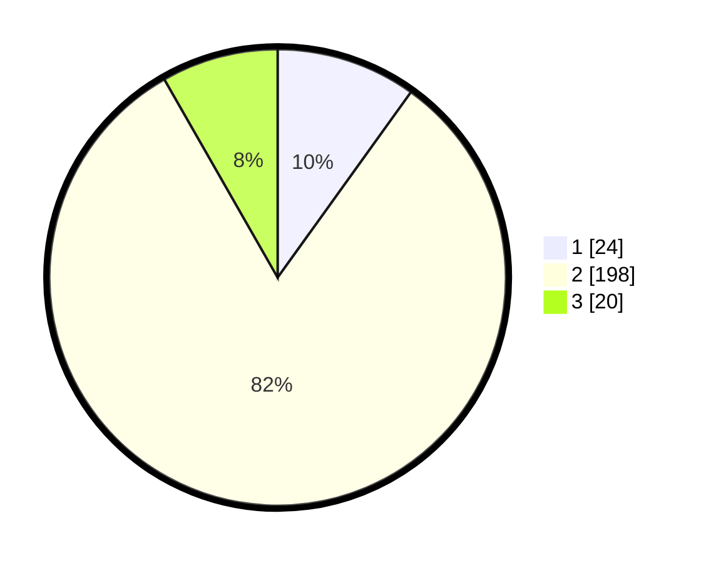

# Hasil

## Grafik

## Tabel

| No. | Nama Paslon    | Suara | Suara (raw) | Persentase |
|:--- |:-------------- | -----:| -----------:| ----------:|
| 1   | ANIES MUHAIMIN | 24    | [24][p-1]   | 9,92       |
| 2   | PRABOWO GIBRAN | 198   | [198][p-2]  | 81,82      |
| 3   | GANJAR MAHFUD  | 20    | [20][p-3]   | 8,26       |

[p-1]: https://github.com/gigit-pemilu/pemilu-2024/blob/main/pilpres/hitung-suara/sub/35-jawa-timur/sub/07-malang/sub/17-jabung/sub/2002-ngadirejo/sub/001-tps/sub/paslon-1.txt
[p-2]: https://github.com/gigit-pemilu/pemilu-2024/blob/main/pilpres/hitung-suara/sub/35-jawa-timur/sub/07-malang/sub/17-jabung/sub/2002-ngadirejo/sub/001-tps/sub/paslon-2.txt
[p-3]: https://github.com/gigit-pemilu/pemilu-2024/blob/main/pilpres/hitung-suara/sub/35-jawa-timur/sub/07-malang/sub/17-jabung/sub/2002-ngadirejo/sub/001-tps/sub/paslon-3.txt

## Foto C Plano

https://sirekap-obj-formc.kpu.go.id/8526/pemilu/ppwp/35/07/17/20/02/3507172002001-20240218-222152--3a8496a2-e679-4f71-bd89-1979a3d9f7ae.jpg

https://sirekap-obj-formc.kpu.go.id/8526/pemilu/ppwp/35/07/17/20/02/3507172002001-20240218-222153--55101b7c-171a-458a-97cb-b0ad8b367a8e.jpg

https://sirekap-obj-formc.kpu.go.id/8526/pemilu/ppwp/35/07/17/20/02/3507172002001-20240218-222153--e91f6a10-48a8-4123-a9c3-c25a7f946e3b.jpg

## Metadata

| Key        | Value               |
| ---------- | ------------------- |
| Time Stamp | 2024-02-19 06:16:00 |

## DATA PEMILIH TETAP

Jumlah pemilih dalam DPT: **282**.
 * L: **145**.
 * P: **137**.

## DATA PENGGUNA HAK PILIH

Jumlah pengguna hak pilih dalam DPT: **255**.
 * L: **127**.
 * P: **128**.

Jumlah pengguna hak pilih dalam DPTb: **0**.
 * L: **0**.
 * P: **0**.

Jumlah pengguna hak pilih dalam DPK: **0**.
 * L: **0**.
 * P: **0**.

Jumlah pengguna hak pilih: **255**.
 * L: **127**.
 * P: **128**.

## JUMLAH SUARA SAH DAN TIDAK SAH

JUMLAH SELURUH SUARA SAH: **242**.

JUMLAH SUARA TIDAK SAH: **13**.

JUMLAH SELURUH SUARA SAH DAN SUARA TIDAK SAH: **255**.

