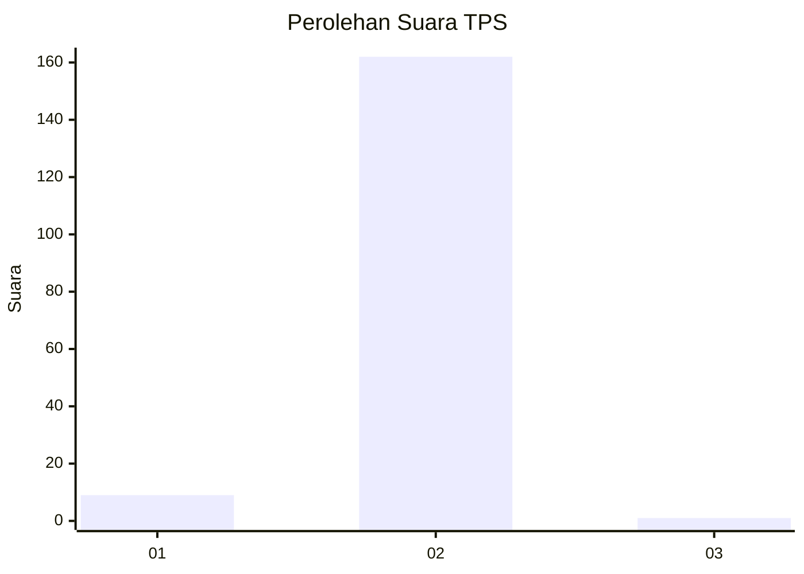
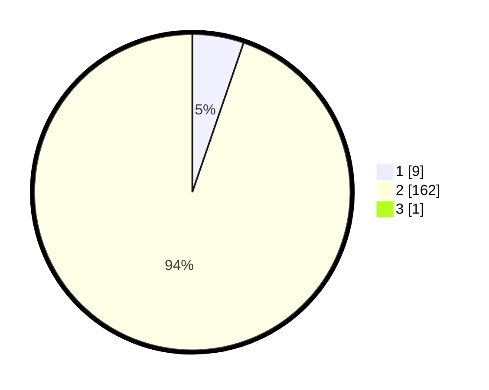

# Hasil

## Grafik

## Tabel

| No. | Nama Paslon    | Suara | Suara (raw) | Persentase |
|:--- |:-------------- | -----:| -----------:| ----------:|
| 1   | ANIES MUHAIMIN | 9     | [9][p-1]    | 5,23       |
| 2   | PRABOWO GIBRAN | 162   | [162][p-2]  | 94,19      |
| 3   | GANJAR MAHFUD  | 1     | [1][p-3]    | 0,58       |

[p-1]: https://github.com/gigit-pemilu/pemilu-2024-35-jawa-timur/blob/main/pilpres/hitung-suara/sub/35-jawa-timur/sub/07-malang/sub/17-jabung/sub/2010-kemantren/sub/030-tps/sub/paslon-1.txt
[p-2]: https://github.com/gigit-pemilu/pemilu-2024-35-jawa-timur/blob/main/pilpres/hitung-suara/sub/35-jawa-timur/sub/07-malang/sub/17-jabung/sub/2010-kemantren/sub/030-tps/sub/paslon-2.txt
[p-3]: https://github.com/gigit-pemilu/pemilu-2024-35-jawa-timur/blob/main/pilpres/hitung-suara/sub/35-jawa-timur/sub/07-malang/sub/17-jabung/sub/2010-kemantren/sub/030-tps/sub/paslon-3.txt

## Foto C Plano

https://sirekap-obj-formc.kpu.go.id/7f3a/pemilu/ppwp/35/07/17/20/10/3507172010030-20240214-234027--b02f51bb-a6d6-453b-8402-14cc13af0e27.jpg

https://sirekap-obj-formc.kpu.go.id/7f3a/pemilu/ppwp/35/07/17/20/10/3507172010030-20240214-234507--00fd5933-eb1f-4efb-b7b2-0353a5da9c2a.jpg

https://sirekap-obj-formc.kpu.go.id/7f3a/pemilu/ppwp/35/07/17/20/10/3507172010030-20240214-234626--a32fa058-0e99-4e49-9ea5-ff1cfc2eb900.jpg

## Metadata

| Key        | Value               |
| ---------- | ------------------- |
| Time Stamp | 2024-02-15 15:00:29 |

