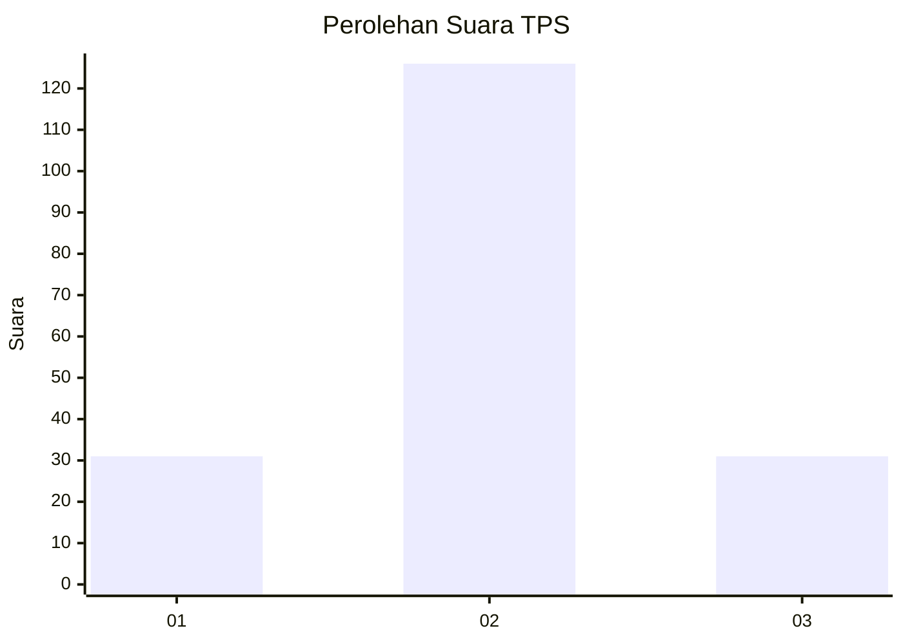
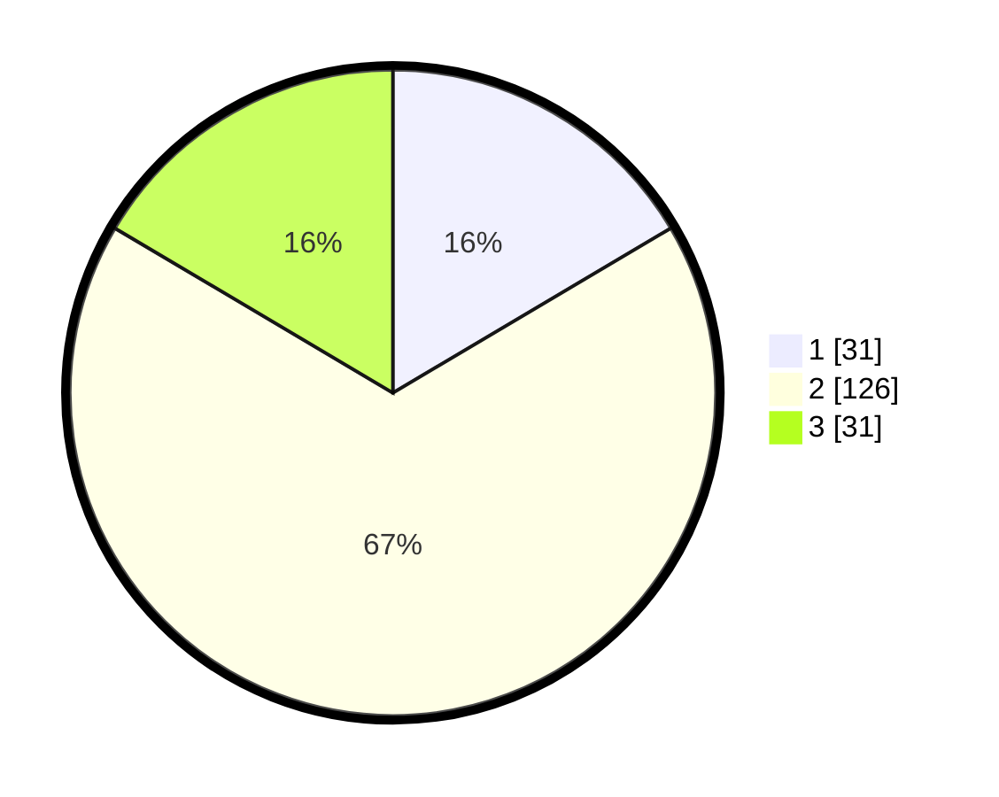

# Hasil

## Grafik

## Tabel

| No. | Nama Paslon    | Suara | Suara (raw) | Persentase |
|:--- |:-------------- | -----:| -----------:| ----------:|
| 1   | ANIES MUHAIMIN | 31    | [31][p-1]   | 16,49      |
| 2   | PRABOWO GIBRAN | 126   | [126][p-2]  | 67,02      |
| 3   | GANJAR MAHFUD  | 31    | [31][p-3]   | 16,49      |

[p-1]: https://github.com/gigit-pemilu/pemilu-2024/blob/main/pilpres/hitung-suara/sub/35-jawa-timur/sub/07-malang/sub/17-jabung/sub/2011-sukolilo/sub/006-tps/sub/paslon-1.txt
[p-2]: https://github.com/gigit-pemilu/pemilu-2024/blob/main/pilpres/hitung-suara/sub/35-jawa-timur/sub/07-malang/sub/17-jabung/sub/2011-sukolilo/sub/006-tps/sub/paslon-2.txt
[p-3]: https://github.com/gigit-pemilu/pemilu-2024/blob/main/pilpres/hitung-suara/sub/35-jawa-timur/sub/07-malang/sub/17-jabung/sub/2011-sukolilo/sub/006-tps/sub/paslon-3.txt

## Foto C Plano

https://sirekap-obj-formc.kpu.go.id/9ad7/pemilu/ppwp/35/07/17/20/11/3507172011006-20240214-235119--6faaca62-2bcf-4e95-b4c9-d135cd6e036d.jpg

https://sirekap-obj-formc.kpu.go.id/9ad7/pemilu/ppwp/35/07/17/20/11/3507172011006-20240214-235520--8a328ed1-f39f-4c7f-8829-5874c2698073.jpg

https://sirekap-obj-formc.kpu.go.id/9ad7/pemilu/ppwp/35/07/17/20/11/3507172011006-20240214-235650--1a333c79-56eb-4fa5-8fcf-74d7029f5b57.jpg

## Metadata

| Key        | Value               |
| ---------- | ------------------- |
| Time Stamp | 2024-02-17 18:00:00 |

