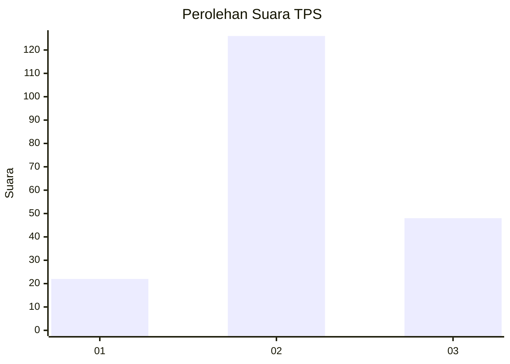
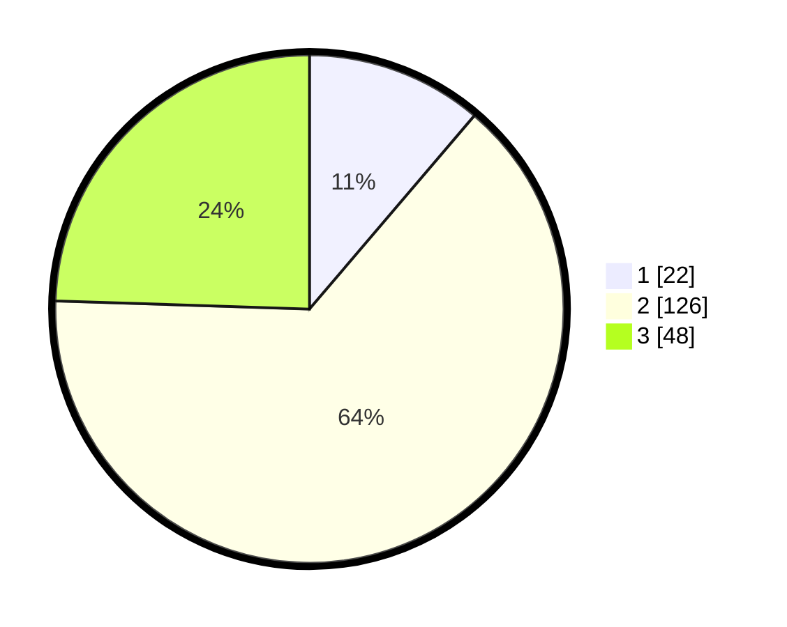

# Hasil

## Grafik

## Tabel

| No. | Nama Paslon    | Suara | Suara (raw) | Persentase |
|:--- |:-------------- | -----:| -----------:| ----------:|
| 1   | ANIES MUHAIMIN | 22    | [22][p-1]   | 11,22      |
| 2   | PRABOWO GIBRAN | 126   | [126][p-2]  | 64,29      |
| 3   | GANJAR MAHFUD  | 48    | [48][p-3]   | 24,49      |

[p-1]: https://github.com/gigit-pemilu/pemilu-2024/blob/main/pilpres/hitung-suara/sub/35-jawa-timur/sub/07-malang/sub/17-jabung/sub/2012-gunungjati/sub/003-tps/sub/paslon-1.txt
[p-2]: https://github.com/gigit-pemilu/pemilu-2024/blob/main/pilpres/hitung-suara/sub/35-jawa-timur/sub/07-malang/sub/17-jabung/sub/2012-gunungjati/sub/003-tps/sub/paslon-2.txt
[p-3]: https://github.com/gigit-pemilu/pemilu-2024/blob/main/pilpres/hitung-suara/sub/35-jawa-timur/sub/07-malang/sub/17-jabung/sub/2012-gunungjati/sub/003-tps/sub/paslon-3.txt

## Foto C Plano

https://sirekap-obj-formc.kpu.go.id/34cd/pemilu/ppwp/35/07/17/20/12/3507172012003-20240214-232226--e1e2cfb8-dc58-4775-afcd-8b632fbdbd7a.jpg

https://sirekap-obj-formc.kpu.go.id/34cd/pemilu/ppwp/35/07/17/20/12/3507172012003-20240214-232523--508b5db1-5340-45ec-a172-361f1383af39.jpg

https://sirekap-obj-formc.kpu.go.id/34cd/pemilu/ppwp/35/07/17/20/12/3507172012003-20240214-232659--54493f6c-27a3-465c-911a-54970a98db33.jpg

## Metadata

| Key        | Value               |
| ---------- | ------------------- |
| Time Stamp | 2024-02-17 18:30:00 |

