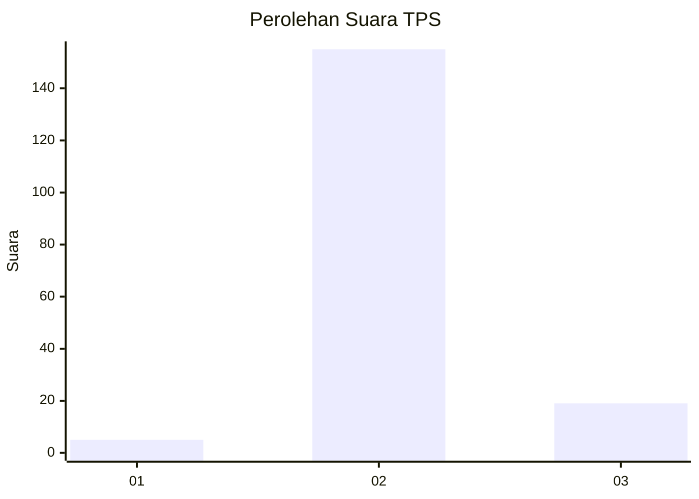
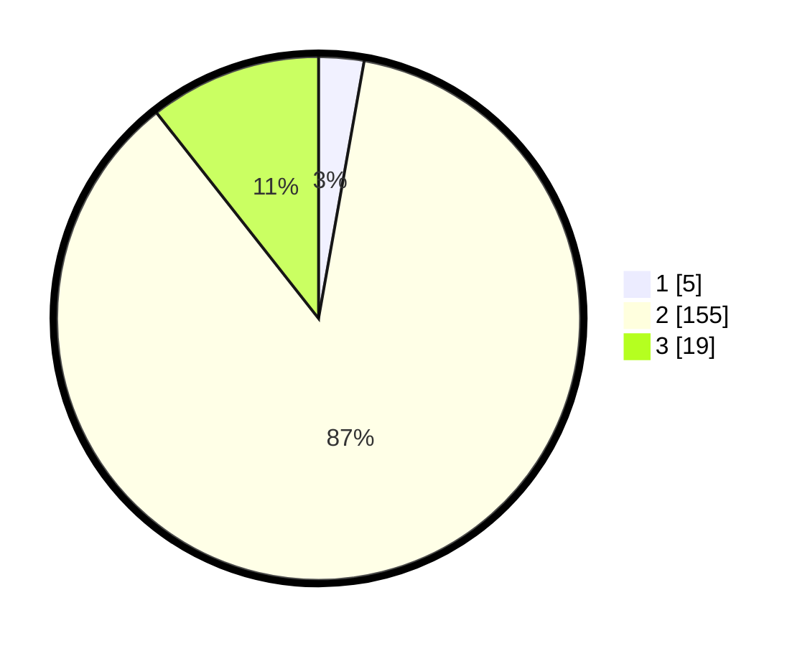

# Hasil

## Grafik

## Tabel

| No. | Nama Paslon    | Suara | Suara (raw) | Persentase |
|:--- |:-------------- | -----:| -----------:| ----------:|
| 1   | ANIES MUHAIMIN | 5     | [5][p-1]    | 2,79       |
| 2   | PRABOWO GIBRAN | 155   | [155][p-2]  | 86,59      |
| 3   | GANJAR MAHFUD  | 19    | [19][p-3]   | 10,61      |

[p-1]: https://github.com/gigit-pemilu/pemilu-2024-35-jawa-timur/blob/main/pilpres/hitung-suara/sub/35-jawa-timur/sub/07-malang/sub/17-jabung/sub/2012-gunungjati/sub/012-tps/sub/paslon-1.txt
[p-2]: https://github.com/gigit-pemilu/pemilu-2024-35-jawa-timur/blob/main/pilpres/hitung-suara/sub/35-jawa-timur/sub/07-malang/sub/17-jabung/sub/2012-gunungjati/sub/012-tps/sub/paslon-2.txt
[p-3]: https://github.com/gigit-pemilu/pemilu-2024-35-jawa-timur/blob/main/pilpres/hitung-suara/sub/35-jawa-timur/sub/07-malang/sub/17-jabung/sub/2012-gunungjati/sub/012-tps/sub/paslon-3.txt

## Foto C Plano

https://sirekap-obj-formc.kpu.go.id/abb8/pemilu/ppwp/35/07/17/20/12/3507172012012-20240214-234214--235b92ce-9777-46cc-9d2b-69cea3ecd52b.jpg

https://sirekap-obj-formc.kpu.go.id/abb8/pemilu/ppwp/35/07/17/20/12/3507172012012-20240214-234516--efb09616-7a23-49c9-ae46-120d3c8e6281.jpg

https://sirekap-obj-formc.kpu.go.id/abb8/pemilu/ppwp/35/07/17/20/12/3507172012012-20240214-234820--e2b22843-b7a4-48af-9854-518447014f7b.jpg

## Metadata

| Key        | Value               |
| ---------- | ------------------- |
| Time Stamp | 2024-02-17 18:30:00 |

