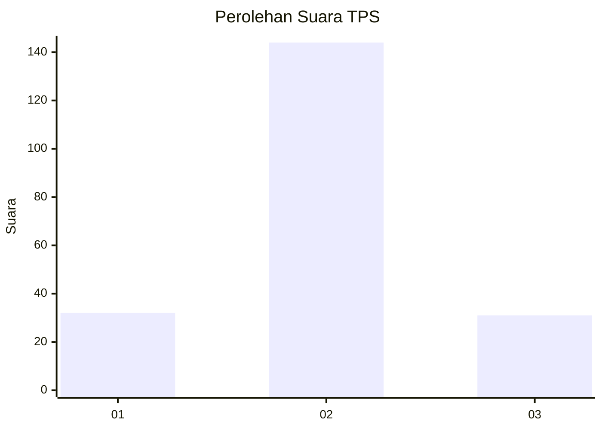

# Hasil

## Grafik

## Tabel

| No. | Nama Paslon    | Suara | Suara (raw) | Persentase |
|:--- |:-------------- | -----:| -----------:| ----------:|
| 1   | ANIES MUHAIMIN | 32    | [32][p-1]   | 15,46      |
| 2   | PRABOWO GIBRAN | 144   | [144][p-2]  | 69,57      |
| 3   | GANJAR MAHFUD  | 31    | [31][p-3]   | 14,98      |

[p-1]: https://github.com/gigit-pemilu/pemilu-2024/blob/main/pilpres/hitung-suara/sub/35-jawa-timur/sub/07-malang/sub/17-jabung/sub/2013-jabung/sub/005-tps/sub/paslon-1.txt
[p-2]: https://github.com/gigit-pemilu/pemilu-2024/blob/main/pilpres/hitung-suara/sub/35-jawa-timur/sub/07-malang/sub/17-jabung/sub/2013-jabung/sub/005-tps/sub/paslon-2.txt
[p-3]: https://github.com/gigit-pemilu/pemilu-2024/blob/main/pilpres/hitung-suara/sub/35-jawa-timur/sub/07-malang/sub/17-jabung/sub/2013-jabung/sub/005-tps/sub/paslon-3.txt

## Foto C Plano

https://sirekap-obj-formc.kpu.go.id/0c1e/pemilu/ppwp/35/07/17/20/13/3507172013005-20240215-094521--1200f2b1-8fe7-4daf-9f4a-86eb6c38e2e8.jpg

https://sirekap-obj-formc.kpu.go.id/0c1e/pemilu/ppwp/35/07/17/20/13/3507172013005-20240217-094213--ddb787e6-2e4b-4d97-93ae-270bcc49d086.jpg

https://sirekap-obj-formc.kpu.go.id/0c1e/pemilu/ppwp/35/07/17/20/13/3507172013005-20240214-233136--6860605b-97bf-4e1f-9073-57cb619b8008.jpg

## Metadata

| Key        | Value               |
| ---------- | ------------------- |
| Time Stamp | 2024-02-17 16:36:25 |

