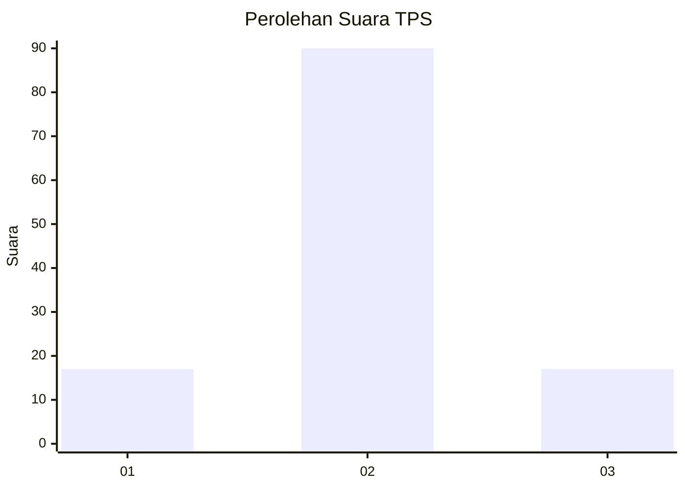
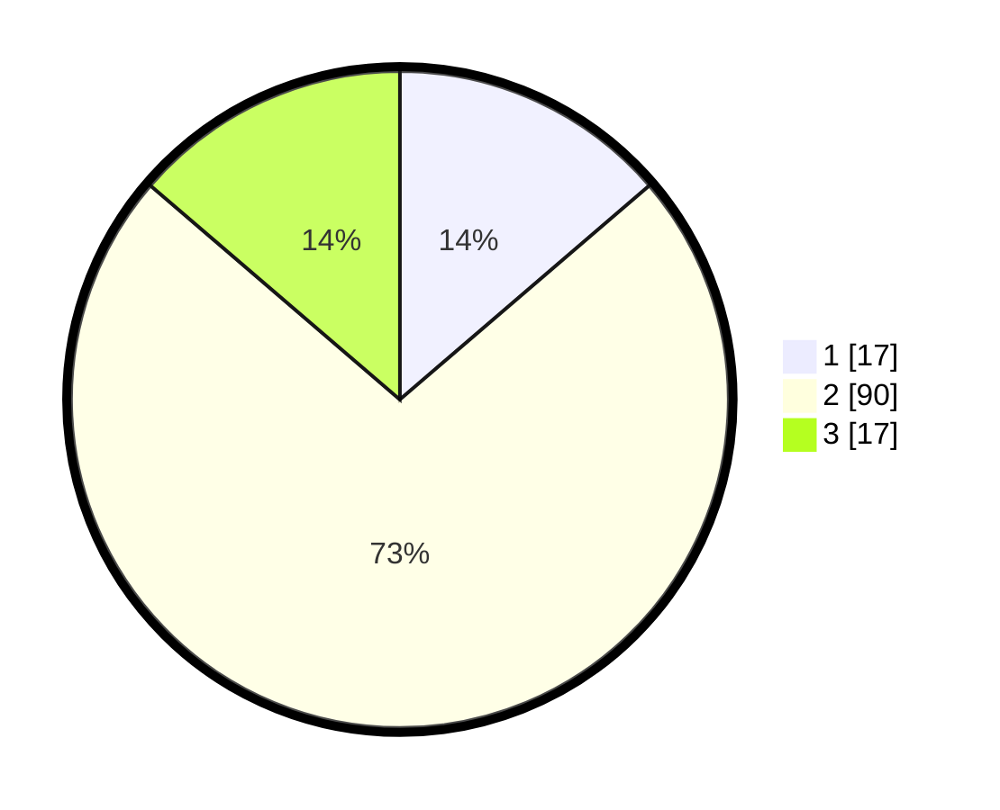

# Hasil

## Grafik

## Tabel

| No. | Nama Paslon    | Suara | Suara (raw) | Persentase |
|:--- |:-------------- | -----:| -----------:| ----------:|
| 1   | ANIES MUHAIMIN | 17    | [17][p-1]   | 13,71      |
| 2   | PRABOWO GIBRAN | 90    | [90][p-2]   | 72,58      |
| 3   | GANJAR MAHFUD  | 17    | [17][p-3]   | 13,71      |

[p-1]: https://github.com/gigit-pemilu/pemilu-2024/blob/main/pilpres/hitung-suara/sub/35-jawa-timur/sub/07-malang/sub/17-jabung/sub/2013-jabung/sub/027-tps/sub/paslon-1.txt
[p-2]: https://github.com/gigit-pemilu/pemilu-2024/blob/main/pilpres/hitung-suara/sub/35-jawa-timur/sub/07-malang/sub/17-jabung/sub/2013-jabung/sub/027-tps/sub/paslon-2.txt
[p-3]: https://github.com/gigit-pemilu/pemilu-2024/blob/main/pilpres/hitung-suara/sub/35-jawa-timur/sub/07-malang/sub/17-jabung/sub/2013-jabung/sub/027-tps/sub/paslon-3.txt

## Foto C Plano

https://sirekap-obj-formc.kpu.go.id/62e5/pemilu/ppwp/35/07/17/20/13/3507172013027-20240214-214713--5cca9d02-0f70-4e58-9370-bc5e7b7796aa.jpg

https://sirekap-obj-formc.kpu.go.id/62e5/pemilu/ppwp/35/07/17/20/13/3507172013027-20240214-214844--bd374358-25a1-4d1e-b7a8-88e8d8a6a1ea.jpg

https://sirekap-obj-formc.kpu.go.id/62e5/pemilu/ppwp/35/07/17/20/13/3507172013027-20240214-214949--1315fd0e-f98a-46dd-aa87-94491db44da1.jpg

## Metadata

| Key        | Value               |
| ---------- | ------------------- |
| Time Stamp | 2024-02-17 18:30:00 |

