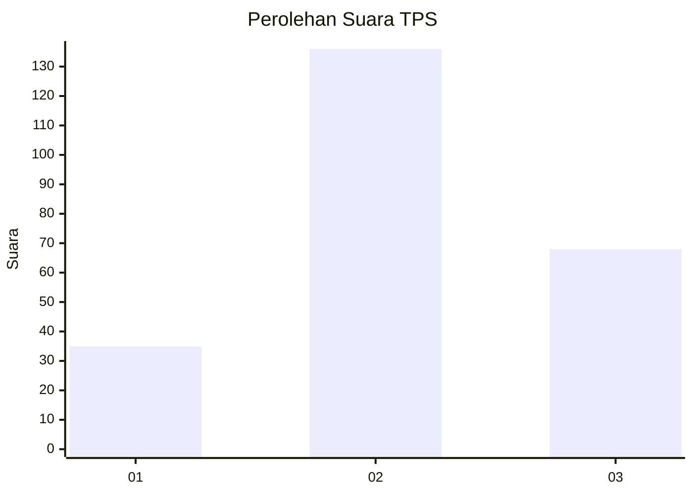
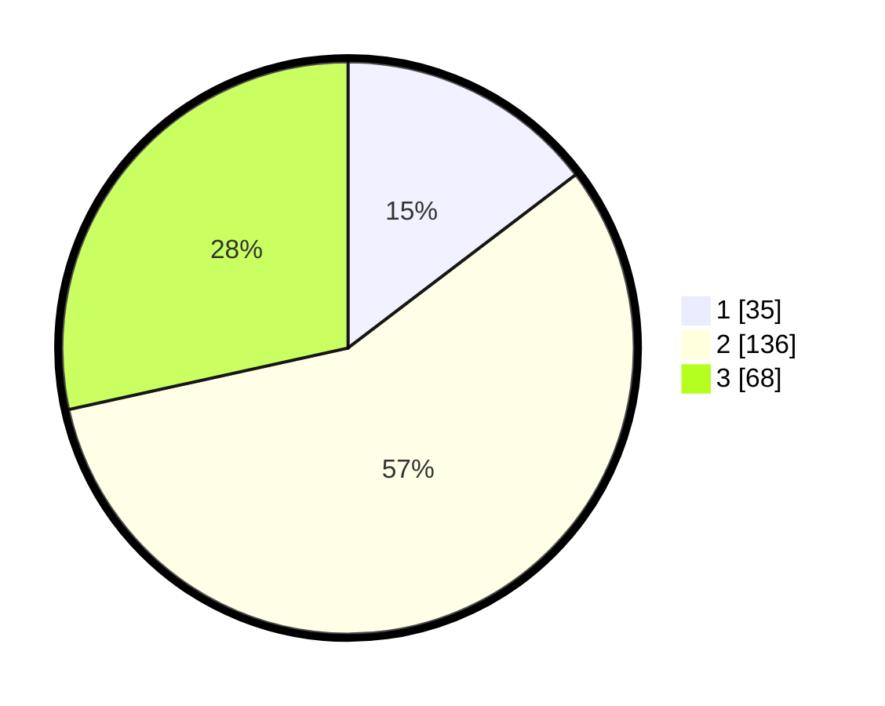

# Hasil

## Grafik

## Tabel

| No. | Nama Paslon    | Suara | Suara (raw) | Persentase |
|:--- |:-------------- | -----:| -----------:| ----------:|
| 1   | ANIES MUHAIMIN | 35    | [35][p-1]   | 14,64      |
| 2   | PRABOWO GIBRAN | 136   | [136][p-2]  | 56,90      |
| 3   | GANJAR MAHFUD  | 68    | [68][p-3]   | 28,45      |

[p-1]: https://github.com/gigit-pemilu/pemilu-2024/blob/main/pilpres/hitung-suara/sub/35-jawa-timur/sub/07-malang/sub/17-jabung/sub/2014-slamparejo/sub/015-tps/sub/paslon-1.txt
[p-2]: https://github.com/gigit-pemilu/pemilu-2024/blob/main/pilpres/hitung-suara/sub/35-jawa-timur/sub/07-malang/sub/17-jabung/sub/2014-slamparejo/sub/015-tps/sub/paslon-2.txt
[p-3]: https://github.com/gigit-pemilu/pemilu-2024/blob/main/pilpres/hitung-suara/sub/35-jawa-timur/sub/07-malang/sub/17-jabung/sub/2014-slamparejo/sub/015-tps/sub/paslon-3.txt

## Foto C Plano

https://sirekap-obj-formc.kpu.go.id/17d9/pemilu/ppwp/35/07/17/20/14/3507172014015-20240218-170643--72351b0b-3e15-4d03-ab82-30057e9c9360.jpg

https://sirekap-obj-formc.kpu.go.id/17d9/pemilu/ppwp/35/07/17/20/14/3507172014015-20240215-064036--14fb8144-ff6d-4069-92ff-c39178e5daee.jpg

https://sirekap-obj-formc.kpu.go.id/17d9/pemilu/ppwp/35/07/17/20/14/3507172014015-20240215-064201--7a6ff3b5-5c1b-4b95-8f5f-ba160532e582.jpg

## Metadata

| Key        | Value               |
| ---------- | ------------------- |
| Time Stamp | 2024-02-19 06:16:00 |

