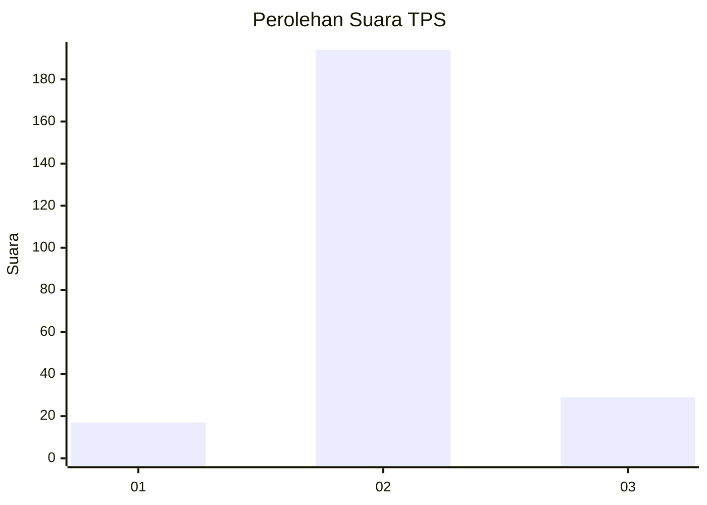
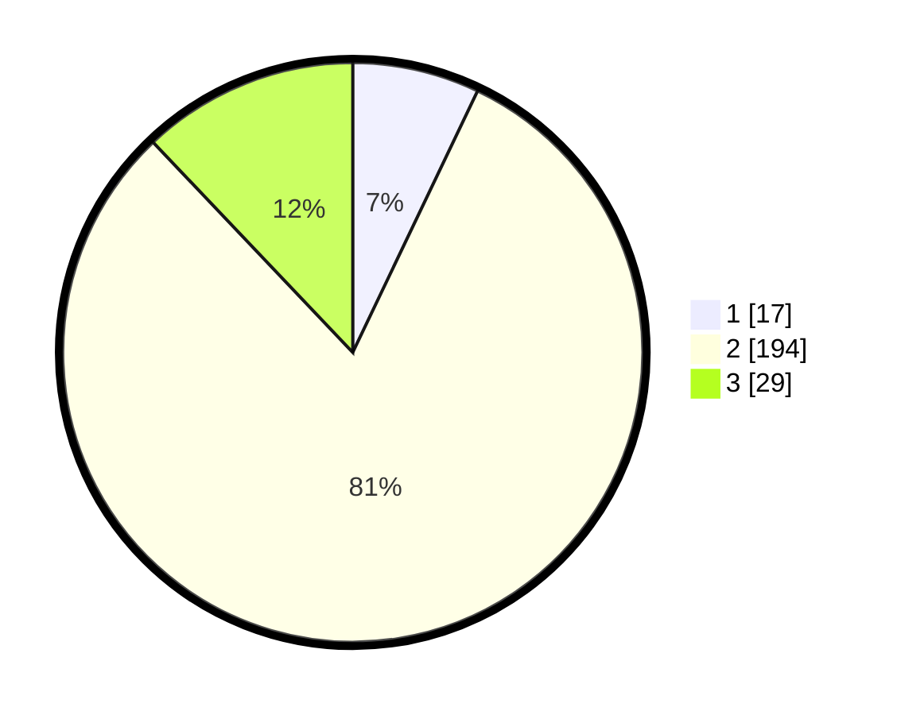

# Hasil

## Grafik

## Tabel

| No. | Nama Paslon    | Suara | Suara (raw) | Persentase |
|:--- |:-------------- | -----:| -----------:| ----------:|
| 1   | ANIES MUHAIMIN | 17    | [17][p-1]   | 7,08       |
| 2   | PRABOWO GIBRAN | 194   | [194][p-2]  | 80,83      |
| 3   | GANJAR MAHFUD  | 29    | [29][p-3]   | 12,08      |

[p-1]: https://github.com/gigit-pemilu/pemilu-2024-35-jawa-timur/blob/main/pilpres/hitung-suara/sub/35-jawa-timur/sub/07-malang/sub/17-jabung/sub/2015-kemiri/sub/006-tps/sub/paslon-1.txt
[p-2]: https://github.com/gigit-pemilu/pemilu-2024-35-jawa-timur/blob/main/pilpres/hitung-suara/sub/35-jawa-timur/sub/07-malang/sub/17-jabung/sub/2015-kemiri/sub/006-tps/sub/paslon-2.txt
[p-3]: https://github.com/gigit-pemilu/pemilu-2024-35-jawa-timur/blob/main/pilpres/hitung-suara/sub/35-jawa-timur/sub/07-malang/sub/17-jabung/sub/2015-kemiri/sub/006-tps/sub/paslon-3.txt

## Foto C Plano

https://sirekap-obj-formc.kpu.go.id/9281/pemilu/ppwp/35/07/17/20/15/3507172015006-20240214-234627--e319000b-9bec-4ff9-a9ca-5eb4960cfec0.jpg

https://sirekap-obj-formc.kpu.go.id/9281/pemilu/ppwp/35/07/17/20/15/3507172015006-20240214-230203--cb52e017-8dd8-432a-831e-ab021602388a.jpg

https://sirekap-obj-formc.kpu.go.id/9281/pemilu/ppwp/35/07/17/20/15/3507172015006-20240214-230208--2f94b609-9855-4a20-b3e4-17298c82672c.jpg

## Metadata

| Key        | Value               |
| ---------- | ------------------- |
| Time Stamp | 2024-02-17 08:30:03 |

