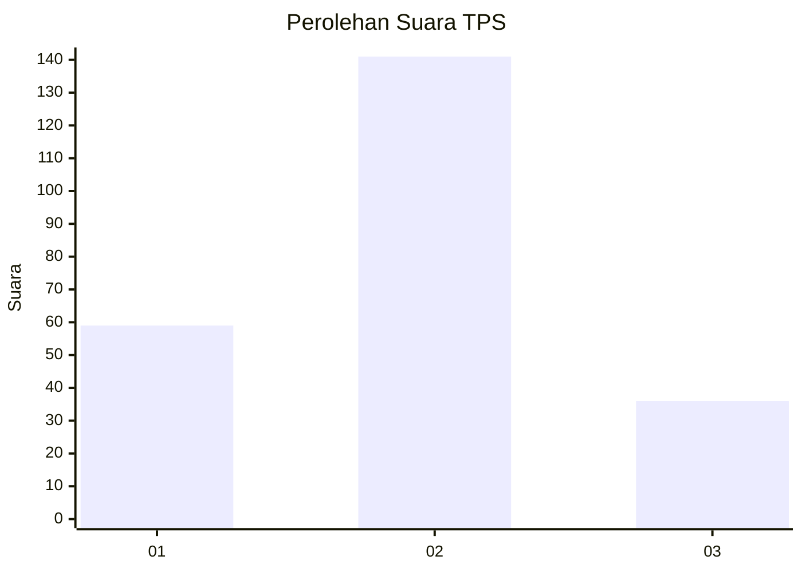

# Hasil

## Grafik

## Tabel

| No. | Nama Paslon    | Suara | Suara (raw) | Persentase |
|:--- |:-------------- | -----:| -----------:| ----------:|
| 1   | ANIES MUHAIMIN | 59    | [59][p-1]   | 25,00      |
| 2   | PRABOWO GIBRAN | 141   | [141][p-2]  | 59,75      |
| 3   | GANJAR MAHFUD  | 36    | [36][p-3]   | 15,25      |

[p-1]: https://github.com/gigit-pemilu/pemilu-2024/blob/main/pilpres/hitung-suara/sub/35-jawa-timur/sub/07-malang/sub/18-pakis/sub/2006-pakiskembar/sub/014-tps/sub/paslon-1.txt
[p-2]: https://github.com/gigit-pemilu/pemilu-2024/blob/main/pilpres/hitung-suara/sub/35-jawa-timur/sub/07-malang/sub/18-pakis/sub/2006-pakiskembar/sub/014-tps/sub/paslon-2.txt
[p-3]: https://github.com/gigit-pemilu/pemilu-2024/blob/main/pilpres/hitung-suara/sub/35-jawa-timur/sub/07-malang/sub/18-pakis/sub/2006-pakiskembar/sub/014-tps/sub/paslon-3.txt

## Foto C Plano

https://sirekap-obj-formc.kpu.go.id/0374/pemilu/ppwp/35/07/18/20/06/3507182006014-20240214-155123--7b9548c2-8e18-4a47-9025-b49bd5a2643d.jpg

https://sirekap-obj-formc.kpu.go.id/0374/pemilu/ppwp/35/07/18/20/06/3507182006014-20240214-155320--64c60fed-7a00-4b1f-888b-bf4f309a9d67.jpg

https://sirekap-obj-formc.kpu.go.id/0374/pemilu/ppwp/35/07/18/20/06/3507182006014-20240214-205120--2e8be294-4e78-4327-b15a-c64d317ffb19.jpg

## Metadata

| Key        | Value               |
| ---------- | ------------------- |
| Time Stamp | 2024-02-25 12:00:00 |

