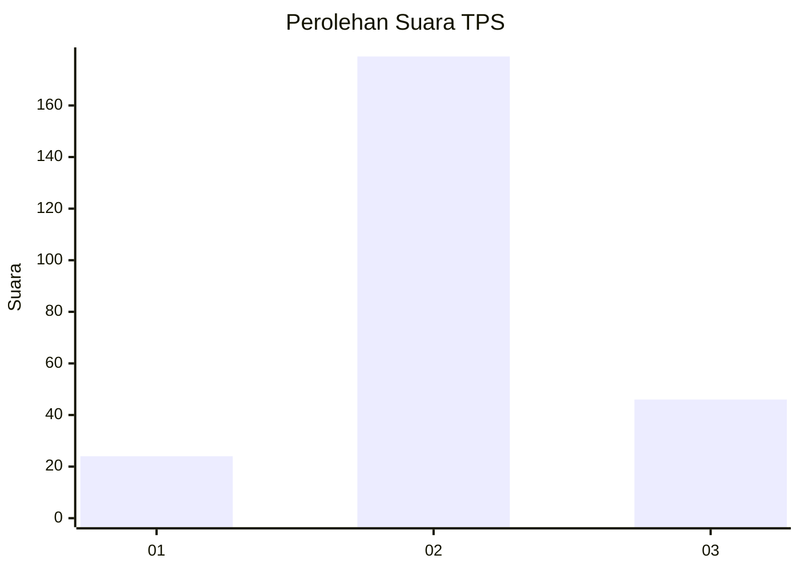
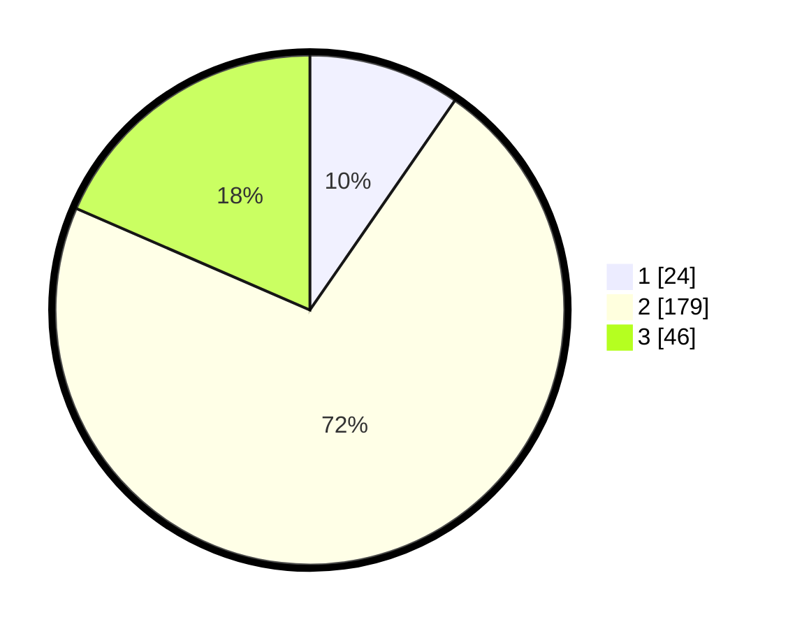

# Hasil

## Grafik

## Tabel

| No. | Nama Paslon    | Suara | Suara (raw) | Persentase |
|:--- |:-------------- | -----:| -----------:| ----------:|
| 1   | ANIES MUHAIMIN | 24    | [24][p-1]   | 9,64       |
| 2   | PRABOWO GIBRAN | 179   | [179][p-2]  | 71,89      |
| 3   | GANJAR MAHFUD  | 46    | [46][p-3]   | 18,47      |

[p-1]: https://github.com/gigit-pemilu/pemilu-2024/blob/main/pilpres/hitung-suara/sub/35-jawa-timur/sub/07-malang/sub/18-pakis/sub/2009-sekarpuro/sub/013-tps/sub/paslon-1.txt
[p-2]: https://github.com/gigit-pemilu/pemilu-2024/blob/main/pilpres/hitung-suara/sub/35-jawa-timur/sub/07-malang/sub/18-pakis/sub/2009-sekarpuro/sub/013-tps/sub/paslon-2.txt
[p-3]: https://github.com/gigit-pemilu/pemilu-2024/blob/main/pilpres/hitung-suara/sub/35-jawa-timur/sub/07-malang/sub/18-pakis/sub/2009-sekarpuro/sub/013-tps/sub/paslon-3.txt

## Foto C Plano

https://sirekap-obj-formc.kpu.go.id/86f4/pemilu/ppwp/35/07/18/20/09/3507182009013-20240215-184133--d60aaf3c-7784-4c2a-bb54-28966b98aef5.jpg

https://sirekap-obj-formc.kpu.go.id/86f4/pemilu/ppwp/35/07/18/20/09/3507182009013-20240215-184109--e0d08dde-9ec9-4ebb-951f-db24c2787c2c.jpg

https://sirekap-obj-formc.kpu.go.id/86f4/pemilu/ppwp/35/07/18/20/09/3507182009013-20240215-184000--60150b1a-aac1-483f-b5fd-20e3528f4366.jpg

## Metadata

| Key        | Value               |
| ---------- | ------------------- |
| Time Stamp | 2024-02-25 21:00:00 |

