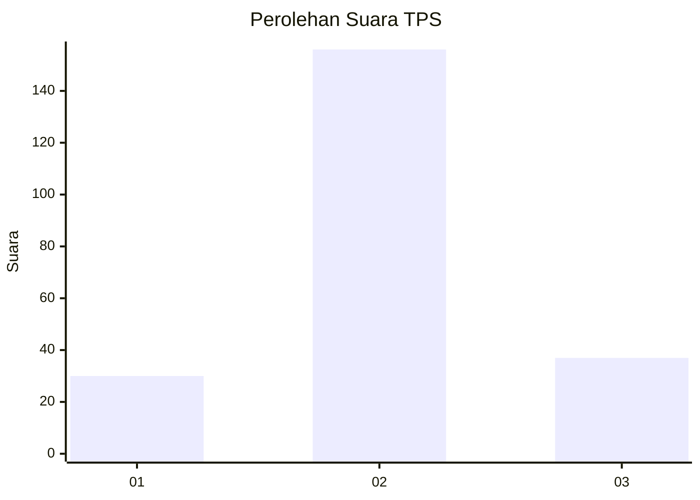
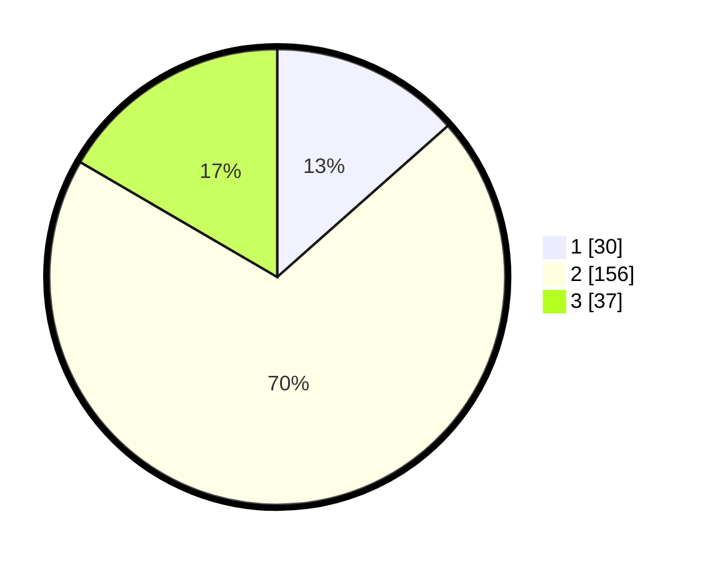

# Hasil

## Grafik

## Tabel

| No. | Nama Paslon    | Suara | Suara (raw) | Persentase |
|:--- |:-------------- | -----:| -----------:| ----------:|
| 1   | ANIES MUHAIMIN | 30    | [30][p-1]   | 13,45      |
| 2   | PRABOWO GIBRAN | 156   | [156][p-2]  | 69,96      |
| 3   | GANJAR MAHFUD  | 37    | [37][p-3]   | 16,59      |

[p-1]: https://github.com/gigit-pemilu/pemilu-2024/blob/main/pilpres/hitung-suara/sub/35-jawa-timur/sub/07-malang/sub/18-pakis/sub/2012-saptorenggo/sub/001-tps/sub/paslon-1.txt
[p-2]: https://github.com/gigit-pemilu/pemilu-2024/blob/main/pilpres/hitung-suara/sub/35-jawa-timur/sub/07-malang/sub/18-pakis/sub/2012-saptorenggo/sub/001-tps/sub/paslon-2.txt
[p-3]: https://github.com/gigit-pemilu/pemilu-2024/blob/main/pilpres/hitung-suara/sub/35-jawa-timur/sub/07-malang/sub/18-pakis/sub/2012-saptorenggo/sub/001-tps/sub/paslon-3.txt

## Foto C Plano

https://sirekap-obj-formc.kpu.go.id/3ab6/pemilu/ppwp/35/07/18/20/12/3507182012001-20240214-204546--4c759947-b734-4aab-bc46-6a12186f957f.jpg

https://sirekap-obj-formc.kpu.go.id/3ab6/pemilu/ppwp/35/07/18/20/12/3507182012001-20240214-204630--fa82eb7e-4ced-4cd8-a9e9-db3085cfb9e8.jpg

https://sirekap-obj-formc.kpu.go.id/3ab6/pemilu/ppwp/35/07/18/20/12/3507182012001-20240214-204702--346112c0-f4e1-48da-b1ca-fa88c05fdeee.jpg

## Metadata

| Key        | Value               |
| ---------- | ------------------- |
| Time Stamp | 2024-02-24 22:31:28 |

