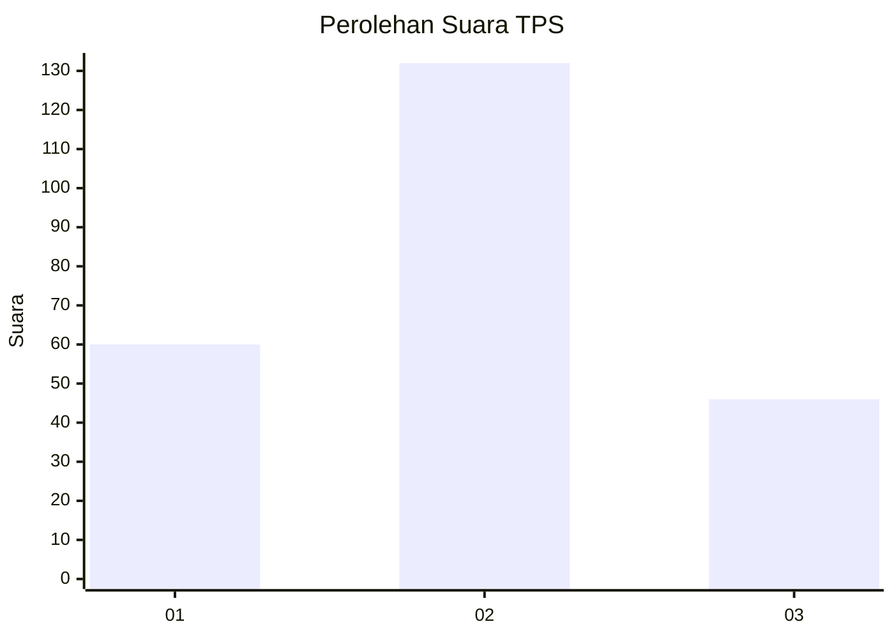
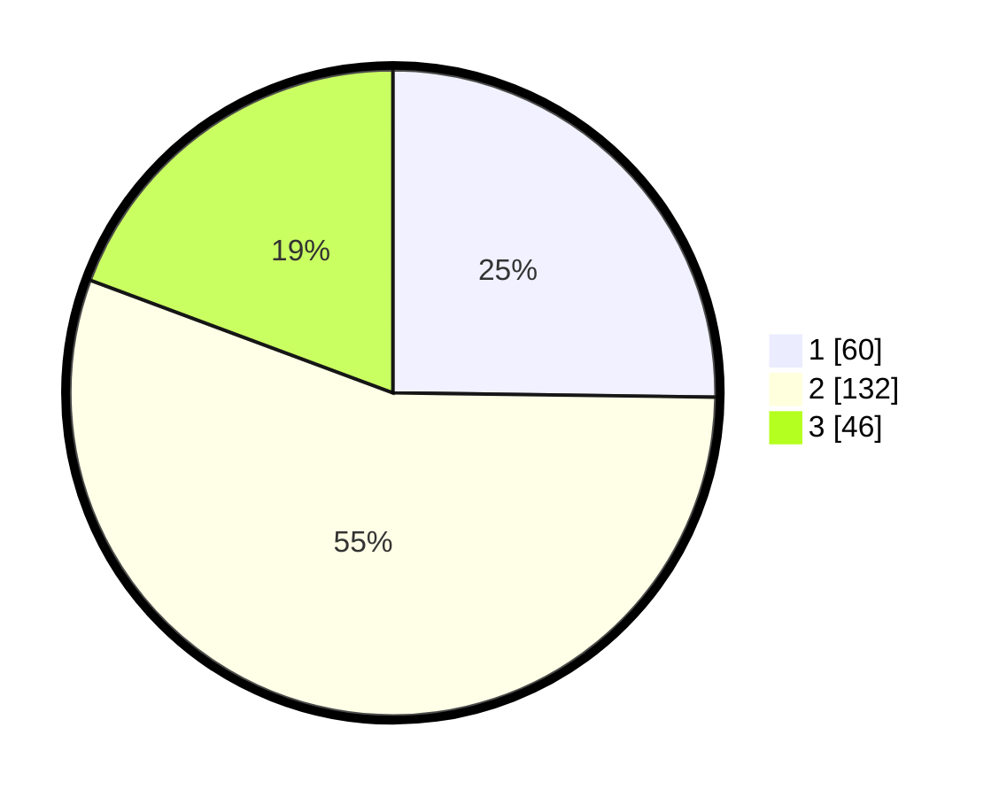

# Hasil

## Grafik

## Tabel

| No. | Nama Paslon    | Suara | Suara (raw) | Persentase |
|:--- |:-------------- | -----:| -----------:| ----------:|
| 1   | ANIES MUHAIMIN | 60    | [60][p-1]   | 25,21      |
| 2   | PRABOWO GIBRAN | 132   | [132][p-2]  | 55,46      |
| 3   | GANJAR MAHFUD  | 46    | [46][p-3]   | 19,33      |

[p-1]: https://github.com/gigit-pemilu/pemilu-2024/blob/main/pilpres/hitung-suara/sub/35-jawa-timur/sub/07-malang/sub/18-pakis/sub/2012-saptorenggo/sub/006-tps/sub/paslon-1.txt
[p-2]: https://github.com/gigit-pemilu/pemilu-2024/blob/main/pilpres/hitung-suara/sub/35-jawa-timur/sub/07-malang/sub/18-pakis/sub/2012-saptorenggo/sub/006-tps/sub/paslon-2.txt
[p-3]: https://github.com/gigit-pemilu/pemilu-2024/blob/main/pilpres/hitung-suara/sub/35-jawa-timur/sub/07-malang/sub/18-pakis/sub/2012-saptorenggo/sub/006-tps/sub/paslon-3.txt

## Foto C Plano

https://sirekap-obj-formc.kpu.go.id/5453/pemilu/ppwp/35/07/18/20/12/3507182012006-20240214-222910--2bc4b66f-5b5d-4b03-96fd-1ceffa80a225.jpg

https://sirekap-obj-formc.kpu.go.id/5453/pemilu/ppwp/35/07/18/20/12/3507182012006-20240214-222925--283f67f0-46a3-407a-8689-7347f40015e1.jpg

https://sirekap-obj-formc.kpu.go.id/5453/pemilu/ppwp/35/07/18/20/12/3507182012006-20240214-222942--4f785f59-7eab-470d-acf7-fb3aff6bcf04.jpg

## Metadata

| Key        | Value               |
| ---------- | ------------------- |
| Time Stamp | 2024-02-25 22:00:00 |

