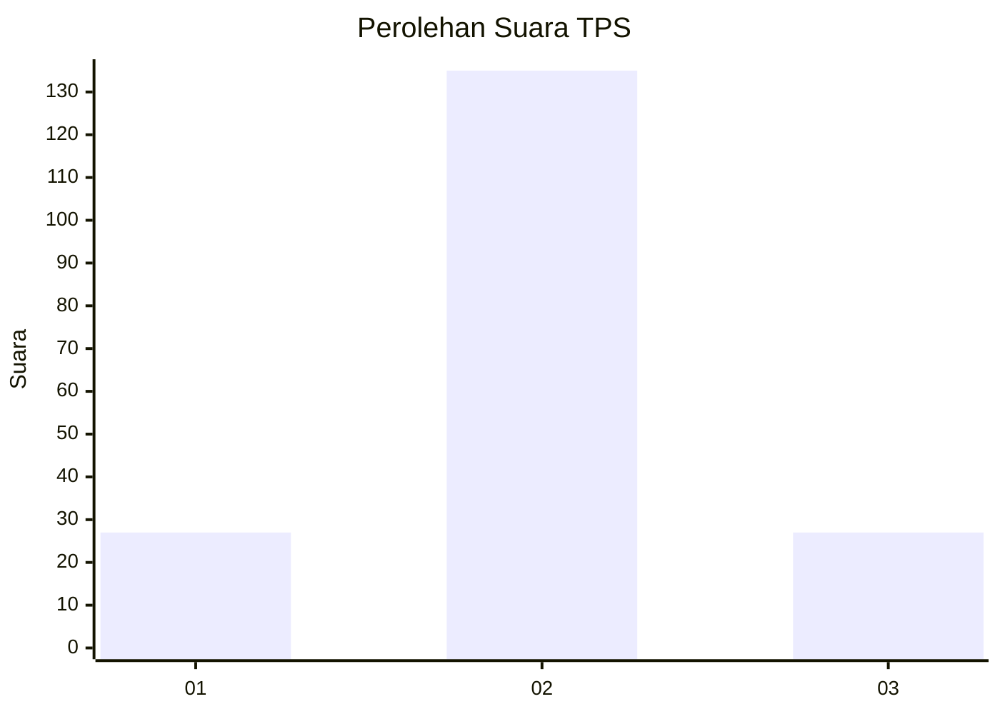

# Hasil

## Grafik

## Tabel

| No. | Nama Paslon    | Suara | Suara (raw) | Persentase |
|:--- |:-------------- | -----:| -----------:| ----------:|
| 1   | ANIES MUHAIMIN | 27    | [27][p-1]   | 14,29      |
| 2   | PRABOWO GIBRAN | 135   | [135][p-2]  | 71,43      |
| 3   | GANJAR MAHFUD  | 27    | [27][p-3]   | 14,29      |

[p-1]: https://github.com/gigit-pemilu/pemilu-2024-35-jawa-timur/blob/main/pilpres/hitung-suara/sub/35-jawa-timur/sub/07-malang/sub/18-pakis/sub/2013-asrikaton/sub/006-tps/sub/paslon-1.txt
[p-2]: https://github.com/gigit-pemilu/pemilu-2024-35-jawa-timur/blob/main/pilpres/hitung-suara/sub/35-jawa-timur/sub/07-malang/sub/18-pakis/sub/2013-asrikaton/sub/006-tps/sub/paslon-2.txt
[p-3]: https://github.com/gigit-pemilu/pemilu-2024-35-jawa-timur/blob/main/pilpres/hitung-suara/sub/35-jawa-timur/sub/07-malang/sub/18-pakis/sub/2013-asrikaton/sub/006-tps/sub/paslon-3.txt

## Foto C Plano

https://sirekap-obj-formc.kpu.go.id/d870/pemilu/ppwp/35/07/18/20/13/3507182013006-20240214-214110--5f8e4021-bbe3-4c3a-ba8b-e8e08eb976f6.jpg

https://sirekap-obj-formc.kpu.go.id/d870/pemilu/ppwp/35/07/18/20/13/3507182013006-20240214-213907--81ab559e-fa73-4ebf-9600-9ed6f35c7d57.jpg

https://sirekap-obj-formc.kpu.go.id/d870/pemilu/ppwp/35/07/18/20/13/3507182013006-20240214-214441--1320f49a-b9fd-4f84-a8ba-6862a2be8c82.jpg

## Metadata

| Key        | Value               |
| ---------- | ------------------- |
| Time Stamp | 2024-02-24 22:31:28 |

