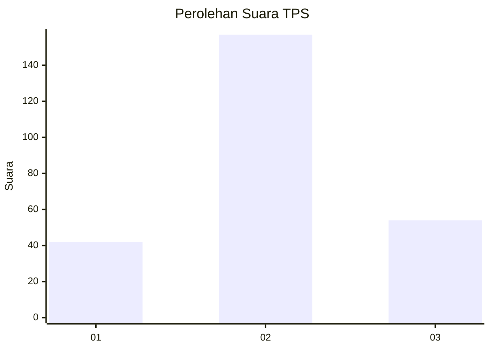
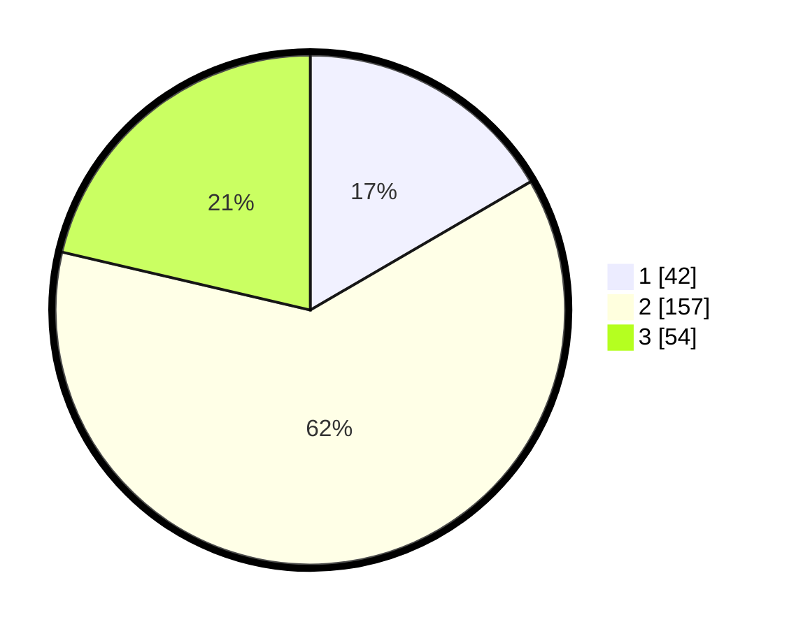

# Hasil

## Grafik

## Tabel

| No. | Nama Paslon    | Suara | Suara (raw) | Persentase |
|:--- |:-------------- | -----:| -----------:| ----------:|
| 1   | ANIES MUHAIMIN | 42    | [42][p-1]   | 16,60      |
| 2   | PRABOWO GIBRAN | 157   | [157][p-2]  | 62,06      |
| 3   | GANJAR MAHFUD  | 54    | [54][p-3]   | 21,34      |

[p-1]: https://github.com/gigit-pemilu/pemilu-2024/blob/main/pilpres/hitung-suara/sub/35-jawa-timur/sub/07-malang/sub/18-pakis/sub/2013-asrikaton/sub/023-tps/sub/paslon-1.txt
[p-2]: https://github.com/gigit-pemilu/pemilu-2024/blob/main/pilpres/hitung-suara/sub/35-jawa-timur/sub/07-malang/sub/18-pakis/sub/2013-asrikaton/sub/023-tps/sub/paslon-2.txt
[p-3]: https://github.com/gigit-pemilu/pemilu-2024/blob/main/pilpres/hitung-suara/sub/35-jawa-timur/sub/07-malang/sub/18-pakis/sub/2013-asrikaton/sub/023-tps/sub/paslon-3.txt

## Foto C Plano

https://sirekap-obj-formc.kpu.go.id/575e/pemilu/ppwp/35/07/18/20/13/3507182013023-20240220-185132--8d98c60f-0549-448b-93f1-a3936d43737f.jpg

https://sirekap-obj-formc.kpu.go.id/575e/pemilu/ppwp/35/07/18/20/13/3507182013023-20240214-202557--373396f0-0251-4597-a5bb-4e9e6d29b73e.jpg

https://sirekap-obj-formc.kpu.go.id/575e/pemilu/ppwp/35/07/18/20/13/3507182013023-20240214-202711--b990ff99-269f-4b2b-9426-11a1ca311972.jpg

## Metadata

| Key        | Value               |
| ---------- | ------------------- |
| Time Stamp | 2024-02-25 12:00:00 |

