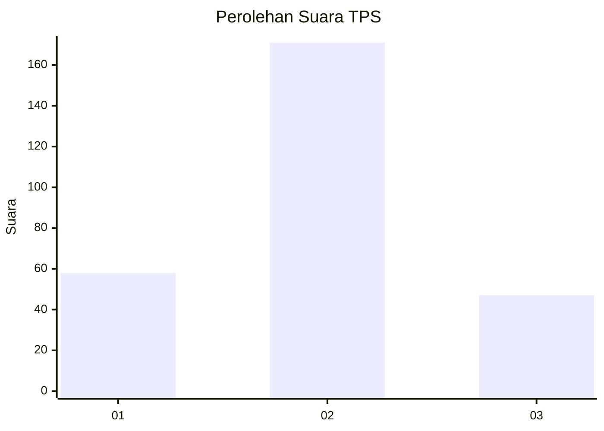

# Hasil

## Grafik

## Tabel

| No. | Nama Paslon    | Suara | Suara (raw) | Persentase |
|:--- |:-------------- | -----:| -----------:| ----------:|
| 1   | ANIES MUHAIMIN | 58    | [58][p-1]   | 21,01      |
| 2   | PRABOWO GIBRAN | 171   | [171][p-2]  | 61,96      |
| 3   | GANJAR MAHFUD  | 47    | [47][p-3]   | 17,03      |

[p-1]: https://github.com/gigit-pemilu/pemilu-2024/blob/main/pilpres/hitung-suara/sub/35-jawa-timur/sub/07-malang/sub/18-pakis/sub/2014-bunutwetan/sub/016-tps/sub/paslon-1.txt
[p-2]: https://github.com/gigit-pemilu/pemilu-2024/blob/main/pilpres/hitung-suara/sub/35-jawa-timur/sub/07-malang/sub/18-pakis/sub/2014-bunutwetan/sub/016-tps/sub/paslon-2.txt
[p-3]: https://github.com/gigit-pemilu/pemilu-2024/blob/main/pilpres/hitung-suara/sub/35-jawa-timur/sub/07-malang/sub/18-pakis/sub/2014-bunutwetan/sub/016-tps/sub/paslon-3.txt

## Foto C Plano

https://sirekap-obj-formc.kpu.go.id/83f9/pemilu/ppwp/35/07/18/20/14/3507182014016-20240216-082504--10c385dc-bdc9-4704-be1a-25923724c6a2.jpg

https://sirekap-obj-formc.kpu.go.id/83f9/pemilu/ppwp/35/07/18/20/14/3507182014016-20240216-123958--dd219339-33bd-46d3-9ebd-3568387a8c4f.jpg

https://sirekap-obj-formc.kpu.go.id/83f9/pemilu/ppwp/35/07/18/20/14/3507182014016-20240216-082510--2ea24013-202c-4b8f-8705-ff6875bc72e6.jpg

## Metadata

| Key        | Value               |
| ---------- | ------------------- |
| Time Stamp | 2024-02-17 19:30:00 |

## DATA PEMILIH TETAP

Jumlah pemilih dalam DPT: **293**.
 * L: **149**.
 * P: **144**.

## DATA PENGGUNA HAK PILIH

Jumlah pengguna hak pilih dalam DPT: **247**.
 * L: **125**.
 * P: **122**.

Jumlah pengguna hak pilih dalam DPTb: **15**.
 * L: **7**.
 * P: **8**.

Jumlah pengguna hak pilih dalam DPK: **20**.
 * L: **11**.
 * P: **9**.

Jumlah pengguna hak pilih: **282**.
 * L: **143**.
 * P: **139**.

## JUMLAH SUARA SAH DAN TIDAK SAH

JUMLAH SELURUH SUARA SAH: **276**.

JUMLAH SUARA TIDAK SAH: **6**.

JUMLAH SELURUH SUARA SAH DAN SUARA TIDAK SAH: **282**.

