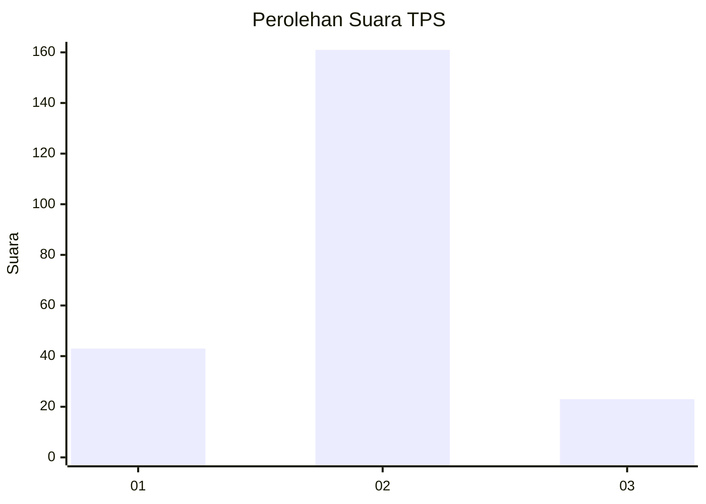
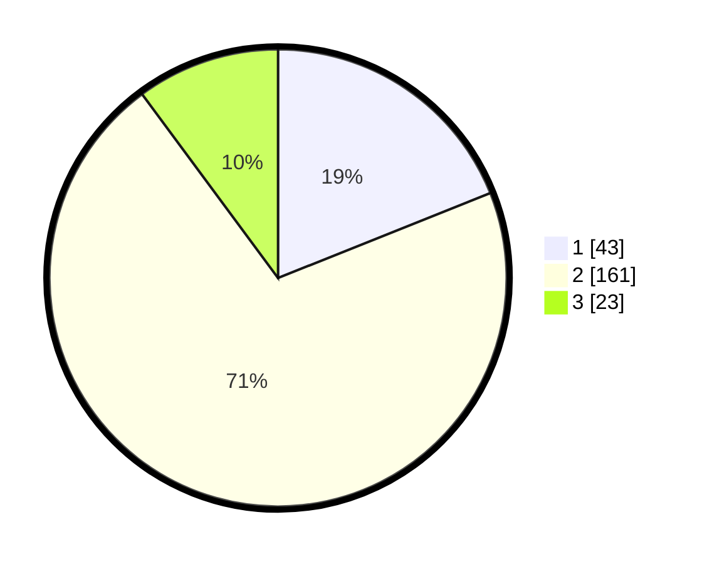

# Hasil

## Grafik

## Tabel

| No. | Nama Paslon    | Suara | Suara (raw) | Persentase |
|:--- |:-------------- | -----:| -----------:| ----------:|
| 1   | ANIES MUHAIMIN | 43    | [43][p-1]   | 18,94      |
| 2   | PRABOWO GIBRAN | 161   | [161][p-2]  | 70,93      |
| 3   | GANJAR MAHFUD  | 23    | [23][p-3]   | 10,13      |

[p-1]: https://github.com/gigit-pemilu/pemilu-2024/blob/main/pilpres/hitung-suara/sub/35-jawa-timur/sub/07-malang/sub/18-pakis/sub/2015-pakisjajar/sub/002-tps/sub/paslon-1.txt
[p-2]: https://github.com/gigit-pemilu/pemilu-2024/blob/main/pilpres/hitung-suara/sub/35-jawa-timur/sub/07-malang/sub/18-pakis/sub/2015-pakisjajar/sub/002-tps/sub/paslon-2.txt
[p-3]: https://github.com/gigit-pemilu/pemilu-2024/blob/main/pilpres/hitung-suara/sub/35-jawa-timur/sub/07-malang/sub/18-pakis/sub/2015-pakisjajar/sub/002-tps/sub/paslon-3.txt

## Foto C Plano

https://sirekap-obj-formc.kpu.go.id/9551/pemilu/ppwp/35/07/18/20/15/3507182015002-20240215-002207--442ea9cf-701a-45bd-8b51-feea688c3b17.jpg

https://sirekap-obj-formc.kpu.go.id/9551/pemilu/ppwp/35/07/18/20/15/3507182015002-20240215-002939--ac6b0e70-2aaf-4786-bb1f-0b25d39ac96a.jpg

https://sirekap-obj-formc.kpu.go.id/9551/pemilu/ppwp/35/07/18/20/15/3507182015002-20240215-002639--40fec882-475d-4174-aeca-86aa7330e801.jpg

## Metadata

| Key        | Value               |
| ---------- | ------------------- |
| Time Stamp | 2024-02-25 12:00:00 |

