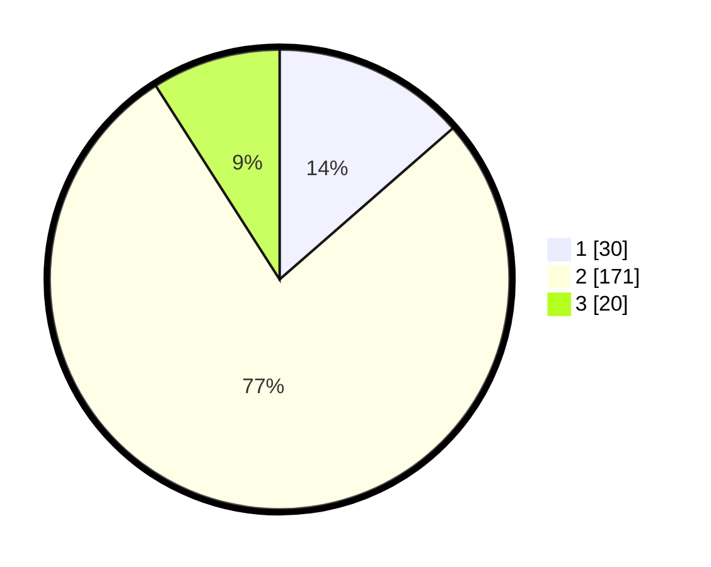

# Hasil

## Grafik

## Tabel

| No. | Nama Paslon    | Suara | Suara (raw) | Persentase |
|:--- |:-------------- | -----:| -----------:| ----------:|
| 1   | ANIES MUHAIMIN | 30    | [30][p-1]   | 13,57      |
| 2   | PRABOWO GIBRAN | 171   | [171][p-2]  | 77,38      |
| 3   | GANJAR MAHFUD  | 20    | [20][p-3]   | 9,05       |

[p-1]: https://github.com/gigit-pemilu/pemilu-2024/blob/main/pilpres/hitung-suara/sub/35-jawa-timur/sub/07-malang/sub/18-pakis/sub/2015-pakisjajar/sub/019-tps/sub/paslon-1.txt
[p-2]: https://github.com/gigit-pemilu/pemilu-2024/blob/main/pilpres/hitung-suara/sub/35-jawa-timur/sub/07-malang/sub/18-pakis/sub/2015-pakisjajar/sub/019-tps/sub/paslon-2.txt
[p-3]: https://github.com/gigit-pemilu/pemilu-2024/blob/main/pilpres/hitung-suara/sub/35-jawa-timur/sub/07-malang/sub/18-pakis/sub/2015-pakisjajar/sub/019-tps/sub/paslon-3.txt

## Foto C Plano

https://sirekap-obj-formc.kpu.go.id/d907/pemilu/ppwp/35/07/18/20/15/3507182015019-20240214-220804--ebd7e551-bdeb-4575-92b0-587facf091fe.jpg

https://sirekap-obj-formc.kpu.go.id/d907/pemilu/ppwp/35/07/18/20/15/3507182015019-20240214-212308--9afb1158-3959-4f8a-b38d-d1cde40af502.jpg

https://sirekap-obj-formc.kpu.go.id/d907/pemilu/ppwp/35/07/18/20/15/3507182015019-20240214-220638--91f6f778-f1a3-4679-827d-47c9a55a2327.jpg

## Metadata

| Key        | Value               |
| ---------- | ------------------- |
| Time Stamp | 2024-02-24 22:31:28 |

