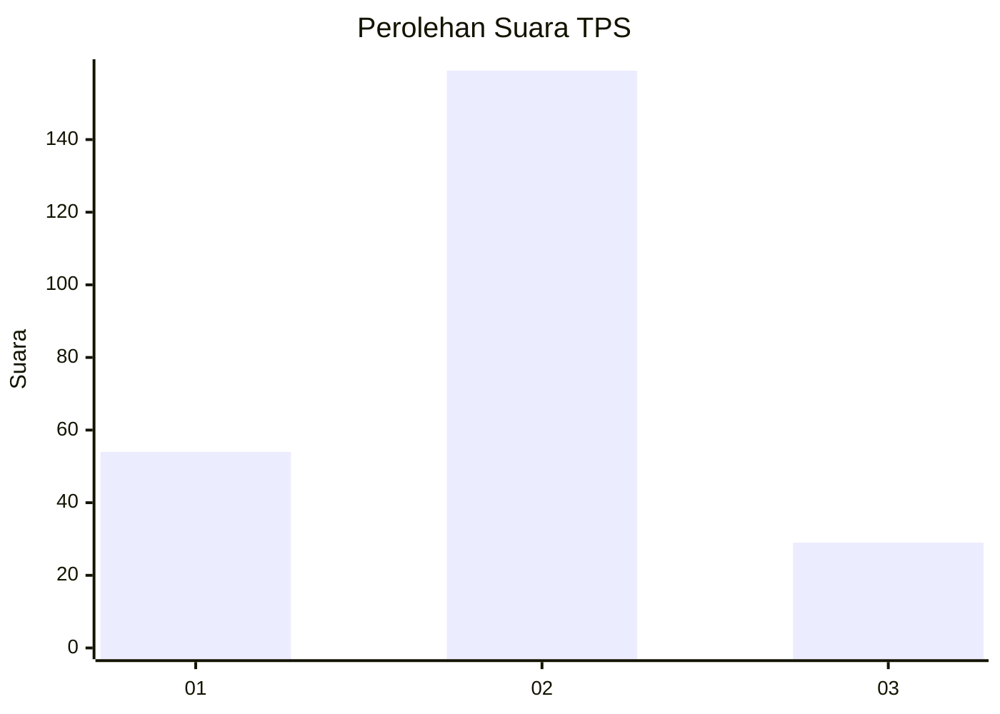
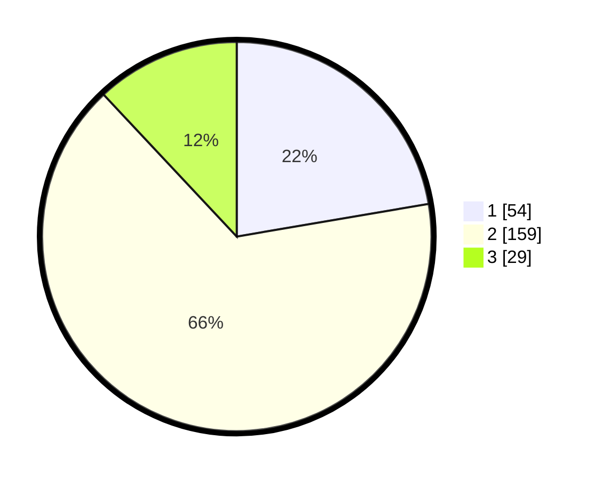

# Hasil

## Grafik

## Tabel

| No. | Nama Paslon    | Suara | Suara (raw) | Persentase |
|:--- |:-------------- | -----:| -----------:| ----------:|
| 1   | ANIES MUHAIMIN | 54    | [54][p-1]   | 22,31      |
| 2   | PRABOWO GIBRAN | 159   | [159][p-2]  | 65,70      |
| 3   | GANJAR MAHFUD  | 29    | [29][p-3]   | 11,98      |

[p-1]: https://github.com/gigit-pemilu/pemilu-2024/blob/main/pilpres/hitung-suara/sub/35-jawa-timur/sub/07-malang/sub/18-pakis/sub/2015-pakisjajar/sub/020-tps/sub/paslon-1.txt
[p-2]: https://github.com/gigit-pemilu/pemilu-2024/blob/main/pilpres/hitung-suara/sub/35-jawa-timur/sub/07-malang/sub/18-pakis/sub/2015-pakisjajar/sub/020-tps/sub/paslon-2.txt
[p-3]: https://github.com/gigit-pemilu/pemilu-2024/blob/main/pilpres/hitung-suara/sub/35-jawa-timur/sub/07-malang/sub/18-pakis/sub/2015-pakisjajar/sub/020-tps/sub/paslon-3.txt

## Foto C Plano

https://sirekap-obj-formc.kpu.go.id/e4af/pemilu/ppwp/35/07/18/20/15/3507182015020-20240214-215543--1f51c656-4a5b-4c07-8d79-93aab6411834.jpg

https://sirekap-obj-formc.kpu.go.id/e4af/pemilu/ppwp/35/07/18/20/15/3507182015020-20240214-215657--b9fa47bc-d6e4-42e7-9cf4-aa5530c94c4c.jpg

https://sirekap-obj-formc.kpu.go.id/e4af/pemilu/ppwp/35/07/18/20/15/3507182015020-20240214-215846--e06561e1-fd65-439a-a852-51dc4591a65c.jpg

## Metadata

| Key        | Value               |
| ---------- | ------------------- |
| Time Stamp | 2024-02-15 18:30:25 |

