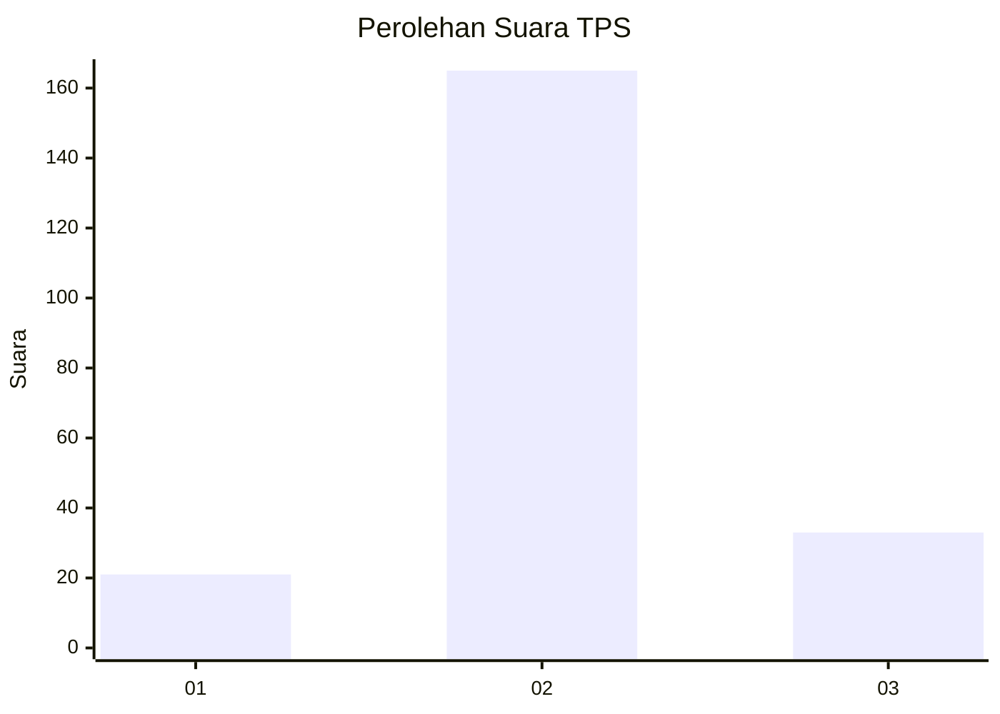

# Hasil

## Grafik

## Tabel

| No. | Nama Paslon    | Suara | Suara (raw) | Persentase |
|:--- |:-------------- | -----:| -----------:| ----------:|
| 1   | ANIES MUHAIMIN | 21    | [21][p-1]   | 9,59       |
| 2   | PRABOWO GIBRAN | 165   | [165][p-2]  | 75,34      |
| 3   | GANJAR MAHFUD  | 33    | [33][p-3]   | 15,07      |

[p-1]: https://github.com/gigit-pemilu/pemilu-2024/blob/main/pilpres/hitung-suara/sub/35-jawa-timur/sub/07-malang/sub/19-pakisaji/sub/2002-karangpandan/sub/015-tps/sub/paslon-1.txt
[p-2]: https://github.com/gigit-pemilu/pemilu-2024/blob/main/pilpres/hitung-suara/sub/35-jawa-timur/sub/07-malang/sub/19-pakisaji/sub/2002-karangpandan/sub/015-tps/sub/paslon-2.txt
[p-3]: https://github.com/gigit-pemilu/pemilu-2024/blob/main/pilpres/hitung-suara/sub/35-jawa-timur/sub/07-malang/sub/19-pakisaji/sub/2002-karangpandan/sub/015-tps/sub/paslon-3.txt

## Foto C Plano

https://sirekap-obj-formc.kpu.go.id/3364/pemilu/ppwp/35/07/19/20/02/3507192002015-20240216-222933--5aa2eaa7-f268-4fbb-b83e-9f031f168374.jpg

https://sirekap-obj-formc.kpu.go.id/3364/pemilu/ppwp/35/07/19/20/02/3507192002015-20240216-222956--3c194c7b-a70a-4f4d-b2e7-6ddc8507f90f.jpg

https://sirekap-obj-formc.kpu.go.id/3364/pemilu/ppwp/35/07/19/20/02/3507192002015-20240304-201505--558cfeca-a864-4e1d-a235-d27ef9c2ac77.jpg

## Metadata

| Key        | Value               |
| ---------- | ------------------- |
| Time Stamp | 2024-03-04 21:00:00 |

