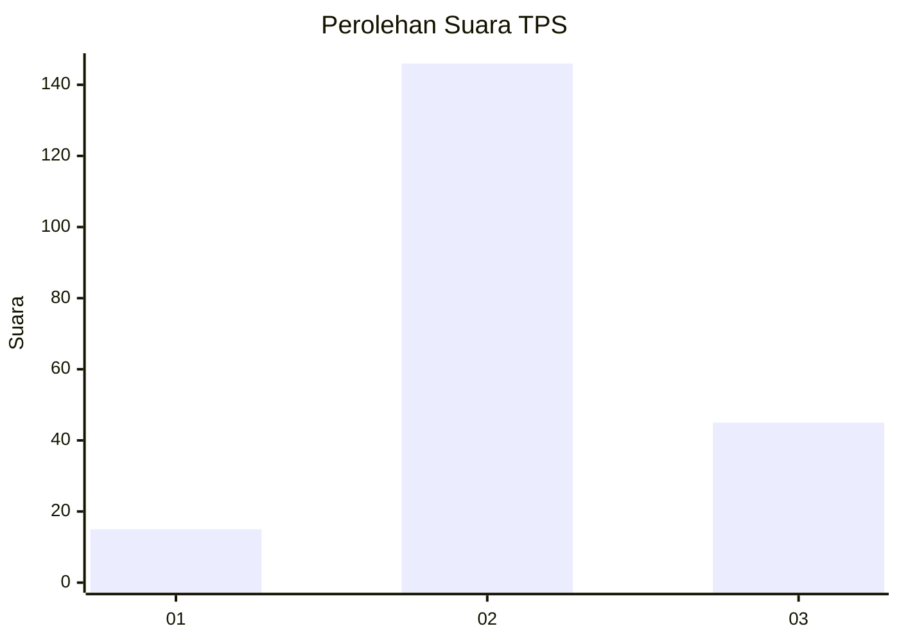

# Hasil

## Grafik

## Tabel

| No. | Nama Paslon    | Suara | Suara (raw) | Persentase |
|:--- |:-------------- | -----:| -----------:| ----------:|
| 1   | ANIES MUHAIMIN | 15    | [15][p-1]   | 7,28       |
| 2   | PRABOWO GIBRAN | 146   | [146][p-2]  | 70,87      |
| 3   | GANJAR MAHFUD  | 45    | [45][p-3]   | 21,84      |

[p-1]: https://github.com/gigit-pemilu/pemilu-2024-35-jawa-timur/blob/main/pilpres/hitung-suara/sub/35-jawa-timur/sub/07-malang/sub/19-pakisaji/sub/2003-gelanggang/sub/005-tps/sub/paslon-1.txt
[p-2]: https://github.com/gigit-pemilu/pemilu-2024-35-jawa-timur/blob/main/pilpres/hitung-suara/sub/35-jawa-timur/sub/07-malang/sub/19-pakisaji/sub/2003-gelanggang/sub/005-tps/sub/paslon-2.txt
[p-3]: https://github.com/gigit-pemilu/pemilu-2024-35-jawa-timur/blob/main/pilpres/hitung-suara/sub/35-jawa-timur/sub/07-malang/sub/19-pakisaji/sub/2003-gelanggang/sub/005-tps/sub/paslon-3.txt

## Foto C Plano

https://sirekap-obj-formc.kpu.go.id/2d49/pemilu/ppwp/35/07/19/20/03/3507192003005-20240304-194842--e57e96ef-eb9a-4008-9f61-6e02d1b8ae84.jpg

https://sirekap-obj-formc.kpu.go.id/2d49/pemilu/ppwp/35/07/19/20/03/3507192003005-20240217-112417--930f640c-3634-4842-95a6-d43810eaea2f.jpg

https://sirekap-obj-formc.kpu.go.id/2d49/pemilu/ppwp/35/07/19/20/03/3507192003005-20240217-112429--d9165f32-2475-4270-8d09-334b2fa8c43f.jpg

## Metadata

| Key        | Value               |
| ---------- | ------------------- |
| Time Stamp | 2024-03-04 20:00:00 |

